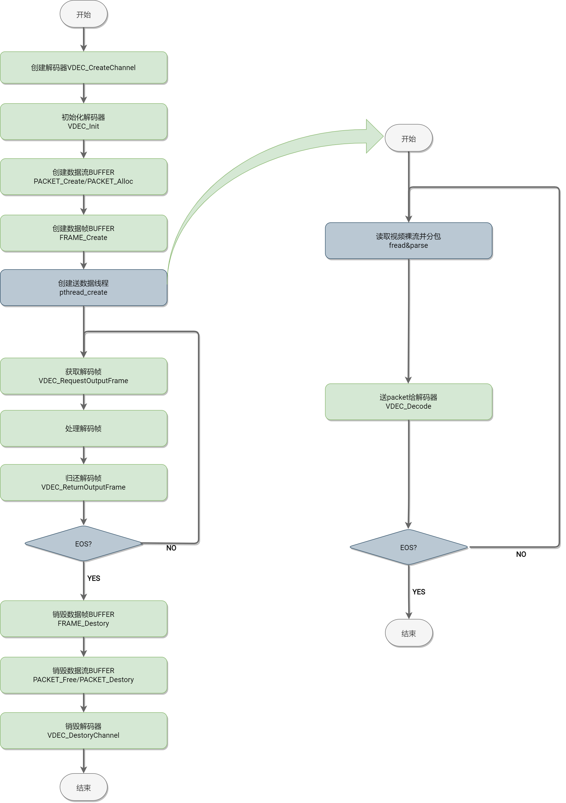

# 多媒体

MPP (Multimedia Processing Platform，多媒体处理平台)开发指南。

## 1. 概述

### 1.1 编写目的

主要介绍 SpacemiT 的多媒体相关的框架层次结构，开放 API 接口等，方便开发者快速上手或者二次开发。

### 1.2 适用范围

适用于 SpacemiT 的 K1 系列 SOC。

### 1.3 相关人员

- 应用开发工程师
- 多媒体中间件开发及维护工程师

### 1.4 文档结构

该文档首先介绍了多媒体整体框架结构及其简要说明，然后分别对 MPP 模块，VPU 模块，JPU 模块，ISP/CPP/MIPI-CSI 模块等进行详细的说明。

## 2 多媒体整体框架

### 2.1 框架层次图及说明


从框架结构上看分 4 层，从上到下依次为：

- **APP层**：包括第三方 APP 和自研 APP，第三方 APP 基本上是通过 GStreamer 和 FFmpeg 等开源框架来实现视频的编解码，例如 Bianbu 默认集成的 mpv 播放器，还有我们常用的 Video（totem）等，自研 APP 目前主要是我们提供的对接 API 的参考 demo 或者 test。
  - **mpv**：Bianbu 桌面系统默认本地播放器，对接了 K1 硬件解码器，支持 H.264/HEVC/VP8/VP9/MPEG-4/MPEG-2/MJPEG 等多种格式的硬件解码，最高支持到 4K60 视频的播放。
  - **totem**：Ubuntu 桌面系统默认本地播放器，对接了 K1 硬件解码器，支持 H.264/HEVC/VP8/VP9/MPEG-4/MPEG-2/MJPEG 等多种格式的硬件解码，目前最高支持到 4K30 视频的播放。
  - **cheese**：Bianbu/Ubuntu 桌面系统默认的 camera 应用，支持预览，拍照，录像等功能，目前已经对接了 K1 的硬件编解码器，实现 1080P30 流畅预览录像。
  - **chromium**：Bianbu 桌面系统默认浏览器，对接了 K1 的硬件解码器，支持 H.264/HEVC 等多种格式的硬件解码，最高支持到 4K30 视频的播放。
  - **kodi**：开发者和发烧友常用的开源播放器，对接了 K1 的硬件解码器，H.264/HEVC/VP8/VP9 等多种格式的硬件解码，最高支持 4K60 视频的播放。
  - **v2d-test**：V2D 模块的测试程序，也可以作为参考 demo，V2D 模块主要是进行非压缩图像的格式转换，旋转，缩放等操作。
  - **mvx-player**：VPU 模块的测试程序，也可以作为参考 demo，通过命令行进行视频的编解码操作，输出以文件的形式保存。
  - **jpu-test**：JPU 模块的测试程序，也可以作为参考 demo，通过命令行进行视频的编解码操作，输出以文件的形式保存，JPU 模块主要进行 JPEG 图像的编解码操作。
  - **camera-test**：CAMERA 通路的测试程序，也可以作为参考 demo，通过命令行进行图像的采集，该测试程序主要是针对 K1 的 CPP-ISP-MIPICSI 模块提供的 API，不包括 USB camera，USB camera 请使用 v4l-utils 等开源标准测试程序。
- **开源多媒体框架层（FRAMEWORK）**：常见的就是 GStreamer，FFmpeg，GStreamer 和 FFmpeg 是完整的多媒体解决方案，全面包含了 muxer/demuxer/decoder/encoder/display 的各种实现，是可以直接使用的开源框架。这一层，我们实现了多个插件通过 MPP 把硬件编解码库对接上。
  - **FFmpeg**：FFmpeg 对接了 K1 的硬件编解码器，支持 H.264/HEVC/VP8/VP9/MPEG-4/MPEG-2/MJPEG 等多种格式的硬件解码，最高支持到 4K60 视频的播放，同时支持 AV_PIX_FMT_DRM_PRIME 和 AV_PIX_FMT_NV12 的输出像素格式，支持 H.264/H.265/VP8/VP9/MJPEG 等多种格式的硬件编码，最高支持到 4K30 的编码。
  - **Gstreamer**：Gstreamer 对接了 K1 的硬件编解码器，支持 H.264/HEVC/VP8/VP9/MPEG-4/MPEG-2/MJPEG 等多种格式的硬件解码，最高支持到 4K30 视频的播放，支持 H.264/H.265/VP8/VP9/MJPEG 等多种格式的硬件编码，最高支持到 1080P60 的编码。
  - **Openmax IL**：编解码适配中
- **MPP**：对上提供统一多媒体 API，对下动态加载不同平台的编解码库插件来调用编解码库。
- **Driver & Library**：IP 厂商提供的驱动和 API 动态库。

### 2.2 概念术语

- **VPU**：（Video Processing Unit，视频处理单元）具有视频编解码功能的硬件，能够提高编解码效率并减少 CPU 负荷，K1 的 VPU 基于标准 V4L2 框架实现，支持 H.264/HEVC/VP8/VP9/MJPEG/MPEG4 等格式的解码和 H.264/HEVC/VP8/VP9/MJPEG 等格式的编码。
- **V2D**：K1 提供的图像处理硬件模块，支持图像格式转换，缩放，裁剪等功能。
- **JPU**：（Jpeg Processing Unit）进行 Jpeg 图像编解码的硬件，能够提高 Jpeg 的编解码效率并减少 CPU 负荷。
- **ISP**：图像处理模块，用于处理传感器输出的图像信号，经过一系列数字图像处理算法达到预期的图像效果。
- **CPP**：图像后处理模块，用于离线处理 ISP 输出的 NV12 数据，金字塔式多层分时处理，主要功能包括：镜头畸变矫正、空域和时域降噪、频域降噪、边沿增强等。
- **RVV**：基于 RISC-V 核心指令集架构的一种向量扩展。向量扩展的目的是在指令级别实现对数据的并行操作,以加速计算过程，类似 ARM 的 neon。
- **MPP**：（Multimedia Processing Platform）多媒体处理平台。
- **Gstreamer**：一个开源的多媒体框架，用于构建流媒体应用程序和处理音频/视频数据。它提供了一套库和工具，可以用来创建、处理和播放各种多媒体流，包括音频、视频、流媒体等。gstreamer 支持多种编解码器和格式，可以在不同平台上运行，是一个灵活且功能强大的多媒体处理框架。
- **FFmpeg**：开源的跨平台音视频处理工具，它可以用来录制、转换和流式传输音视频内容，以及进行音视频编辑和处理。它支持多种音视频格式和编解码器，可以在不同的操作系统上运行，包括 Windows、Mac 和 Linux。FFmpeg 是一个功能强大且灵活的工具，被广泛应用于多媒体处理领域。
- **V4L2**：Video for Linux 2 的缩写，是一个用于 Linux 系统的视频采集和输出设备的驱动程序接口。它提供了一种统一的方式来访问视频设备，包括摄像头、视频采集卡和其他视频输入/输出设备。V4L2 接口允许用户程序通过统一的 API 来控制和使用视频设备，从而实现视频的采集、处理和显示。这使得在 Linux 系统上开发视频应用程序变得更加简单和灵活。
- **ALSA**：Advanced Linux Sound Architecture（高级 Linux 音频架构）的缩写，是 Linux 系统上用于处理音频和音频设备的软件架构。它提供了一个统一的音频接口，使得应用程序可以与音频硬件进行通信，支持多种音频设备和音频格式，并提供了低延迟和高质量的音频处理功能。ALSA 还提供了一组工具和库，用于配置和管理音频设备，以及编写音频应用程序。ALSA 已经成为 Linux 系统上主流的音频架构，被广泛应用于各种 Linux 发行版中。

## 3 MPP

### 3.1 模块介绍

#### 3.1.1 背景介绍

MPP(Multimedia Processing Platform，多媒体处理平台)属于自研操作系统 Bianbu，其目的是封装多平台硬件编解码的使用差异，提供统一的 API 供开发者使用。

#### 3.1.2 概念术语

- **MPP(Multimedia Processing Platform)**：多媒体处理平台。
- **MPI(Multimedia Processing Interface)**：多媒体处理平台提供给上层的 API 调用。
- **MPP AL**: 抽象层，对不同 IP，不同 SOC，不同方案的多媒体接口进行抽象。
- **Packet**：数据包，主要表示经过压缩后的数据，即解码前或者编码后的数据，如 H.264/H.265 的视频流。
- **Frame**：数据帧，主要表示未经压缩的数据，即解码后或者编码前的数据，如 YUV420 的图像。

#### 3.1.3 模块功能

目前 MPP 主要包含下面几个部分：

- **VDEC**: 视频解码子模块及开放 API，主要用于各种数据流 packet 的解码。
- **VENC**: 视频编码子模块及开放 API，主要用于 RGB/YUV 数据帧 frame 的编码。
- **G2D**: 2D 图形处理加速子模块及开放 API，主要进行数据帧 frame 的格式转换，缩放，旋转，裁剪等操作。
- **BIND 系统**：支持多模块动态绑定。
- **AL(Abstract Layer)**: 支持多平台。
- **VI**: 视频输入子模块及开放 API，目前仅支持文件输入及标准 V4L2 输入。
- **VO**: 视频输出子模块及开放 API，目前仅支持文件输出及 SDL2 视频输出。

未包含部分：

- **AI/AO**: 音频的输入输出，走标准的 pipewire->alsa-lib->alsa driver。
- **AENC/ADEC**: 纯软件实现，Gstreamer/FFmpeg 等开源框架都有全面支持，暂不支持。

#### 3.1.4 配置说明

##### 3.1.4.1 调试配置

- **MPP_PRINT_BUFFER**：环境变量，默认 0，配置成 1 后能够实时打印 buffer 状态。
- **MPP_SAVE_OUTPUT_BUFFER**：环境变量，默认 0，配置成 1 后能够保存解码后的 YUV buffer，YUV buffer 较大，会导致播放卡顿并且保存文件会占用较大空间，请注意。
- **MPP_SAVE_OUTPUT_BUFFER_PATH**：环境变量，用于配置输出 YUV 的文件路径，默认/home/bianbu/output.yuv，MPP_SAVE_OUTPUT_BUFFER 开启后才生效。
- **MPP_FRINT_UNFREE_PACKET**：环境变量，默认 0，配置成 1 后能够实时打印 packet 的申请释放情况
- **MPP_FRINT_UNFREE_FRAME**：环境变量，默认 0，配置成 1 后能够实时打印 frame 的申请释放情况
- **MPP_FRINT_UNFREE_DMABUF**：环境变量，默认 0，配置成 1 后能够实时打印 dmabuf 的申请释放情况

使用示例：

```shell
#需要实时打印buffer状态
export MPP_PRINT_BUFFER=1

#需要保存解码后的YUV数据到/mnt/a.yuv
export MPP_SAVE_OUTPUT_BUFFER=1
export MPP_SAVE_OUTPUT_BUFFER_PATH=/mnt/a.yuv
```

##### 3.1.4.2 参数配置

暂未提供配置参数

#### 3.1.5 源码

##### 3.1.5.1 源码位置

MPP 的源码位置位于：

```shell
bianbu-linux/package-src/mpp
```

##### 3.1.5.2 源码编译

bianbu-linux 方案中默认已经开启了编译，如果需要修改代码后需要重新编译，执行：

```shell
make mpp-rebuild
```

##### 3.1.5.3 源码结构

MPP 的源码结构及简要说明如下（源码结构做了精简）：

```shell
|-- al                               ；AL(Abstract Layer)层代码，对接各平台功能模块或者驱动
|   |-- CMakeLists.txt
|   |-- include
|   |   |-- al_interface_base.h      ；AL层接口基类
|   |   |-- al_interface_dec.h       ；AL层解码接口基类，继承于base
|   |   |-- al_interface_enc.h       ；AL层编码接口基类，继承于base
|   |   |-- al_interface_g2d.h       ；AL层图像转换接口基类，继承于base
|   |   |-- al_interface_vi.h        ；AL层视频输入接口基类，继承于base
|   |   `-- al_interface_vo.h        ；AL层视频输出接口基类，继承于base
|   |-- vcodec                       ；对接多平台的编解码模块或者驱动
|   |   |-- chipmedia                ；对接chipmedia IP的编解码器
|   |   |   |-- CMakeLists.txt
|   |   |   `-- starfive             ；对接starfive的编解码器API（暂未实现）
|   |   |       |-- sfdec_plugin.c
|   |   |       `-- sfenc_plugin.c
|   |   |-- CMakeLists.txt
|   |   |-- debug                    ；虚拟解码插件，输出简单纯色图，用于debug
|   |   |   |-- CMakeLists.txt
|   |   |   `-- fake_dec_plugin.c
|   |   |-- ffmpeg                   ；对接ffmpeg软件编解码，用于debug
|   |   |   |-- CMakeLists.txt
|   |   |   |-- ffmpegdec.c
|   |   |   |-- ffmpegenc.c
|   |   |   `-- ffmpegswscale.c
|   |   |-- k1
|   |   |   |-- CMakeLists.txt
|   |   |   `-- jpu                  ；对接K1的Jpu编解码（暂未实现）
|   |   |       |-- include
|   |   |       |-- jpudec.c
|   |   |       `-- jpuenc.c
|   |   |-- openh264                 ；对接openh264软件编解码库，用于debug
|   |   |   |-- CMakeLists.txt
|   |   |   |-- include
|   |   |   |   `-- wels
|   |   |   |       |-- codec_api.h
|   |   |   |       |-- codec_app_def.h
|   |   |   |       |-- codec_def.h
|   |   |   |       `-- codec_ver.h
|   |   |   |-- openh264dec.cpp
|   |   |   |-- openh264enc.cpp
|   |   |   `-- README.md
|   |   |-- openmax                  ；对接openmax
|   |   |   |-- CMakeLists.txt
|   |   |   |-- include
|   |   |   |   |-- khronos
|   |   |   |   |   |-- OMX_Audio.h
|   |   |   |   |   |-- OMX_ComponentExt.h
|   |   |   |   |   |-- OMX_Component.h
|   |   |   |   |   |-- OMX_ContentPipe.h
|   |   |   |   |   |-- OMX_CoreExt.h
|   |   |   |   |   |-- OMX_Core.h
|   |   |   |   |   |-- OMX_ImageExt.h
|   |   |   |   |   |-- OMX_Image.h
|   |   |   |   |   |-- OMX_IndexExt.h
|   |   |   |   |   |-- OMX_Index.h
|   |   |   |   |   |-- OMX_IVCommon.h
|   |   |   |   |   |-- OMX_Other.h
|   |   |   |   |   |-- OMX_Types.h
|   |   |   |   |   |-- OMX_VideoExt.h
|   |   |   |   |   `-- OMX_Video.h
|   |   |   |   |-- sfomxil_find_dec_library.h
|   |   |   |   `-- sfomxil_find_enc_library.h
|   |   |   `-- starfive             ；对接starfive的openmaxIL层视频编解码
|   |   |       |-- sfomxil_dec_plugin.c
|   |   |       `-- sfomxil_enc_plugin.c
|   |   |-- v4l2                     ；对接V4L2编解码
|   |   |   |-- CMakeLists.txt
|   |   |   |-- linlonv5v7           ；对接linlonv5v7编解码（K1）
|   |   |   |   |-- include
|   |   |   |   |   |-- linlonv5v7_buffer.h
|   |   |   |   |   |-- linlonv5v7_codec.h
|   |   |   |   |   |-- linlonv5v7_constant.h
|   |   |   |   |   |-- linlonv5v7_port.h
|   |   |   |   |   `-- mvx-v4l2-controls.h
|   |   |   |   |-- linlonv5v7_buffer.c
|   |   |   |   |-- linlonv5v7_codec.c
|   |   |   |   |-- linlonv5v7_dec.c
|   |   |   |   |-- linlonv5v7_enc.c
|   |   |   |   `-- linlonv5v7_port.c
|   |   |   `-- standard
|   |   |       |-- v4l2dec.c
|   |   |       `-- v4l2enc.c
|   |   `-- verisilicon              ；对接verisilicon编解码（未实现）
|   |       |-- CMakeLists.txt
|   |       `-- vc8000.c
|   |-- vi                           ；对接多平台视频输入模块或者驱动
|   |   |-- CMakeLists.txt
|   |   |-- file                     ；视频通过File输入
|   |   |   |-- include
|   |   |   |   |-- defaultparse.h
|   |   |   |   |-- h264parse.h
|   |   |   |   |-- h265parse.h
|   |   |   |   |-- mjpegparse.h
|   |   |   |   `-- parse.h
|   |   |   |-- parse
|   |   |   |   |-- defaultparse.c
|   |   |   |   |-- h264parse.c
|   |   |   |   |-- h265parse.c
|   |   |   |   |-- mjpegparse.c
|   |   |   |   `-- parse.c
|   |   |   `-- vi_file.c
|   |   |-- k1                       ；视频通过K1的ISP输入，暂未实现
|   |   |   `-- cam
|   |   |       |-- include
|   |   |       `-- vi_k1_cam.c
|   |   `-- v4l2                     ；视频通过标准V4L2输入
|   |       |-- include
|   |       `-- vi_v4l2.c
|   |-- vo                           ；对接多平台视频输出模块或者驱动
|   |   |-- CMakeLists.txt
|   |   |-- file                     ；视频输出到File
|   |   |   `-- vo_file.c
|   |   `-- sdl2                     ；视频通过SDL2输出
|   |       |-- include
|   |       |   |-- begin_code.h
|   |       |   |-- close_code.h
|   |       |   |-- SDL_assert.h
|   |       |   |-- SDL_atomic.h
|   |       |   `-- SDL_vulkan.h
|   |       `-- vo_sdl2.c
|   `-- vps                          ；对接多平台视频处理模块或者驱动
|       |-- CMakeLists.txt
|       `-- k1
|           |-- CMakeLists.txt
|           `-- v2d                  ；对接K1的v2d模块，实现基本框架
|               |-- include
|               |   |-- asr_v2d_api.h
|               |   `-- asr_v2d_type.h
|               `-- v2d.c
|-- cmake                            ；查找系统模块
|   `-- modules
|       |-- Findlibavcodec.cmake
|       |-- Findlibopenh264.cmake
|       |-- Findlibsfdec.cmake
|       |-- Findlibsfenc.cmake
|       `-- Findlibsf-omx-il.cmake
|-- CMakeLists.txt
|-- compile_install_completely.sh
|-- debian                           ；deb包构建目录
|   |-- bianbu.conf
|   |-- changelog
|   |-- compat
|   |-- control
|   |-- copyright
|   |-- install
|   |-- README.Debian
|   |-- rules
|   |-- source
|   |   `-- format
|   |-- usr
|   |   `-- lib
|   |       `-- udev
|   |           `-- rules.d
|   |               `-- 99-video.rules
|   `-- watch
|-- doc                              ；一些文档
|   |-- C_naming_conventions.md
|   `-- MPP Module Design Document V0.1.pdf
|-- do_test.sh
|-- format.sh
|-- include                          ；API头文件
|   |-- data.h                       ；MppData数据基类
|   |-- dataqueue.h                  ；数据队列管理API
|   |-- dmabufwrapper.h              ；dmabuf管理API
|   |-- frame.h                      ；frame帧管理API
|   |-- g2d.h                        ；图像处理API
|   |-- packet.h                     ；packet包管理API
|   |-- para.h                       ；参数结构体
|   |-- processflow.h
|   |-- ringbuffer.h                 ；环形buffer管理API
|   |-- sys.h                        ；SYS相关API
|   |-- vdec.h                       ；视频解码API
|   `-- venc.h                       ；视频解码API
|   |-- vi.h                         ；视频输入API
|   `-- vo.h                         ；视频输出API
|-- LICENSE
|-- mpi                              ；API接口实现
|   |-- CMakeLists.txt
|   |-- g2d.c
|   |-- include
|   |   `-- module.h
|   |-- module.c
|   |-- sys.c
|   |-- vdec.c
|   |-- venc.c
|   |-- vi.c
|   `-- vo.c
|-- mpp.cppcheck
|-- pack_to_tar_gz.sh
|-- pkgconfig
|   `-- spacemit_mpp.pc.cmake
|-- remove_space_end_of_line.sh
|-- test                             ；测试程序，测试脚本，测试文件等
|   |-- CMakeLists.txt
|   |-- g2d_test.c
|   |-- include
|   |   |-- argument.h
|   |   |-- const.h
|   |   |-- defaultparse.h
|   |   |-- h264parse.h
|   |   |-- h265parse.h
|   |   |-- mjpegparse.h
|   |   `-- parse.h
|   |-- parse
|   |   |-- defaultparse.c
|   |   |-- h264parse.c
|   |   |-- h265parse.c
|   |   |-- mjpegparse.c
|   |   `-- parse.c
|   |-- test_script
|   |   |-- cases
|   |   |   `-- vdec.csv
|   |   |-- streams
|   |   `-- vdec_test.sh
|   |-- test_sys_vdec_venc_one_frame.c
|   |-- test_sys_vdec_venc_vdec_one_frame.c
|   |-- test_sys_venc_vdec_one_frame.c
|   |-- vi_file_vdec_venc_sync_userptr_vo_file_test.c
|   |-- vi_file_vdec_vo_test.c
|   |-- vi_file_venc_sync_userptr_vo_file_test.c
|   `-- vi_v4l2_vo_test.c
|-- thirdparty
|   |-- ffmpeg_compile_install.md
|   `-- openh264_compile_install.md
`-- utils                            ；utils
    |-- CMakeLists.txt
    |-- dataqueue.c                  ；数据队列实现
    |-- dmabufwrapper.c              ；dmabuf管理实现
    |-- env.c
    |-- frame.c                      ；frame管理实现
    |-- include
    |   |-- env.h
    |   |-- log.h
    |   |-- resolution_utils.h
    |   |-- type.h
    |   `-- v4l2_utils.h
    |-- log.c
    |-- os
    |   |-- include
    |   |   |-- os_env.h
    |   |   `-- os_log.h
    |   `-- linux
    |       |-- os_env.c
    |       `-- os_log.c
    |-- packet.c                     ；packet管理实现
    |-- resolution_utils.c
    |-- ringbuffer.c
    |-- utils.c
    `-- v4l2_utils.c
```

### 3.2 MPP 框架结构图


从框架结构上，主要分 2 层，如下：

- **MPI**：接口层，主要包含对上层的 API 及其实现
- **MPP AL**：抽象层，屏蔽不同平台和硬件的差异

从功能上来看，分为：

- **MPI**：接口层
- **MPP AL**：抽象层
- **TESTS**：测试程序，测试用例及测试流
- **UTILS**：工具包，基础功能实现，包括 PACKET/FRAME 管理，日志输出，环境变量读写等
- **SYS**：主要实现动态加载插件和 BIND 系统

### 3.3 关键流程

#### 3.3.1 解码流程



#### 3.3.2 编码流程


### 3.4 数据结构

#### 3.4.1 通用数据结构

##### 3.4.1.1 enum MppModuleType

该枚举类型定义了支持的插件类型，可以通过该枚举来选择插件，AUTO 表示按照默认优先级来选择插件（逻辑未完善），K1 上编解码一般选择 CODEC_V4L2_LINLONV5V7。

```c
/***
 * @description: all codec mpp support
 */

/*

+-----------------------+---------+---------+-----------+
|                       | DECODER | ENCODER | CONVERTER |
+=======================+=========+=========+===========+
| CODEC_OPENH264        | √       | √       | x         |
+-----------------------+---------+---------+-----------+
| CODEC_FFMPEG          | √       | √       | x         |
+-----------------------+---------+---------+-----------+
| CODEC_SFDEC           | √       | x       | x         |
+-----------------------+---------+---------+-----------+
| CODEC_SFENC           | x       | √       | x         |
+-----------------------+---------+---------+-----------+
| CODEC_CODADEC         | √(jpeg) | x       | x         |
+-----------------------+---------+---------+-----------+
| CODEC_SFOMX           | √       | √       | x         |
+-----------------------+---------+---------+-----------+
| CODEC_V4L2            | √       | √       | x         |
+-----------------------+---------+---------+-----------+
| CODEC_FAKEDEC         | √       | x       | x         |
+-----------------------+---------+---------+-----------+
| CODEC_V4L2_LINLONV5V7 | √       | √       | x         |
+-----------------------+---------+---------+-----------+
| CODEC_K1_JPU          | √       | √       | x         |
+-----------------------+---------+---------+-----------+
| VO_SDL2               | x       | x       | x         |
+-----------------------+---------+---------+-----------+
| VO_FILE               | x       | x       | x         |
+-----------------------+---------+---------+-----------+
| VI_V4L2               | x       | x       | x         |
+-----------------------+---------+---------+-----------+
| VI_K1_CAM             | x       | x       | x         |
+-----------------------+---------+---------+-----------+
| VI_FILE               | x       | x       | x         |
+-----------------------+---------+---------+-----------+
| VPS_K1_V2D            | x       | x       | √         |
+-----------------------+---------+---------+-----------+

*/

typedef enum _MppModuleType {
  /***
   * auto mode, mpp select suitable codec.
   */
  CODEC_AUTO = 0,

  /***
   * use openh264 soft codec api, support decoder and encoder
   */
  CODEC_OPENH264,

  /***
   * use ffmpeg avcodec api, support decoder and encoder.
   */
  CODEC_FFMPEG,

  /***
   * use starfive wave511 vpu api for video decoder.
   */
  CODEC_SFDEC,

  /***
   * use starfive wave420l vpu api for video encoder.
   */
  CODEC_SFENC,

  /***
   * use starfive codaj12 vpu api for jpeg video decoder and encoder.
   */
  CODEC_CODADEC,

  /***
   * use starfive omx-il api for video decoder and encoder.
   */
  CODEC_SFOMX,

  /***
   * use V4L2 standard codec interface for video decoder and encoder.
   */
  CODEC_V4L2,

  /***
   * a fake decoder for test, send green frame to application layer.
   */
  CODEC_FAKEDEC,

  /***
   * use ARM LINLON VPU codec interface for video decoder and encoder.(K1)
   */
  CODEC_V4L2_LINLONV5V7,

  /***
   * use jpu for jpeg decoder and encoder (K1).
   */
  CODEC_K1_JPU,

  CODEC_MAX,

  /***
   * auto mode, mpp select suitable vo.
   */
  VO_AUTO = 100,

  /***
   * use sdl2 for output
   */
  VO_SDL2,
  VO_FILE,

  VO_MAX,

  /***
   * auto mode, mpp select suitable vi.
   */
  VI_AUTO = 200,

  /***
   * use standard v4l2 framework for input
   */
  VI_V4L2,

  /***
   * use K1 ISP for input
   */
  VI_K1_CAM,
  VI_FILE,

  VI_MAX,

  /***
   * auto mode, mpp select suitable vi.
   */
  VPS_AUTO = 300,

  /***
   * use v2d for graphic 2D convert (K1).
   */
  VPS_K1_V2D,

  VPS_MAX,
} MppModuleType;
```

代码中通过下面接口来动态加载特定编解码器的插件库。

```c
/**
 * @description: dlopen the video codec library by codec_type
 * @param {MppCodecType} codec_type : input, the codec need to be opened
 * @return {MppModule*} : the module context
 */
 MppModule*  module_init(MppCodecType codec_type)
```

##### 3.4.1.2 enum MppCodingType

该枚举类型定义了支持的编码格式，包含解码器和编码器支持的所有格式，每种编解码器可能只支持其中的部分类型，比如 openh264 仅支持 H264 的编码和解码。

```c
typedef enum _MppCodingType {
  CODING_UNKNOWN = 0,
  CODING_H263,
  CODING_H264,

  /***
   * Multiview Video Coding, 3D, etc.
   */
  CODING_H264_MVC,

  /***
   * no start code
   */
  CODING_H264_NO_SC,
  CODING_H265,
  CODING_MJPEG,
  CODING_JPEG,
  CODING_VP8,
  CODING_VP9,
  CODING_AV1,
  CODING_AVS,
  CODING_AVS2,
  CODING_MPEG1,
  CODING_MPEG2,
  CODING_MPEG4,
  CODING_RV,

  /***
   * ANNEX_G, Advanced Profile
   */
  CODING_VC1,

  /***
   * ANNEX_L, Simple and Main Profiles
   */
  CODING_VC1_ANNEX_L,
  CODING_FWHT,
  CODING_MAX,
} MppCodingType;
```

需要特别指出的是：每一种编解码器有自己定义的格式类型，需要进行格式的转换，下面是 ffmpeg 的格式对应示例：

```c
#define CODING_TYPE_MAPPING_DEFINE(Type, format)  \
    typedef struct _AL##Type##CodingTypeMapping {  \
        MppCodingType eMppCodingType;  \
        format e##Type##CodingType;  \
    } AL##Type##CodingTypeMapping;

#define CODING_TYPE_MAPPING_CONVERT(Type, type, format)  \
    static MppCodingType get_##type##_mpp_coding_type(format src_type)  \
    {  \
        S32 i = 0;  \
        S32 mapping_length = NUM_OF(stAL##Type##CodingTypeMapping);  \
        for(i = 0; i < mapping_length; i ++)  \
        {  \
            if(src_type == stAL##Type##CodingTypeMapping[i].e##Type##CodingType)  \
                return stAL##Type##CodingTypeMapping[i].eMppCodingType;  \
        }  \
  \
        mpp_loge("Can not find the mapping format, please check it !");  \
        return CODING_UNKNOWN;  \
    }  \
  \
    static format get_##type##_codec_coding_type(MppCodingType src_type)  \
    {  \
        S32 i = 0;  \
        S32 mapping_length = NUM_OF(stAL##Type##CodingTypeMapping);  \
        for(i = 0; i < mapping_length; i ++)  \
        {  \
            if(src_type == stAL##Type##CodingTypeMapping[i].eMppCodingType)  \
                return stAL##Type##CodingTypeMapping[i].e##Type##CodingType;  \
        }  \
  \
        mpp_loge("Can not find the mapping coding type, please check it !");  \
        return CODING_UNKNOWN;  \
    }

...

CODING_TYPE_MAPPING_DEFINE(FFMpegDec, enum AVCodecID)
static const ALFFMpegDecCodingTypeMapping stALFFMpegDecCodingTypeMapping[] = {
    {CODING_H264, AV_CODEC_ID_H264},
    {CODING_H265, AV_CODEC_ID_H265},
    {CODING_MJPEG, AV_CODEC_ID_MJPEG},
    {CODING_VP8, AV_CODEC_ID_VP8},
    {CODING_VP9, AV_CODEC_ID_VP9},
    {CODING_AV1, AV_CODEC_ID_NONE},
    {CODING_AVS, AV_CODEC_ID_AVS},
    {CODING_AVS2, AV_CODEC_ID_AVS2},
    {CODING_MPEG1, AV_CODEC_ID_MPEG1VIDEO},
    {CODING_MPEG2, AV_CODEC_ID_MPEG2VIDEO},
    {CODING_MPEG4, AV_CODEC_ID_MPEG4},
};
CODING_TYPE_MAPPING_CONVERT(FFMpegDec, ffmpegdec, enum AVCodecID)
```

##### 3.4.1.3 enum MppPixelFormat

该枚举类型定义了支持的像素格式，包含解码器和编码器支持的所有格式，每种编解码器可能只支持其中的部分类型。

```c
/***
 * @description: pixelformat mpp or some other platform may use.
 */
typedef enum _MppPixelFormat {
  PIXEL_FORMAT_UNKNOWN = 0,

  /***
   * YYYYYYYYVVUU
   */
  PIXEL_FORMAT_YV12,

  /***
   * YYYYYYYYUUVV  YU12/YUV420P is the same
   */
  PIXEL_FORMAT_I420,

  /***
   * YYYYYYYYVUVU
   */
  PIXEL_FORMAT_NV21,

  /***
   * YYYYYYYYUVUV
   */
  PIXEL_FORMAT_NV12,

  /***
   * 11111111 11000000, 16bit only use 10bit
   */
  PIXEL_FORMAT_YV12_P010,

  /***
   * 11111111 11000000, 16bit only use 10bit
   */
  PIXEL_FORMAT_I420_P010,

  /***
   * 11111111 11000000, 16bit only use 10bit
   */
  PIXEL_FORMAT_NV21_P010,

  /***
   * 11111111 11000000, 16bit only use 10bit
   */
  PIXEL_FORMAT_NV12_P010,
  PIXEL_FORMAT_YV12_P016,
  PIXEL_FORMAT_I420_P016,
  PIXEL_FORMAT_NV21_P016,
  PIXEL_FORMAT_NV12_P016,

  /***
   * YYYYUUVV, YU16 is the same
   */
  PIXEL_FORMAT_YUV422P,

  /***
   * YYYYVVUU
   */
  PIXEL_FORMAT_YV16,

  /***
   * YYYYUVUV  NV16 is the same
   */
  PIXEL_FORMAT_YUV422SP,

  /***
   * YYYYVUVU
   */
  PIXEL_FORMAT_NV61,
  PIXEL_FORMAT_YUV422P_P010,
  PIXEL_FORMAT_YV16_P010,
  PIXEL_FORMAT_YUV422SP_P010,
  PIXEL_FORMAT_NV61_P010,

  /***
   * YYUUVV
   */
  PIXEL_FORMAT_YUV444P,

  /***
   * YYUVUV
   */
  PIXEL_FORMAT_YUV444SP,
  PIXEL_FORMAT_YUYV,
  PIXEL_FORMAT_YVYU,
  PIXEL_FORMAT_UYVY,
  PIXEL_FORMAT_VYUY,
  PIXEL_FORMAT_YUV_MB32_420,
  PIXEL_FORMAT_YUV_MB32_422,
  PIXEL_FORMAT_YUV_MB32_444,
  PIXEL_FORMAT_YUV_MAX,

  PIXEL_FORMAT_RGB_MIN,
  PIXEL_FORMAT_RGBA,
  PIXEL_FORMAT_ARGB,
  PIXEL_FORMAT_ABGR,
  PIXEL_FORMAT_BGRA,
  PIXEL_FORMAT_RGBA_5658,
  PIXEL_FORMAT_ARGB_8565,
  PIXEL_FORMAT_ABGR_8565,
  PIXEL_FORMAT_BGRA_5658,
  PIXEL_FORMAT_RGBA_5551,
  PIXEL_FORMAT_ARGB_1555,
  PIXEL_FORMAT_ABGR_1555,
  PIXEL_FORMAT_BGRA_5551,
  PIXEL_FORMAT_RGBA_4444,
  PIXEL_FORMAT_ARGB_4444,
  PIXEL_FORMAT_ABGR_4444,
  PIXEL_FORMAT_BGRA_4444,
  PIXEL_FORMAT_RGB_888,
  PIXEL_FORMAT_BGR_888,
  PIXEL_FORMAT_RGB_565,
  PIXEL_FORMAT_BGR_565,
  PIXEL_FORMAT_RGB_555,
  PIXEL_FORMAT_BGR_555,
  PIXEL_FORMAT_RGB_444,
  PIXEL_FORMAT_BGR_444,
  PIXEL_FORMAT_RGB_MAX,

  PIXEL_FORMAT_AFBC_YUV420_8,
  PIXEL_FORMAT_AFBC_YUV420_10,
  PIXEL_FORMAT_AFBC_YUV422_8,
  PIXEL_FORMAT_AFBC_YUV422_10,

  /***
   * for usb camera
   */
  PIXEL_FORMAT_H264,
  PIXEL_FORMAT_MJPEG,

  PIXEL_FORMAT_MAX,
} MppPixelFormat;
```

需要特别指出的是：每一种编解码器有自己定义的格式类型，需要进行格式的对应，下面是 ffmpeg 的格式对应示例：

```c
#define PIXEL_FORMAT_MAPPING_DEFINE(Type, format)  \
    typedef struct _AL##Type##PixelFormatMapping {  \
        MppPixelFormat eMppPixelFormat;  \
        format e##Type##PixelFormat;  \
    } AL##Type##PixelFormatMapping;

#define PIXEL_FORMAT_MAPPING_CONVERT(Type, type, format)  \
    static MppPixelFormat get_##type##_mpp_pixel_format(format src_format)  \
    {  \
        S32 i = 0;  \
        S32 mapping_length = NUM_OF(stAL##Type##PixelFormatMapping);  \
        for(i = 0; i < mapping_length; i ++)  \
        {  \
            if(src_format == stAL##Type##PixelFormatMapping[i].e##Type##PixelFormat)  \
                return stAL##Type##PixelFormatMapping[i].eMppPixelFormat;  \
        }  \
  \
        mpp_loge("Can not find the mapping format, please check it !");  \
        return PIXEL_FORMAT_UNKNOWN;  \
    }  \
  \
    static format get_##type##_codec_pixel_format(MppPixelFormat src_format)  \
    {  \
        S32 i = 0;  \
        S32 mapping_length = NUM_OF(stAL##Type##PixelFormatMapping);  \
        for(i = 0; i < mapping_length; i ++)  \
        {  \
            if(src_format == stAL##Type##PixelFormatMapping[i].eMppPixelFormat)  \
                return stAL##Type##PixelFormatMapping[i].e##Type##PixelFormat;  \
        }  \
  \
        mpp_loge("Can not find the mapping format, please check it !");  \
        return (format)0;  \
    }

...

PIXEL_FORMAT_MAPPING_DEFINE(FFMpegDec, enum AVPixelFormat)
static const ALFFMpegDecPixelFormatMapping stALFFMpegDecPixelFormatMapping[] = {
    {PIXEL_FORMAT_I420, AV_PIX_FMT_YUV420P},
    {PIXEL_FORMAT_NV12, AV_PIX_FMT_NV12},
    {PIXEL_FORMAT_YVYU, AV_PIX_FMT_YVYU422},
    {PIXEL_FORMAT_UYVY, AV_PIX_FMT_UYVY422},
    {PIXEL_FORMAT_YUYV, AV_PIX_FMT_YUYV422},
    {PIXEL_FORMAT_RGBA, AV_PIX_FMT_RGBA},
    {PIXEL_FORMAT_BGRA, AV_PIX_FMT_BGRA},
    {PIXEL_FORMAT_ARGB, AV_PIX_FMT_ARGB},
    {PIXEL_FORMAT_ABGR, AV_PIX_FMT_ABGR},
};
PIXEL_FORMAT_MAPPING_CONVERT(FFMpegDec, ffmpegdec, enum AVPixelFormat)
```

##### 3.4.1.4 struct MppData

数据类型基类，MppPacket 和 MppFrame 继承于 MppData。

```c
/*
 *                  +------------------------+
 *                  |       MppData          |
 *                  +------------------------+
 *                  |   eType                |
 *                  +-----------^------------+
 *                              |
 *            +-----------------+---------------+
 *            |                                 |
 * +----------+-------------+       +-----------+-----------+
 * |       MppPacket        |       |       MppFrame        |
 * +------------------------+       +-----------------------+
 * |   eBaseData            |       |   eBaseData           |
 * |   pData                |       |   nDataUsedNum        |
 * |   nLength              |       |   pData0              |
 * |                        |       |   pData1              |
 * |                        |       |   pData2              |
 * +------------------------+       +-----------------------+
 *
 */

/***
 * @description: mpp data type struct.
 *
 */
typedef enum _MppDataType {
  /***
   * stream type, bitstream, un-decoded data or encoded data maybe.
   */
  MPP_DATA_STREAM = 1,

  /***
   * frame type, YUV/RGB format, decoded data or un-encoded data maybe.
   */
  MPP_DATA_FRAME = 2,

  MPP_DATA_UNKNOWN = 1023
} MppDataType;

/***
 * @description: abstruct MppData struct.
 *
 * important struct.
 *
 * data abstruct from MppFrame and MppPacket.
 */
typedef struct _MppData {
  MppDataType eType;
} MppData;
```

##### 3.4.1.5 enum MppReturnValue

MPP 返回值：

```c
typedef enum _MppReturnValue {
  MPP_OK = 0,

  /***
   * error about memory
   */
  MPP_OUT_OF_MEM = -1,
  MPP_MALLOC_FAILED = -2,
  MPP_MMAP_FAILED = -3,
  MPP_MUNMAP_FAILED = -4,
  MPP_NULL_POINTER = -5,

  /***
   * error about file
   */
  MPP_FILE_NOT_EXIST = -100,
  MPP_OPEN_FAILED = -101,
  MPP_IOCTL_FAILED = -102,
  MPP_CLOSE_FAILED = -103,
  MPP_POLL_FAILED = -104,

  /***
   * error about codec
   */
  MPP_NO_STREAM = -200,
  MPP_NO_FRAME = -201,
  MPP_DECODER_ERROR = -202,
  MPP_ENCODER_ERROR = -203,
  MPP_CONVERTER_ERROR = -204,
  MPP_CODER_EOS = -205,
  MPP_CODER_NO_DATA = -206,
  MPP_RESOLUTION_CHANGED = -207,
  MPP_ERROR_FRAME = -208,
  MPP_CODER_NULL_DATA = -209,

  /***
   * error about dataqueue
   */
  MPP_DATAQUEUE_FULL = -300,
  MPP_DATAQUEUE_EMPTY = -301,

  /***
   * other
   */
  MPP_INIT_FAILED = -400,
  MPP_CHECK_FAILED = -401,
  MPP_BIND_NOT_MATCH = -402,
  MPP_NOT_SUPPORTED_FORMAT = -403,

  /*unknown error*/
  MPP_ERROR_UNKNOWN = -1023
} MppReturnValue;

```

#### 3.4.2 解码数据结构

##### 3.4.2.1 struct MppVdecCtx

视频解码器上下文，通过 VDEC_CreateChannel 和 VDEC_Init 进行创建和初始化。

```c
typedef struct _MppVdecCtx {
  MppProcessNode pNode;        ；用于bind系统的pipeline的创建
  MppModuleType eCodecType;    ；选择的解码插件
  MppModule *pModule;          ；解码插件动态库的上下文
  MppVdecPara stVdecPara;      ；解码参数集
} MppVdecCtx;
```

##### 3.4.2.2 struct MppVdecPara

解码器参数结构体。

```c
/***
 * @description: para sent and get between application and decoder.
 */
typedef struct _MppVdecPara {
  /***
   * set to MPP
   */
  MppCodingType eCodingType;                   ；视频编码格式
  S32 nProfile;                                ；视频编码的profile

  /***
   * read from MPP
   */
  MppFrameBufferType eFrameBufferType;         ；frame帧的buffer类型
  MppDataTransmissinMode eDataTransmissinMode; ；输入输出buffer的传输类型

  /***
   * set to MPP
   */
  S32 nWidth;                                  ；视频宽
  S32 nHeight;                                 ；视频高
  S32 nStride;                                 ；视频对齐宽度
  S32 nScale;                                  ；视频缩放比例

  /***
   * Horizontal downscale ratio, [1, 256]
   * set to MPP
   */
  S32 nHorizonScaleDownRatio;                  ；视频水平缩放比例

  /***
   * Vertical downscale ratio, [1, 128]
   * set to MPP
   */
  S32 nVerticalScaleDownRatio;                 ；视频垂直缩放比例

  /***
   * Downscaled frame width in pixels
   * set to MPP
   */
  S32 nHorizonScaleDownFrameWidth;             ；视频水平缩放宽度

  /***
   * Downscaled frame height in pixels
   * set to MPP
   */
  S32 nVerticalScaleDownFrameHeight;           ；视频垂直缩放高度

  /***
   * 0, 90, 180, 270
   * set to MPP
   */
  S32 nRotateDegree;                           ；视频旋转角度
  S32 bThumbnailMode;                          ；暂未使用
  BOOL bIsInterlaced;                          ；是否i源
  BOOL bIsFrameReordering;
  BOOL bIgnoreStreamHeaders;
  MppPixelFormat eOutputPixelFormat;           ；输出像素格式
  BOOL bNoBFrames;
  BOOL bDisable3D;
  BOOL bSupportMaf;
  BOOL bDispErrorFrame;
  BOOL bInputBlockModeEnable;                  ；bitstreem输入是否开启block模式
  BOOL bOutputBlockModeEnable;                 ；frame输出是否开启block模式

  /***
   * read from MPP
   */
  /***
   * input buffer num that APP can use
   */
  S32 nInputQueueLeftNum;
  S32 nOutputQueueLeftNum;
  S32 nInputBufferNum;
  S32 nOutputBufferNum;
  void* pFrame[64];
  S32 nOldWidth;
  S32 nOldHeight;
  BOOL bIsResolutionChanged;

  /***
   * used for chromium
   */
  BOOL bIsBufferInDecoder[64];
  S32 nOutputBufferFd[64];
} MppVdecPara;
```

#### 3.4.3 编码数据结构

##### 3.4.3.1 struct MppVencCtx

视频编码器上下文，通过 VENC_CreateChannel 和 VENC_Init 进行创建和初始化。

```c
typedef struct _MppVencCtx {
  MppProcessNode pNode;        ；用于bind系统的pipeline的创建
  MppModuleType eCodecType;    ；选择的编码插件
  MppVencPara stVencPara;      ；编码参数集
  MppModule *pModule;          ；编码插件动态库的上下文
} MppVencCtx;
```

##### 3.4.3.2 struct MppVencPara

编码器参数结构体。

```c
/***
 * @description: para sent and get between application and encoder.
 */
typedef struct _MppVencPara {
  /***
   * set to MPP
   */
  MppCodingType eCodingType;                   ；视频编码格式
  MppPixelFormat PixelFormat;                  ；输入frame的像素格式

  /***
   * read from MPP
   */
  MppFrameBufferType eFrameBufferType;         ；frame帧的buffer类型
  MppDataTransmissinMode eDataTransmissinMode; ；输入输出buffer的传输类型

  /***
   * set to MPP
   */
  S32 nWidth;                                  ；视频宽
  S32 nHeight;                                 ；视频高
  S32 nStride;                                 ；视频对齐宽度
  S32 nBitrate;                                ；视频码率
  S32 nFrameRate;                              ；视频帧率
} MppVencPara;
```

#### 3.4.4 G2D 数据结构

##### 3.4.4.1 struct MppG2dCtx

图像处理器上下文。

```c
typedef struct _MppG2dCtx {
  MppProcessNode pNode;         ；用于bind系统的pipeline的创建
  MppModuleType eCodecType;     ；选择的图像处理插件
  MppModule *pModule;           ；图像处理插件动态库的上下文
  MppG2dPara stG2dPara;         ；图像处理参数集
} MppG2dCtx;
```

##### 3.4.4.2 MppG2dPara（待完善）

```c
typedef struct _MppG2dPara {
  /***
   * read from MPP
   */
  MppFrameBufferType eInputFrameBufferType;     ；输入frame帧的buffer类型
  MppFrameBufferType eOutputFrameBufferType;    ；输出frame帧的buffer类型
  MppDataTransmissinMode eDataTransmissinMode;  ；输入输出buffer的传输类型

  /***
   * set to MPP
   */
  MppG2dCmd eG2dCmd;                            ；处理命令
  MppPixelFormat eInputPixelFormat;             ；输入frame帧的像素格式
  MppPixelFormat eOutputPixelFormat;            ；输出frame帧的像素格式
  S32 nInputBufFd;                              ；输入frame帧的fd
  S32 nOutputBufFd;                             ；输出frame帧的fd
  S32 nInputWidth;                              ；输入frame帧的宽
  S32 nInputHeight;                             ；输入frame帧的高
  S32 nOutputWidth;                             ；输出frame帧的宽
  S32 nOutputHeight;                            ；输出frame帧的高
  S32 nInputBufSize;                            ；输入frame帧的size
  S32 nOutputBufSize;                           ；输出frrame帧的size
  union {
    MppG2dFillColorPara sFillColorPara;         ；颜色填充参数
    MppG2dCopyPara sCopyPara;                   ；复制参数
    MppG2dScalePara sScalePara;                 ；缩放参数
    MppG2dRotatePara sRotatePara;               ；旋转参数
    MppG2dMaskPara sMaskPara;
    MppG2dDrawPara sDrawPara;
  };
} MppG2dPara;
```

#### 3.4.5 VI 数据结构

##### 3.4.5.1 struct MppViCtx

视频输入上下文。

```c
typedef struct _MppViCtx {
  MppProcessNode pNode;         ；用于bind系统的pipeline的创建
  MppModuleType eViType;        ；选择的视频输入插件
  MppModule *pModule;           ；视频输入插件动态库的上下文
  MppViPara stViPara;           ；视频输入参数集
} MppViCtx;
```

##### 3.4.5.2 MppViPara

```c
typedef struct _MppViPara {
  MppFrameBufferType eFrameBufferType;          ；输入frame帧的buffer类型
  MppDataTransmissinMode eDataTransmissinMode;  ；输入输出buffer的传输类型
  BOOL bIsFrame;

  /***
   * for frame
   */
  MppPixelFormat ePixelFormat;                  ；输入frame的像素格式
  S32 nWidth;                                   ；输入frame的宽
  S32 nHeight;                                  ；输入frame的高
  S32 nStride;                                  ；输入frame的水平对齐宽度

  /***
   * for packet
   */
  MppCodingType eCodingType;                    ；输入packet的视频编码格式

  /***
   * for vi v4l2
   */
  S32 nBufferNum;                               ；申请的buffer数量
  U8* pVideoDeviceName;                         ；V4L2的设备节点
  /***
   * for vi file
   */
  U8* pInputFileName;                           ；输入文件的路径
} MppViPara;
```

#### 3.4.6 VO 数据结构

##### 3.4.6.1 struct MppVoCtx

视频输入上下文。

```c
typedef struct _MppVoCtx {
  MppProcessNode pNode;         ；用于bind系统的pipeline的创建
  MppModuleType eVoType;        ；选择的视频输出插件
  MppModule *pModule;           ；视频输出插件动态库的上下文
  MppVoPara stVoPara;           ；视频输出参数集
} MppVoCtx;
```

##### 3.4.6.2 MppVoPara

```c
typedef struct _MppVoPara {
  MppFrameBufferType eFrameBufferType;          ；输出frame帧的buffer类型
  MppDataTransmissinMode eDataTransmissinMode;  ；输入输出buffer的传输类型
  BOOL bIsFrame;

  /***
   * for frame
   */
  MppPixelFormat ePixelFormat;                  ；输出frame的像素格式
  S32 nWidth;                                   ；输出frame的宽
  S32 nHeight;                                  ；输出frame的高
  S32 nStride;                                  ；输出frame的水平对齐宽度

  /***
   * for vo file
   */
  U8* pOutputFileName;                          ；输出文件的路径
} MppVoPara;
```

#### 3.4.7 SYS 数据结构（待完善）

##### 3.4.7.1 struct MppProcessFlowCtx

BIND 系统 pipeline 上下文。

```c
/***
 * @description: main process flow struct
 *
 * manage the whole process flow, maybe include some process nodes.
 */
typedef struct _MppProcessFlowCtx {
  /***
   * the total node num of the flow.
   */
  S32 nNodeNum;

  /***
   * every node in this flow.
   */
  MppProcessNode *pNode[MAX_NODE_NUM];

  /***
   * data transmission thread between nodes.
   */
  pthread_t pthread[MAX_NODE_NUM];
} MppProcessFlowCtx;
```

##### 3.4.7.2 struct MppProcessNode

BIND 系统 pipeline 的每一个 node 节点的定义。

```c
/***
 * @description: main process node struct
 *
 * manage every process node.
 */
typedef struct _MppProcessNode {
  S32 nNodeId;
  MppProcessNodeType eType;
  ALBaseContext *pAlBaseContext;
  MppOps *ops;
} MppProcessNode;
```

##### 3.4.7.3 struct MppOps

接口抽象。

```c
/***
 * @description: common ops for bind node
 *
 */
typedef struct _MppOps {
  /***
   * @description: send unhandled data to process node
   * @param {ALBaseContext} *base_context
   * @param {MppData} *sink_data
   * @return {*}
   */
  S32 (*handle_data)(ALBaseContext *base_context, MppData *sink_data);
  /***
   * @description: get handled result from process node
   * @param {ALBaseContext} *base_context
   * @param {MppData} *src_data
   * @return {*}
   */
  S32 (*get_result)(ALBaseContext *base_context, MppData *src_data);
  /***
   * @description: return the buffer to process node if needed
   * @param {ALBaseContext} *base_context
   * @param {MppData} *src_data
   * @return {*}
   */
  S32 (*return_result)(ALBaseContext *base_context, MppData *src_data);
} MppOps;
```

##### 3.4.7.4 struct MppProcessNodeType

该枚举定义了 node 节点的类型。

```c
/***
 * @description: process node type enum
 *
 */
typedef enum _MppProcessNodeType {
  /***
   * video decoder node, bitstream in and frame out
   */
  VDEC = 1,

  /***
   * video encoder node, frame in and bitstream out
   */
  VENC = 2,

  /***
   * graphic 2d node, frame in and frame out
   */
  G2D = 3,
} MppProcessNodeType;
```

#### 3.4.8 内部关键数据结构

##### 3.4.8.1 struct MppFrame

```c
struct _MppFrame {
  /**
   * parent class
   */
  MppData eBaseData;              ；MppData基类

  /**
   * video parameter
   */
  MppPixelFormat ePixelFormat;    ；视频的像素格式
  S32 nWidth;                     ；视频的宽
  S32 nHeight;                    ；视频的高
  S32 nLineStride;                ；视频的对齐宽度
  S32 nFrameRate;                 ；视频的帧率

  /**
   * frame parameter
   */
  S64 nPts;                       ；frame的pts
  BOOL bEos;                      ；frame的eos flag
  MppFrameBufferType eBufferType; ；frame帧的buffer类型
  S32 nDataUsedNum;               ；planner的数量
  S32 nID;                        ；frame的ID
  U8 *pData0;                     ；planner0的地址
  U8 *pData1;                     ；planner1的地址
  U8 *pData2;                     ；planner2的地址
  U8 *pData3;                     ；planner3的地址
  void *pMetaData;
  S32 nFd[MPP_MAX_PLANES];
  U32 refCount;
  DmaBufWrapper *pDmaBufWrapper;

  // environment variable
  BOOL bEnableUnfreeFrameDebug;
};
```

##### 3.4.8.2 struct MppPacket

```c
struct _MppPacket {
  /**
   * parent class
   */
  MppData eBaseData;              ；MppData基类

  /**
   * video parameter
   */
  MppPixelFormat ePixelFormat;    ；视频的像素格式
  S32 nWidth;                     ；视频的宽
  S32 nHeight;                    ；视频的高
  S32 nLineStride;                ；视频的对齐宽度
  S32 nFrameRate;                 ；视频的帧率

  /**
   * packet parameter
   */
  U8 *pData;                      ；packet的地址
  S32 nTotalSize;  // total size that PACKET_Alloc
  S32 nLength;     // data length, nLength <= nTotalSize
  void *pMetaData;
  S32 nID;                        ；packet的ID
  S64 nPts;                       ；packet的pts
  S64 nDts;                       ；packet的dts
  BOOL bEos;                      ；packet的eos flag

  // environment variable
  BOOL bEnableUnfreePacketDebug;
};
```

##### 3.4.8.3 struct ALBaseContex/ALXxxBaseContext

```c
typedef struct _ALBaseContext ALBaseContext;
typedef struct _ALDecBaseContext ALDecBaseContext;
typedef struct _ALEncBaseContext ALEncBaseContext;
typedef struct _ALG2dBaseContext ALG2dBaseContext;
typedef struct _ALVoBaseContext ALVoBaseContext;
typedef struct _ALViBaseContext ALViBaseContext;

struct _ALBaseContext {};

struct _ALDecBaseContext {
  ALBaseContext stAlBaseContext;
};

struct _ALEncBaseContext {
  ALBaseContext stAlBaseContext;
};

struct _ALG2dBaseContext {
  ALBaseContext stAlBaseContext;
};

struct _ALVoBaseContext {
  ALBaseContext stAlBaseContext;
};

struct _ALViBaseContext {
  ALBaseContext stAlBaseContext;
```

### 3.5 接口说明

#### 3.5.1 外部接口

##### 3.5.1.1 VDEC

| 接口                    | 说明               | 参数                                                         | 返回值                    |
| ----------------------- | ------------------ | ------------------------------------------------------------ | ------------------------- |
| VDEC_CreateChannel      | 创建解码器         | 无                                                           | MppVdecCtx*：解码器上下文 |
| VDEC_Init               | 初始化解码器       | MppVdecCtx *ctx：解码器上下文                                | 0：成功 非0：错误码       |
| VDEC_SetParam           | 设置解码器参数     | MppVdecCtx *ctx：解码器上下文                                | 0：成功 非0：错误码       |
| VDEC_GetParam           | 获取解码器参数     | MppVdecCtx *ctx：解码器上下文 MppVdecPara **stVdecPara：参数 | 0：成功 非0：错误码       |
| VDEC_GetDefaultParam    | 获取默认解码器参数 | MppVdecCtx *ctx：解码器上下文                                | 0：成功 非0：错误码       |
| VDEC_Decode             | 传送码流给解码器   | MppVdecCtx *ctx：解码器上下文 MppData *sink_data：buffer     | 0：成功 非0：错误码       |
| VDEC_RequestOutputFrame | 获取解码帧         | MppVdecCtx *ctx：解码器上下文 MppData *src_data：解码出来的帧 | 0：成功 非0：错误码       |
| VDEC_ReturnOutputFrame  | 归还解码帧         | MppVdecCtx *ctx：解码器上下文 MppData *src_data：解码出来的帧 | 0：成功 非0：错误码       |
| VDEC_DestroyChannel     | 销毁解码器         | MppVdecCtx *ctx：解码器上下文                                | 0：成功 非0：错误码       |
| VDEC_ResetChannel       | 重置解码器         | MppVdecCtx *ctx：解码器上下文                                | 0：成功 非0：错误码       |

##### 3.5.1.2 VENC

| 接口                       | 说明                 | 参数                                                         | 返回值                    |
| -------------------------- | -------------------- | ------------------------------------------------------------ | ------------------------- |
| VENC_CreateChannel         | 创建编码器           | 无                                                           | MppVencCtx*：编码器上下文 |
| VENC_Init                  | 初始化编码器         | MppVencCtx *ctx：编码器上下文                                | 0：成功 非0：错误码       |
| VENC_SetParam              | 设置编码器参数       | MppVencCtx *ctx：编码器上下文 MppVencPara *para：编码器参数  | 0：成功 非0：错误码       |
| VENC_GetParam              | 获取编码器参数       | MppVencCtx *ctx：编码器上下文 MppVencPara *para：编码器参数  | 0：成功 非0：错误码       |
| VENC_SendInputFrame        | 向编码器送帧         | MppVencCtx *ctx：编码器上下文 MppData *sink_data：编码帧     | 0：成功 非0：错误码       |
| VENC_ReturnInputFrame      | 向编码器回收帧       | MppVencCtx *ctx：编码器上下文 MppData *sink_data：编码帧     | 0：成功 非0：错误码       |
| VENC_GetOutputStreamBuffer | 获取编码后码流       | MppVencCtx *ctx：编码器上下文 MppData *src_data：编码出来的码流 | 0：成功 非0：错误码       |
| VENC_DestroyChannel        | 销毁编码器           | MppVencCtx *ctx：编码器上下文                                | 0：成功 非0：错误码       |
| VENC_ResetChannel          | 重置编码器           | MppVencCtx *ctx：编码器上下文                                | 0：成功 非0：错误码       |
| VENC_Flush                 | 刷掉编码器内部buffer | MppVencCtx *ctx：编码器上下文                                | 0：成功 非0：错误码       |

##### 3.5.1.3 G2D（待完善）

| 接口                   | 说明           | 参数                                                   | 返回值                |
| ---------------------- | -------------- | ------------------------------------------------------ | --------------------- |
| G2D_CreateChannel      | 创建G2D        | 无                                                     | MppG2dCtx*：G2D上下文 |
| G2D_Init               | 初始化G2D      | MppG2dCtx *ctx：G2D上下文                              | 0：成功 非0：错误码   |
| G2D_SetParam           | 设置G2D参数    | MppG2dCtx*ctx：G2D上下文 MppG2dPara *para：G2D参数     | 0：成功 非0：错误码   |
| G2D_GetParam           | 获取G2D参数    | MppG2dCtx*ctx：G2D上下文 MppG2dPara *para：G2D参数     | 0：成功 非0：错误码   |
| G2D_SendInputFrame     | 传送待处理帧   | MppG2dCtx*ctx：G2D上下文 MppData *sink_data：待处理帧  | 0：成功 非0：错误码   |
| G2D_ReturnInputFrame   | 归还待处理帧帧 | MppG2dCtx*ctx：G2D上下文 MppData *sink_data：待处理帧  | 0：成功 非0：错误码   |
| G2D_RequestOutputFrame | 获取处理后的帧 | MppG2dCtx*ctx：G2D上下文 MppData *src_data：处理后的帧 | 0：成功 非0：错误码   |
| G2D_ReturnOutputFrame  | 释放处理后的帧 | MppG2dCtx*ctx：G2D上下文 MppData *src_data：处理后的帧 | 0：成功 非0：错误码   |
| G2D_DestoryChannel     | 销毁G2D        | MppG2dCtx*ctx：G2D上下文                               | 0：成功 非0：错误码   |

##### 3.5.1.4 VI

| 接口                 | 说明         | 参数                                                | 返回值              |
| -------------------- | ------------ | --------------------------------------------------- | ------------------- |
| VI_CreateChannel     | 创建VI       | 无                                                  | MppViCtx*：VI上下文 |
| VI_Init              | 初始化VI     | MppViCtx *ctx：VI上下文                             | 0：成功 非0：错误码 |
| VI_SetParam          | 设置VI参数   | MppViCtx *ctx：VI上下文 MppViPara *para：VI参数     | 0：成功 非0：错误码 |
| VI_GetParam          | 获取VI参数   | MppViCtx *ctx：VI上下文 MppViPara *para：VI参数     | 0：成功 非0：错误码 |
| VI_RequestOutputData | 获取输入数据 | MppViCtx *ctx：VI上下文 MppData *src_data：输入数据 | 0：成功 非0：错误码 |
| VI_ReturnOutputData  | 释放输入数据 | MppViCtx *ctx：VI上下文 MppData *src_data：输入数据 | 0：成功 非0：错误码 |
| VI_DestoryChannel    | 销毁VI       | MppViCtx *ctx：VI上下文                             | 0：成功 非0：错误码 |

##### 3.5.1.5 VO

| 接口              | 说明       | 参数                                                 | 返回值                     |
| ----------------- | ---------- | ---------------------------------------------------- | -------------------------- |
| VO_CreateChannel  | 创建VO     | 无                                                   | MppVoCtx *：图像处理上下文 |
| VO_Init           | 初始化VI   | MppVoCtx *ctx：编码器上下文                          | 0：成功 非0：错误码        |
| VO_SetParam       | 设置VI参数 | MppVoCtx *ctx：VO上下文 MppVoPara *para：VO参数      | 0：成功 非0：错误码        |
| VO_GetParam       | 获取VI参数 | MppVoCtx *ctx：VO上下文 MppVoPara **para：VO参数     | 0：成功 非0：错误码        |
| VO_Process        | 输出数据   | MppVoCtx *ctx：VO上下文 MppData *sink_data：输出数据 | 0：成功 非0：错误码        |
| VO_DestoryChannel | 销毁VO     | MppVoCtx *ctx：VO上下文                              | 0：成功 非0：错误码        |

##### 3.5.1.6 SYS

| 接口           | 说明                       | 参数                                                         | 返回值                         |
| -------------- | -------------------------- | ------------------------------------------------------------ | ------------------------------ |
| SYS_GetVersion | 获取MPP版本号              | MppVersion *version：MPP版本号                               | 0：成功 非0：错误码            |
| SYS_CreateFlow | 创建BIND flow              | 无                                                           | MppProcessFlowCtx*：flow上下文 |
| SYS_CreateNode | 创建BIND node（节点）      | MppProcessNodeType type：节点类型                            | MppProcessNode*：node上下文    |
| SYS_Init       | 初始化BIND flow            | MppProcessFlowCtx *ctx：flow上下文                           | 无                             |
| SYS_Destory    | 销毁BIND flow              | MppProcessFlowCtx *ctx：flow上下文                           | 无                             |
| SYS_Bind       | 数据源绑定数据接收者       | MppProcessFlowCtx *ctx：flow上下文 MppProcessNode *src_ctx：数据源 MppProcessNode *sink_ctx：数据接受者 | 0：成功 非0：错误码            |
| SYS_UnBind     | 解绑所有数据源和数据接收者 | MppProcessFlowCtx *ctx：flow上下文                           | 无                             |
| SYS_Handledata | 处理数据                   | MppProcessFlowCtx *ctx：flow上下文 MppData *sink_data：待处理数据 | 无                             |
| SYS_Getresult  | 返回结果                   | MppProcessFlowCtx *ctx：flow上下文 MppData *src_data：处理完成的数据 | 无                             |


### 3.6 测试程序

#### 3.6.1 单路解码测试（vi_file_vdec_vo_test）

```shell
VI(file) --> VDEC(linlonv5v7) --> VO(file or sdl2)
```

##### 3.6.1.1 测试程序使用说明

```shell
bianbu@k1:~$ vi_file_vdec_vo_test -H
Usage:
-H       --help                    Print help
-i       --input                   Input file path
-c       --codingtype              Coding type
-m       --moduletype              Module type
-o       --save_frame_file         Saving picture file path
-w       --width                   Video width
-h       --height                  Video height
-f       --format                  Video PixelFormat
--codectype:
0        CODEC_AUTO
1        CODEC_OPENH264
2        CODEC_FFMPEG
3        CODEC_SFDEC
4        CODEC_SFENC
5        CODEC_CODADEC
6        CODEC_SFOMX
7        CODEC_V4L2
8        CODEC_FAKEDEC
9        CODEC_V4L2_LINLONV5V7
10       CODEC_K1_JPU
100      UNKNOWN
101      VO_SDL2
102      VO_FILE
200      UNKNOWN
201      VI_V4L2
202      VI_K1_CAM
203      VI_FILE
300      UNKNOWN
301      VPS_K1_V2D
--codingtype:
0        CODING_UNKNOWN
1        CODING_H263
2        CODING_H264
3        CODING_H264_MVC
4        CODING_H264_NO_SC
5        CODING_H265
6        CODING_MJPEG
7        CODING_JPEG
8        CODING_VP8
9        CODING_VP9
10       CODING_AV1
11       CODING_AVS
12       CODING_AVS2
13       CODING_MPEG1
14       CODING_MPEG2
15       CODING_MPEG4
16       CODING_RV
17       CODING_VC1
18       CODING_VC1_ANNEX_L
19       CODING_FWHT
--format:
0        PIXEL_FORMAT_UNKNOWN
1        PIXEL_FORMAT_YV12
2        PIXEL_FORMAT_I420
3        PIXEL_FORMAT_NV21
4        PIXEL_FORMAT_NV12
5        PIXEL_FORMAT_YV12_P010
6        PIXEL_FORMAT_I420_P010
7        PIXEL_FORMAT_NV21_P010
8        PIXEL_FORMAT_NV12_P010
9        PIXEL_FORMAT_YV12_P016
10       PIXEL_FORMAT_I420_P016
11       PIXEL_FORMAT_NV21_P016
12       PIXEL_FORMAT_NV12_P016
13       PIXEL_FORMAT_YUV422P
14       PIXEL_FORMAT_YV16
15       PIXEL_FORMAT_YUV422SP
16       PIXEL_FORMAT_NV61
17       PIXEL_FORMAT_YUV422P_P010
18       PIXEL_FORMAT_YV16_P010
19       PIXEL_FORMAT_YUV422SP_P010
20       PIXEL_FORMAT_NV61_P010
21       PIXEL_FORMAT_YUV444P
22       PIXEL_FORMAT_YUV444SP
23       PIXEL_FORMAT_YUYV
24       PIXEL_FORMAT_YVYU
25       PIXEL_FORMAT_UYVY
26       PIXEL_FORMAT_VYUY
27       PIXEL_FORMAT_YUV_MB32_420
28       PIXEL_FORMAT_YUV_MB32_422
29       PIXEL_FORMAT_YUV_MB32_444
31       UNKNOWN
32       PIXEL_FORMAT_RGBA
33       PIXEL_FORMAT_ARGB
34       PIXEL_FORMAT_ABGR
35       PIXEL_FORMAT_BGRA
36       PIXEL_FORMAT_RGBA_5658
37       PIXEL_FORMAT_ARGB_8565
38       PIXEL_FORMAT_ABGR_8565
39       PIXEL_FORMAT_BGRA_5658
40       PIXEL_FORMAT_RGBA_5551
41       PIXEL_FORMAT_ARGB_1555
42       PIXEL_FORMAT_ABGR_1555
43       PIXEL_FORMAT_BGRA_5551
44       PIXEL_FORMAT_RGBA_4444
45       PIXEL_FORMAT_ARGB_4444
46       PIXEL_FORMAT_ABGR_4444
47       PIXEL_FORMAT_BGRA_4444
48       PIXEL_FORMAT_RGB_888
49       PIXEL_FORMAT_BGR_888
50       PIXEL_FORMAT_RGB_565
51       PIXEL_FORMAT_BGR_565
52       PIXEL_FORMAT_RGB_555
53       PIXEL_FORMAT_BGR_555
54       PIXEL_FORMAT_RGB_444
55       PIXEL_FORMAT_BGR_444
```

使用 LINLONV5V7 解码器将文件中读取的 H.264 码流 input.264 解码为 NV12 的 output.yuv，输出到文件，如下：

```shell
vdec_test -i input.264 -m 203,9,102 -c 2 -f 4 -o output.yuv

// -m 203,9,102
// 203 表示 VI_FILE
// 9 表示 CODEC_V4L2_LINLONV5V7
// 102 表示 VO_FILE
```

##### 3.6.1.2 测试程序代码流程

测试程序代码流程比较简单，这里不赘述，可自行查看源码，位置在：

```shell
mpp/test/vi_file_vdec_vo_test.c
```

#### 3.6.2 编码测试（vi_file_venc_sync_userptr_vo_file_test）

```shell
VI(file) --> VENC(linlonv5v7) --> VO(file)
```

##### 3.6.2.1 测试程序使用说明

```shell
bianbu@k1:~$ vi_file_venc_sync_userptr_vo_file_test -H
Usage:
-H       --help                    Print help
-i       --input                   Input file path
-c       --codingtype              Coding type
-m       --moduletype              Module type
-o       --save_frame_file         Saving picture file path
-w       --width                   Video width
-h       --height                  Video height
-f       --format                  Video PixelFormat
--codectype:
0        CODEC_AUTO
1        CODEC_OPENH264
2        CODEC_FFMPEG
3        CODEC_SFDEC
4        CODEC_SFENC
5        CODEC_CODADEC
6        CODEC_SFOMX
7        CODEC_V4L2
8        CODEC_FAKEDEC
9        CODEC_V4L2_LINLONV5V7
10       CODEC_K1_JPU
100      UNKNOWN
101      VO_SDL2
102      VO_FILE
200      UNKNOWN
201      VI_V4L2
202      VI_K1_CAM
203      VI_FILE
300      UNKNOWN
301      VPS_K1_V2D
--codingtype:
0        CODING_UNKNOWN
1        CODING_H263
2        CODING_H264
3        CODING_H264_MVC
4        CODING_H264_NO_SC
5        CODING_H265
6        CODING_MJPEG
7        CODING_JPEG
8        CODING_VP8
9        CODING_VP9
10       CODING_AV1
11       CODING_AVS
12       CODING_AVS2
13       CODING_MPEG1
14       CODING_MPEG2
15       CODING_MPEG4
16       CODING_RV
17       CODING_VC1
18       CODING_VC1_ANNEX_L
19       CODING_FWHT
--format:
0        PIXEL_FORMAT_UNKNOWN
1        PIXEL_FORMAT_YV12
2        PIXEL_FORMAT_I420
3        PIXEL_FORMAT_NV21
4        PIXEL_FORMAT_NV12
5        PIXEL_FORMAT_YV12_P010
6        PIXEL_FORMAT_I420_P010
7        PIXEL_FORMAT_NV21_P010
8        PIXEL_FORMAT_NV12_P010
9        PIXEL_FORMAT_YV12_P016
10       PIXEL_FORMAT_I420_P016
11       PIXEL_FORMAT_NV21_P016
12       PIXEL_FORMAT_NV12_P016
13       PIXEL_FORMAT_YUV422P
14       PIXEL_FORMAT_YV16
15       PIXEL_FORMAT_YUV422SP
16       PIXEL_FORMAT_NV61
17       PIXEL_FORMAT_YUV422P_P010
18       PIXEL_FORMAT_YV16_P010
19       PIXEL_FORMAT_YUV422SP_P010
20       PIXEL_FORMAT_NV61_P010
21       PIXEL_FORMAT_YUV444P
22       PIXEL_FORMAT_YUV444SP
23       PIXEL_FORMAT_YUYV
24       PIXEL_FORMAT_YVYU
25       PIXEL_FORMAT_UYVY
26       PIXEL_FORMAT_VYUY
27       PIXEL_FORMAT_YUV_MB32_420
28       PIXEL_FORMAT_YUV_MB32_422
29       PIXEL_FORMAT_YUV_MB32_444
31       UNKNOWN
32       PIXEL_FORMAT_RGBA
33       PIXEL_FORMAT_ARGB
34       PIXEL_FORMAT_ABGR
35       PIXEL_FORMAT_BGRA
36       PIXEL_FORMAT_RGBA_5658
37       PIXEL_FORMAT_ARGB_8565
38       PIXEL_FORMAT_ABGR_8565
39       PIXEL_FORMAT_BGRA_5658
40       PIXEL_FORMAT_RGBA_5551
41       PIXEL_FORMAT_ARGB_1555
42       PIXEL_FORMAT_ABGR_1555
43       PIXEL_FORMAT_BGRA_5551
44       PIXEL_FORMAT_RGBA_4444
45       PIXEL_FORMAT_ARGB_4444
46       PIXEL_FORMAT_ABGR_4444
47       PIXEL_FORMAT_BGRA_4444
48       PIXEL_FORMAT_RGB_888
49       PIXEL_FORMAT_BGR_888
50       PIXEL_FORMAT_RGB_565
51       PIXEL_FORMAT_BGR_565
52       PIXEL_FORMAT_RGB_555
53       PIXEL_FORMAT_BGR_555
54       PIXEL_FORMAT_RGB_444
55       PIXEL_FORMAT_BGR_444
```

使用 LINLONV5V7 编码器将文件输入的 NV12 的 input.yuv(1280×720)编码为 H.264 码流 output.264，保存到文件，如下：

```shell
vi_file_venc_sync_userptr_vo_file_test -i input.yuv -m 293,9,102 -c 2 -f 4 -w 1280 -h 720 -o output.264

// -m 203,9,102
// 203 表示 VI_FILE
// 9 表示 CODEC_V4L2_LINLONV5V7
// 102 表示 VO_FILE
```

##### 3.6.2.2 测试程序代码流程

测试程序代码流程比较简单，这里不赘述，可自行查看源码，位置在：

```shell
mpp/test/vi_file_venc_sync_userptr_vo_file_test.c
```

#### 3.6.3 解码后编码测试（vi_file_vdec_venc_sync_userptr_vo_file_test）

```shell
VI(file) --> VDEC(linlonv5v7) --> VENC(linlonv5v7) --> VO(file)
```

##### 3.6.3.1 测试程序使用说明

```shell
bianbu@k1:~$ vi_file_vdec_venc_sync_userptr_vo_file_test -H
Usage:
-H       --help                    Print help
-i       --input                   Input file path
-c       --codingtype              Coding type
-m       --moduletype              Module type
-o       --save_frame_file         Saving picture file path
-w       --width                   Video width
-h       --height                  Video height
-f       --format                  Video PixelFormat
--codectype:
0        CODEC_AUTO
1        CODEC_OPENH264
2        CODEC_FFMPEG
3        CODEC_SFDEC
4        CODEC_SFENC
5        CODEC_CODADEC
6        CODEC_SFOMX
7        CODEC_V4L2
8        CODEC_FAKEDEC
9        CODEC_V4L2_LINLONV5V7
10       CODEC_K1_JPU
100      UNKNOWN
101      VO_SDL2
102      VO_FILE
200      UNKNOWN
201      VI_V4L2
202      VI_K1_CAM
203      VI_FILE
300      UNKNOWN
301      VPS_K1_V2D
--codingtype:
0        CODING_UNKNOWN
1        CODING_H263
2        CODING_H264
3        CODING_H264_MVC
4        CODING_H264_NO_SC
5        CODING_H265
6        CODING_MJPEG
7        CODING_JPEG
8        CODING_VP8
9        CODING_VP9
10       CODING_AV1
11       CODING_AVS
12       CODING_AVS2
13       CODING_MPEG1
14       CODING_MPEG2
15       CODING_MPEG4
16       CODING_RV
17       CODING_VC1
18       CODING_VC1_ANNEX_L
19       CODING_FWHT
--format:
0        PIXEL_FORMAT_UNKNOWN
1        PIXEL_FORMAT_YV12
2        PIXEL_FORMAT_I420
3        PIXEL_FORMAT_NV21
4        PIXEL_FORMAT_NV12
5        PIXEL_FORMAT_YV12_P010
6        PIXEL_FORMAT_I420_P010
7        PIXEL_FORMAT_NV21_P010
8        PIXEL_FORMAT_NV12_P010
9        PIXEL_FORMAT_YV12_P016
10       PIXEL_FORMAT_I420_P016
11       PIXEL_FORMAT_NV21_P016
12       PIXEL_FORMAT_NV12_P016
13       PIXEL_FORMAT_YUV422P
14       PIXEL_FORMAT_YV16
15       PIXEL_FORMAT_YUV422SP
16       PIXEL_FORMAT_NV61
17       PIXEL_FORMAT_YUV422P_P010
18       PIXEL_FORMAT_YV16_P010
19       PIXEL_FORMAT_YUV422SP_P010
20       PIXEL_FORMAT_NV61_P010
21       PIXEL_FORMAT_YUV444P
22       PIXEL_FORMAT_YUV444SP
23       PIXEL_FORMAT_YUYV
24       PIXEL_FORMAT_YVYU
25       PIXEL_FORMAT_UYVY
26       PIXEL_FORMAT_VYUY
27       PIXEL_FORMAT_YUV_MB32_420
28       PIXEL_FORMAT_YUV_MB32_422
29       PIXEL_FORMAT_YUV_MB32_444
31       UNKNOWN
32       PIXEL_FORMAT_RGBA
33       PIXEL_FORMAT_ARGB
34       PIXEL_FORMAT_ABGR
35       PIXEL_FORMAT_BGRA
36       PIXEL_FORMAT_RGBA_5658
37       PIXEL_FORMAT_ARGB_8565
38       PIXEL_FORMAT_ABGR_8565
39       PIXEL_FORMAT_BGRA_5658
40       PIXEL_FORMAT_RGBA_5551
41       PIXEL_FORMAT_ARGB_1555
42       PIXEL_FORMAT_ABGR_1555
43       PIXEL_FORMAT_BGRA_5551
44       PIXEL_FORMAT_RGBA_4444
45       PIXEL_FORMAT_ARGB_4444
46       PIXEL_FORMAT_ABGR_4444
47       PIXEL_FORMAT_BGRA_4444
48       PIXEL_FORMAT_RGB_888
49       PIXEL_FORMAT_BGR_888
50       PIXEL_FORMAT_RGB_565
51       PIXEL_FORMAT_BGR_565
52       PIXEL_FORMAT_RGB_555
53       PIXEL_FORMAT_BGR_555
54       PIXEL_FORMAT_RGB_444
55       PIXEL_FORMAT_BGR_444
```

使用 LINLONV5V7 编解码器将文件读取的 H.264 的 input.264(1280×720)先解码为 NV12，后编码为 H.264 码流 output.264，如下：

```shell
vi_file_vdec_venc_sync_userptr_vo_file_test -i input.264 -m 203,9,9,102 -c 2 -f 4 -w 1280 -h 720 -o output.264

// -m 203,9,9,102
// 203 表示 VI_FILE
// 9 表示 CODEC_V4L2_LINLONV5V7
// 102 表示 VO_FILE
```

##### 3.6.3.2 测试程序代码流程

测试程序代码流程比较简单，这里不赘述，可自行查看源码，位置在：

```shell
mpp/test/vi_file_vdec_venc_sync_userptr_vo_file_test.c
```

### 3.7 硬解支持与验证方法

#### 3.7.1 Bianbu 桌面系统

##### 3.7.1.1 mpv 播放器

mpv 支持 H.264/HEVC/VP8/VP9/MJPEG/MPEG4 等格式的硬件解码，最高支持到 4K60fps，验证方法如下：

- 桌面系统中找到要播放的片源，鼠标右键，选择 mpv 播放
- 终端中，使用命令行播放

```
mpv  xxx.mp4
mpv -fs xxx.mp4  //全屏播放
mpv --loop xxx.mp4  //循环播放
```

##### 3.7.1.2 totem 播放器

totem 支持 H.264/HEVC/VP8/VP9/MJPEG 等格式的硬件解码，目前最高支持到 4K30fps，验证方法如下：

- 桌面系统中找到要播放的片源，鼠标右键，选择 totem 播放
- 终端中，使用命令行播放

```
totem  xxx.mp4
```

##### 3.7.1.3 chromium 浏览器

chromium 目前支持 H.264/HEVC 等格式的硬件解码，目前最高支持到 4K30fps，验证方法如下：

- 打开 chromium，播放 Bilibili 的片源
- 打开 chromium，播放优酷的片源
- 打开 chromium，播放新浪体育的片源
- 打开 chromium，播放其他视频网站片源

##### 3.7.1.4 kodi 播放器

kodi 支持 H.264/HEVC/VP8/VP9 等格式的硬件解码，最高支持到 4K60fps，验证方法如下：

- 打开 kodi，选择要播放的片源，点击播放即可。

##### 3.7.1.5 ffplay 命令行

```
ffplay -codec:v h264_stcodec xxx.mp4(H.264视频编码)
ffplay -codec:v hevc_stcodec xxx.mp4(HEVC视频编码)
...
```

##### 3.7.1.6 Gstreamer 命令行

```
gst-launch-1.0 playbin uri=file:///path/to/some/media/file.mp4 (H.264视频编码)
gst-launch-1.0 playbin uri=file:///path/to/some/media/file.mp4 (HEVC视频编码)
```

#### 3.7.2 Bianbu Linux 系统

##### 3.7.2.1 FFmpeg

```
ffplay -codec:v h264_stcodec xxx.mp4(H.264视频编码)
ffplay -codec:v hevc_stcodec xxx.mp4(HEVC视频编码)
...
```

##### 3.7.2.2 Gstreamer

```sql
gst-launch-1.0 playbin uri=file:///path/to/some/media/file.mp4 (H.264视频编码)
gst-launch-1.0 playbin uri=file:///path/to/some/media/file.mp4 (HEVC视频编码)
```

## 4. VPU

K1 的 VPU 是基于标准的 V4L2 接口实现，并提供了完整的测试程序供参考。

### 4.1 规格

#### 4.1.1 解码规格（2cores@819MHz）

| 格式  | profile                   | 最大分辨率 | 最大码率 | 规格        | 多路规格        |
| ----- | ------------------------- | ---------- | -------- | ----------- | --------------- |
| HEVC  | Main/Main10               | 4096×4096  | 200Mbps  | 4k@60fps    | 8路 1080P@30fps |
| H.264 | BP/MP/HP/High10           | 4096×4096  | 200Mbps  | 4k@60fps    | 8路 1080P@30fps |
| VP8   | /                         | 2048×2048  | 100Mbps  | 1080p@60fps | 2路 1080P@30fps |
| VP9   | Profile0/Profile 2 10-bit | 4096×4096  | 120Mbps  | 4k@30fps    | 4路 1080P@30fps |
| JPEG  | Baseline sequential       | 8192×8192  | 80Mbps   | 4k@30fps    | 4路 1080P@30fps |
| VC-1  | SP/MP/AP                  | 2048×4096  | 80Mbps   | 1080p@60fps | 2路 1080P@30fps |
| MPEG4 | SP/ASP                    | 2048×2048  | 40Mbps   | 1080p@60fps | 2路 1080P@30fps |
| MPEG2 | MP                        | 4096×4096  | 40Mbps   | 1080p@60fps | 2路 1080P@30fps |

### 4.1.2 编码规格（2cores@819MHz）

| 格式  | profile                   | 最大分辨率 | 最大码率 | 规格        | 多路规格        |
| ----- | ------------------------- | ---------- | -------- | ----------- | --------------- |
| HEVC  | Main/Main10               | 4096×4096  | 200Mbps  | 4k@30fps    | 4路 1080P@30fps |
| H.264 | BP/MP/HP/High10           | 4096×4096  | 200Mbps  | 4k@30fps    | 4路 1080P@30fps |
| VP8   | /                         | 2048×2048  | 100Mbps  | 1080p@60fps | 2路 1080P@30fps |
| VP9   | Profile0/Profile 2 10-bit | 4096×4096  | 200Mbps  | 4k@30fps    | 4路 1080P@30fps |
| JPEG  | Baseline sequential       | 8192×8192  | 200Mbps  | 4k@30fps    | 4路 1080P@30fps |


### 4.2 VPU 测试程序

#### 4.2.1 概述

k1x-vpu-test 是一套用于测试验证 K1 芯片的 VPU（Video Processing Unit，负责视频的编解码工作）功能性能的程序集，也可以作为客户开发自己的应用程序（需要对接 VPU 进行硬件编解码）的参考。

#### 4.2.2 安装说明

##### 4.2.2.1 Bianbu 桌面系统

源中已经集成了 k1x-vpu-test，直接使用 apt 命令来安装即可。

```shell
sudo apt update
sudo apt install k1x-vpu-test
```

##### 4.2.2.2 Bianbu Linux 系统

2 种方法将 k1x-vpu-test 集成到系统中：

- 在编译 img 的时候，将 k1x-vpu-test 的编译集成选项打开（默认已经打开），这样，编译的 img 中默认就有 k1x-vpu-test 相关的测试程序
- 如果编译 img 的时候，没有打开 k1x-vpu-test 的编译集成选项，img 中没有 k1x-vpu-test 相关的测试程序，只能手动编译 k1x-vpu-test，然后将生成的 bin 拷贝到系统的/usr/bin/目录中来使用，具体包括哪些 bin，下面有说明

#### 4.2.3 使用说明

k1x-vpu-test 的测试程序集中主要包含下面几个测试程序：

- **mvx_decoder**：用于单路视频码流的解码测试
- **mvx_decoder_multi**：用于多路视频码流的解码测试（多路视频码流必须为同一个视频）
- **mvx_encoder**：用于单路视频流的视频编码测试
- **mvx_encoder_multi**：用于多路 YUV 流的视频编码测试（多路 YUV 流必须为同一个流）
- **mvx_logd**：用于抓取 firmware 的 log 分析定位问题

##### 4.2.3.1 mvx_decoder

一些基本用法

```shell
//将input.264的H.264视频流（带startcode）解码为output.yuv
//-f raw ： 表示视频裸流
//输入码流的编码格式默认为H.264
//输出YUV数据的像素格式默认为YUV420P
mvx_decoder -f raw /mnt/streams/input.264 /mnt/test/output.yuv

//将input.264的H.264视频流（带startcode）解码为output.yuv，output.yuv的像素格式为NV12
mvx_decoder -f raw -o yuv420_nv12 /mnt/streams/input.264 /mnt/test/output.yuv

//将input.265的HEVC视频流（带startcode）解码为output.yuv
mvx_decoder -f raw -i hevc /mnt/streams/input.265 /mnt/test/output.yuv
```

参数说明

```shell
usage: ./mvx_decoder [optional] [positional]

positional arguments:
    input
        Input file.
    output
        Output file.

optional arguments:
    --dev
        Device.
        Default: /dev/video0
    -i, --inputformat
        Pixel format.
        Default: h264
    -o, --outputformat
        Output pixel format.
        Default: yuv420
    -f, --format
        Input container format. [ivf, rcv, raw]
        For ivf input format will be taken from IVF header.
        Default: ivf
    -s, --stride
        Stride alignment.
        Default: 1
    -y, --intbuf
        Limit of intermediate buffer size
        Default: 1000000
    -m, --md5
        Output md5 file
    -e, --md5ref
        Input ref md5 file
    -u, --nalu
        Nalu format, START_CODES (0) and ONE_NALU_PER_BUFFER (1),                                                      ONE_BYTE_LENGTH_FIELD (2),                                                    TWO_BYTE_LENGTH_FIELD (3),                                                    FOUR_BYTE_LENGTH_FIELD (3).
        Default: 0
    -r, --rotate
        Rotation, 0 | 90 | 180 | 270
        Default: 0
    -d, --downscale
        Down Scale, 1 | 2 | 4
        Default: 1
    -v, --fps
        Frame rate.
        Default: 24
    --dsl_ratio_hor
        Horizontal downscale ratio, [1, 256]
        Default: 0
    --dsl_ratio_ver
        Vertical downscale ratio, [1, 128]
        Default: 0
    --dsl_frame_width
        Downscaled frame width in pixels
        Default: 0
    --dsl_frame_height
        Downscaled frame height in pixels
        Default: 0
    --dsl_pos_mode
        Flexible Downscaled original position mode [0, 2], 
        only availble in high precision mode. 
        Value: 0 [default:x_original=(x_resized + 0.5)/scale - 0.5]         
        Value: 1 [x_original=x_reized/scale]
        Value: 2 [x_original=(x_resized+0.5)/scale]
        Default: 0
    --frames
        nr of frames to process
        Default: 0
    --fro
        Frame reordering 1 is on (default), 0 is off
        Default: 1
    --ish
        Ignore Stream Headers 1 is on, 0 is off (default)
        Default: 0
    --trystop
        Try if Decoding Stop Command exixts
        Default: 0
    --one_frame_per_packet
        Each input buffer contains one frame.
        Default: 0
    -n, --interlaced
        Frames are interlaced
        Default: 0
    --tiled
        Use tiles for AFBC formats.
        Default: disabled
    --preload
        preload the input stream to memory.
        the size for input file should be less than 15MBytes.
        Default: 0
    --fw_timeout
        timeout value[secs] for watchdog timeout. range: 5~60.
        Default: 5
    --profiling
        enable profiling for bandwidth statistics . 0:disable; 1:enable.
        Default: 0
```

##### 4.2.3.2 mvx_decoder_multi

一些基本用法

```shell
//将input.264的H.264视频流（带startcode）解码为output.yuv，同时4路解码并行
//输入码流的编码格式默认为H.264
//输出YUV数据的像素格式默认为YUV420P
mvx_decoder_multi -n 4 /mnt/streams/input.264 /mnt/test/output.yuv

//将input.265的HEVC视频流（带startcode）解码为output.yuv，4路同时进行，output.yuv的像素格式为NV21
mvx_decoder_multi -n 4 -i hevc -o yuv420_nv21 /mnt/streams/input.265 /mnt/test/output.yuv
```

参数说明

```shell
usage: ./mvx_decoder_multi [optional] [positional]

positional arguments:
    input
        Input file.
    output
        Output file.

optional arguments:
    --dev
        Device.
        Default: /dev/video0
    -i, --inputformat
        Pixel format.
        Default: h264
    -o, --outputformat
        Output pixel format.
        Default: yuv420
    -s, --stride
        Stride alignment.
        Default: 1
    -n, --nsessions
        Number of sessions.
        Default: 1
```

##### 4.2.3.3 mvx_encoder

一些基本用法

```shell
//将input.yuv的YUV420P流编码为output.264的H.264视频流（带startcode）
//输入YUV流的像素格式默认为YUV420P
//输出视频流的编码格式默认为H.264
mvx_encoder -f raw -w 1280 -h 720 /mnt/streams/input.yuv /mnt/test/output.264

//将input.yuv的NV21流编码为output.265的HEVC视频流(带startcode)
mvx_encoder -f raw -w 1280 -h 720 -i yuv420_nv21 -o hevc /mnt/streams/input.yuv /mnt/test/output.265
```

参数说明

```shell
usage: ./mvx_encoder [optional] [positional]

positional arguments:
    input
        Input file.
    output
        Output file.

optional arguments:
    --dev
        Device.
        Default: /dev/video0
    -i, --inputformat
        Pixel format.
        Default: yuv420
    -o, --outputformat
        Output pixel format.
        Default: h264
    -f, --format
        Output container format. [ivf, raw]
        Default: ivf
    -w, --width
        Width.
        Default: 1920
    -h, --height
        Height.
        Default: 1080
    -s, --stride
        Stride alignment.
        Default: 1
    --mirror
        mirror, 1 : horizontal; 2 : vertical.
        Default: 0
    --roi_cfg
        ROI config file.
    --frames
        nr of frames to process
        Default: 0
    --epr_cfg
        Encode Parameter Records config file name
    --rate_control
        Selects rate control type, constant/variable/off
        Default: off
    --target_bitrate
        If rate control is enabled, this option sets target bitrate
        Default: 0
    --max_bitrate
        If rate control is enabled, this option sets maximum bitrate
        Default: 0
    --gop
        GOP: 0 is None, 1 is Bidi, 2 is Low delay, 3 is Pyramid
        Default: 0
    --pframes
        Number of P frames
        Default: 0
    --bframes
        Number of B frames
        Default: 0
    -n, --minqp
        H264 min QP
        Default: 0
    -m, --maxqp
        H264 max QP
        Default: 51
    -t, --tier
        Profile.
        Default: 2
    -l, --level
        Level.
        Default: 1
    -v, --fps
        Frame rate.
        Default: 24
    --ecm
        0 is CAVLC, 1 is CABAC
        Default: 1
    --bitdepth
        Set other bitdepth
        Default: 8
    -q, --fixedqp
        H264 fixed QP for I P B frames. 
        If it is combined with -x, the value will later be increased with 2.
        Default: 20
    --qpi
        H264 fixed QP for I frames.
        Default: 20
    --qpb
        H264 fixed QP for B frames.
        Default: 20
    --qpp
        H264 fixed QP for P frames.
        Default: 20
    --crop_left
        encoder SPS crop param, left offset
        Default: 0
    --crop_right
        encoder SPS crop param, right offset
        Default: 0
    --crop_top
        encoder SPS crop param, top offset
        Default: 0
    --crop_bottom
        encoder SPS crop param, bottom offset
        Default: 0
    --colour_description_range
        VUI param: Colour description; range
        Value: 0=Unspecified, 1=Limited, 2=Full
        Default: 0
    --colour_primaries
        VUI param: Colour description; 
        colour primaries (0-255, see hevc spec. E.3.1)
        Value: 0=Unspecified, 
               1=BT709, 
               2=BT470M, 
               3=BT601_625, 
               4=T601_525, 
               5=GENERIC_FILM, 
               6=BT2020
        Default: 0
    --transfer_characteristics
        VUI param: Colour description; 
        transfer characteristics (0-255, see hevc spec. E.3.1)
        Value: 0=Unspecified, 
               1=LINEAR, 
               2=SRGB, 
               3=SMPTE170M, 
               4=GAMMA22, 
               5=GAMMA28, 
               6=ST2084, 
               7=HLG, 
               8=SMPTE240M, 
               9=XVYCC, 
               10=BT1361, 
               11=ST428
        Default: 0
    --matrix_coeff
        VUI param: Colour description; 
        matrix coefficients (0-255, see hevc spec. E.3.1)
        Value: 0=Unspecified, 
               1=BT709, 
               2=BT470M, 
               3=BT601, 
               4=SMPTE240M, 
               5=T2020, 
               6=BT2020Constant
        Default: 0
    --time_scale
        VUI param: vui_time_scale
        Default: 0
    --num_units_in_tick
        VUI param: vui_num_units_in_tick
        Default: 0
    --aspect_ratio_idc
        VUI param: aspect_ratio_idc. [0,255]
        Default: 0
    --sar_width
        VUI param: sar_width
        Default: 0
    --sar_height
        VUI param: sar_height
        Default: 0
    --video_format
        VUI param: video_format. (0-5, see hevc spec. E.3.1)
        Value: 0=Component, 2=PAL, 2=NTSC, 3=SECAM, 4=MAC, 5=Unspecified
        Default: 0
    --sei_mastering_display
        SEI param : mastering display 's parameters
        Default: 0
    --sei_content_light
        SEI param : sei_content_light
        Default: 0
    --sei_user_data_unregistered
        SEI param : user data unregisterd
        Default: 0
    --hrd_buffer_size
        Hypothetical Reference Decoder buffer size 
        relative to the bitrate (in seconds) for rate control                         Value: should bigger than target_bitrate/fps on normal case
        Default: 0
    --ltr_mode
        encoder long term reference mode,range from 1 to 8 (inclusive)
        1: LDP-method-1 | 
        2: LDP-method-2 | 
        3: LDB-method-1 | 
        4: LDB-method-2
        5: BiDirection-method-1 | 
        6: BiDirection-method-2 | 
        7: Pyrimid-method-1 | 
        8: Pyrimid-method-2
        Default: 0
    --ltr_period
        encoder long term reference period, range from 2 to 254 (inclusive)
        Default: 0
    --trystop
        Try if Encoding Stop Command exixts
        Default: 0
    --restart_interval
        JPEG restart interval.
        Default: -1
    --quality
        JPEG compression quality. [1-100, 0 - default]
        Default: 0
    --preload
        preload the first 5 yuv frames to memory.
        Default: 0
    --fw_timeout
        timeout value[secs] for watchdog timeout. range: 5~60.
        Default: 5
    --profiling
        enable profiling for bandwidth statistics . 0:disable; 1:enable.
        Default: 0
```

##### 4.2.3.4 mvx_encoder_multi

一些基本用法

```shell
//将input.yuv的YUV420P流编码为output.264的H.264视频流（带startcode），4路同时进行
mvx_encoder_multi -n 4 -w 1280 -h 720 /mnt/streams/input.yuv /mnt/test/output.264

//将input.yuv的NV21流编码为output.265的HEVC视频流(带startcode)，4路同时进行
mvx_encoder_multi -n 4 -w 1280 -h 720 -i yuv420_nv21 -o hevc /mnt/streams/input.yuv /mnt/test/output.265
```

参数说明

```shell
usage: ./mvx_encoder_multi [optional] [positional]

positional arguments:
    input
        Input file.
    output
        Output file.

optional arguments:
    --dev
        Device.
        Default: /dev/video0
    -i, --inputformat
        Pixel format.
        Default: yuv420
    -o, --outputformat
        Output pixel format.
        Default: h264
    -s, --stride
        Stride alignment.
        Default: 1
    -w, --width
        Stride alignment.
        Default: 1280
    -h, --height
        Stride alignment.
        Default: 720
    -f, --frames
        Specfied frame count to be processed.
        Default: 0
    -n, --nsessions
        Number of sessions.
        Default: 1
```

##### 4.2.3.5 mvx_logd

一些基本用法

```shell
//挂载debugfs，保存fw的log到文件
mount -t debugfs none /sys/kernel/debug
//清除之前的log
mvx_logd -C
//设置好保存路径
mvx_logd -d -f text xxx.log
//开始播放视频
//查看xxx.log
```

参数说明

```shell
Usage: ./mvx_logd [OPTIONS] [DST]

Positional arguments:
    DST
        Output file (default stdout).

Optional arguments:
    -h
        --help This help message.
    -C
        Clear ring buffer.
    -c
        Clear ring buffer after first printing its contents.
    -d
        Daemonize process. DST file is expected in this case.
    --follow
        Keep on reading.
    -f
        Format.
        text  Text format (default).
        bin   Binary format.
        json  Java Script Object Notation.
    -i
        Input file (default /sys/kernel/debug/amvx/log/drain/ram0/msg).
    -t
        Adjust for timezone differences.

Example:
    Print and clear log.
    # mvx_logd -c

    Run in daemon mode.
    # mvx_logd -d -f bin fw.log

    Unpack binary log and adjust for timezone differences.
    # mvx_logd -t -1 fw.log
```

#### 4.2.4 代码结构

k1x-vpu-test 的代码位置在：

```shell
package-src/k1x-vpu-test
```

代码结构及简要说明如下：

```shell
|-- CMakeLists.txt                //cmake构建脚本
|-- debian                        //deb包构建的相关配置和脚本
|-- format.sh                     //代码风格格式化脚本，Google风格进行格式化
|-- include                       //重要头文件
|   |-- fw_v2
|   |   `-- mve_protocol_def.h    
|   |-- md5.h
|   |-- mvx_argparse.h
|   |-- mvx_list.h
|   |-- mvx_log_ram.h
|   `-- mvx-v4l2-controls.h       //VPU驱动的附加API
|-- test
|   |-- coverage
|   |-- md5                                 //md5相关的API与实现
|   |   |-- CMakeLists.txt
|   |   |-- md5.c
|   |   `-- md5.h
|   |-- mvx_player                          //测试程序集实现代码
|   |   |-- CMakeLists.txt
|   |   |-- dmabufheap                      //dmabuf管理相关API与实现
|   |   |   |-- BufferAllocator.cpp
|   |   |   |-- BufferAllocator.h
|   |   |   |-- BufferAllocatorWrapper.cpp
|   |   |   |-- BufferAllocatorWrapper.h
|   |   |   `-- dmabufheap-defs.h
|   |   |-- mvx_decoder.cpp                 //mvx_decoder实现
|   |   |-- mvx_decoder_multi.cpp           //mvx_decoder_multi实现
|   |   |-- mvx_encoder.cpp                 //mvx_encoder实现
|   |   |-- mvx_encoder_gen.cpp             //mvx_encoder_gen实现
|   |   |-- mvx_encoder_multi.cpp           //mvx_encoder_multi实现
|   |   |-- mvx_info.cpp                    //mvx_info实现
|   |   |-- mvx_player.cpp                  //核心逻辑封装实现
|   |   |-- mvx_player.hpp                  //核心逻辑封装API
|   |   `-- reader                          //码流读取API与实现
|   |       |-- parser.h
|   |       `-- read_util.h
|   |-- userptr
|   |   |-- CMakeLists.txt
|   |   `-- mvx_userptr.cpp
|   `-- utils                               //utils
|       |-- CMakeLists.txt
|       |-- mvx_argparse.c
|       |-- mvx_argparse.h
|       `-- mvx_list.h
`-- tools
    |-- logd                                //logd实现，抓取VPU的firmware的log
    |   |-- CMakeLists.txt
    |   |-- mvx_logd.cpp
    |   |-- mvx_logd_fwif_v2.cpp
    |   `-- mvx_logd.hpp
    `-- securevideo                         //用于安全视频的测试（未验证使用）
        |-- 50-mvx.rules
        |-- mvx_securehelper.cpp
        |-- mvx_secureplayer.cpp
        |-- mvx_securevideo.cpp
        `-- mvx_securevideo.hpp

```

#### 4.2.5 编译说明

Bianbu 桌面系统

```shell
cd k1x-vpu-test
sudo apt-get build-dep k1x-vpu-test    #安装依赖
dpkg-buildpackage -us -uc -nc -b -j32
```

Bianbu Linux 系统

```shell
cd k1x-vpu-test
mkdir out
cd out
cmake ..
make
make install
```

#### 4.2.6 调试说明

##### 4.2.6.1 Log 添加

使用 printf 或者 fprintf 来添加 log，重新编译安装即可生效

##### 4.2.6.2 解码成功 log

###### 4.2.6.2.1 单路解码

```shell
/mnt/tool # ./mvx_decoder -f raw /mnt/streams/h264dec/Zhling_1280x720.264 /mnt/test/output.yuv  //输入命令

Opening '/dev/video0'.
Enumerate frame size. index=0, pixel_format=32314d59, min_width=2, max_width=8192, step_width=2, min_height=2, max_height=8192, step_height=2
Format: type=2, format=875967048, width=0, height=0, sizeimage=1048576, bytesperline=0, interlaced:1
Format: type=9, format=842091865, width=0, height=0, nplanes=3, bytesperline=[0, 0, 0], sizeimage=[0, 0, 0], interlaced:1
Request buffers. type=2, count=6, memory=4
Query: type=2, index=0, sequence=0, timestamp={0, 0}, flags=4000, bytesused=0, length=1048576
Query: type=2, index=1, sequence=0, timestamp={0, 0}, flags=4000, bytesused=0, length=1048576
Query: type=2, index=2, sequence=0, timestamp={0, 0}, flags=4000, bytesused=0, length=1048576
Query: type=2, index=3, sequence=0, timestamp={0, 0}, flags=4000, bytesused=0, length=1048576
Query: type=2, index=4, sequence=0, timestamp={0, 0}, flags=4000, bytesused=0, length=1048576
Query: type=2, index=5, sequence=0, timestamp={0, 0}, flags=4000, bytesused=0, length=1048576
Request buffers. type=9, count=1, memory=4
Query: type=9, index=0, sequence=0, timestamp={0, 0}, flags=4000, num_planes=3, bytesused=[0, 0, 0], length=[1, 1, 1], offset=[0, 0, 0]
//申请输入输出buffer

Stream on 2
Stream on 9
//输入输出开流

Event. type=5.
source changed. should reset output stream.
Stream off 9
Request buffers. type=9, count=0, memory=4
Format: type=9, format=842091865, width=1280, height=720, nplanes=3, bytesperline=[1280, 640, 640], sizeimage=[921600, 230400, 230400], interlaced:1
Request buffers. type=9, count=4, memory=4
Query: type=9, index=0, sequence=0, timestamp={0, 0}, flags=4000, num_planes=3, bytesused=[0, 0, 0], length=[921600, 230400, 230400], offset=[0, 0, 0]
Query: type=9, index=1, sequence=0, timestamp={0, 0}, flags=4000, num_planes=3, bytesused=[0, 0, 0], length=[921600, 230400, 230400], offset=[0, 0, 0]
Query: type=9, index=2, sequence=0, timestamp={0, 0}, flags=4000, num_planes=3, bytesused=[0, 0, 0], length=[921600, 230400, 230400], offset=[0, 0, 0]
Query: type=9, index=3, sequence=0, timestamp={0, 0}, flags=4000, num_planes=3, bytesused=[0, 0, 0], length=[921600, 230400, 230400], offset=[0, 0, 0]
Stream on 9
//收到分辨率改变消息，关闭输出流，重新申请输出buffer，开启输出流

-----Decoder. set timestart_us: 15432355548 us---------
//开始解码

Capture EOS.
-----[Test Result] MVX Decode Done. frames_processed: 18, cost time: 16604176 us.
Stream off 2
Stream off 9
-----[Test Result] MVX Decode PASS. Average Framerate: 1.08.
Total size 26265600
Closing fd 5.
//解码完成，输出信息，退出
```

###### 4.2.6.2.2 多路解码

```shell
/mnt/tool # ./mvx_decoder_multi -n 4 /mnt/streams/h264dec/foreman_128x64.264 /mnt/test/output.yuv
//命令

-----Decoder. set timestart_us: 16076598695 us---------
-----Decoder. set timestart_us: 16076606348 us---------
-----Decoder. set timestart_us: 16076569259 us---------
-----Decoder. set timestart_us: 16076788196 us---------
//开始解码

-----[Test Result] MVX Decode Done. frames_processed: 2, cost time: 148367 us.
-----[Test Result] MVX Decode Done. frames_processed: 2, cost time: 250563 us.
-----[Test Result] MVX Decode Done. frames_processed: 2, cost time: 217680 us.
-----[Test Result] MVX Decode Done. frames_processed: 2, cost time: 279399 us.
Total size 36864
Total size 36864
Total size 36864
Total size 36864
//解码完成，输出信息，退出
```

##### 4.2.6.3 编码成功 log

###### 4.2.6.3.1 单路编码

```shell
/mnt/tool # ./mvx_encoder -f raw -w 1280 -h 720 /mnt/streams/yuv/zhling_1280x720.yuv /mnt/test/output.264
//命令

Opening '/dev/video0'.
setEncFramerate( 1966080 )
setRateControl( 0,0,0)
Enumerate frame size. index=0, pixel_format=34363248, min_width=2, max_width=8192, step_width=2, min_height=2, max_height=8192, step_height=2
Format: type=10, format=842091865, width=1280, height=720, nplanes=3, bytesperline=[1280, 640, 640], sizeimage=[921600, 230400, 230400], interlaced:1
Format: type=9, format=875967048, width=1280, height=720, nplanes=1, bytesperline=[0, 0, 0], sizeimage=[921600, 0, 0], interlaced:1
Request buffers. type=10, count=3, memory=4
Query: type=10, index=0, sequence=0, timestamp={0, 0}, flags=4000, num_planes=3, bytesused=[0, 0, 0], length=[921600, 230400, 230400], offset=[0, 0, 0]
Query: type=10, index=1, sequence=0, timestamp={0, 0}, flags=4000, num_planes=3, bytesused=[0, 0, 0], length=[921600, 230400, 230400], offset=[0, 0, 0]
Query: type=10, index=2, sequence=0, timestamp={0, 0}, flags=4000, num_planes=3, bytesused=[0, 0, 0], length=[921600, 230400, 230400], offset=[0, 0, 0]
Request buffers. type=9, count=9, memory=4
Query: type=9, index=0, sequence=0, timestamp={0, 0}, flags=4000, num_planes=1, bytesused=[0], length=[921600], offset=[0]
Query: type=9, index=1, sequence=0, timestamp={0, 0}, flags=4000, num_planes=1, bytesused=[0], length=[921600], offset=[0]
Query: type=9, index=2, sequence=0, timestamp={0, 0}, flags=4000, num_planes=1, bytesused=[0], length=[921600], offset=[0]
Query: type=9, index=3, sequence=0, timestamp={0, 0}, flags=4000, num_planes=1, bytesused=[0], length=[921600], offset=[0]
Query: type=9, index=4, sequence=0, timestamp={0, 0}, flags=4000, num_planes=1, bytesused=[0], length=[921600], offset=[0]
Query: type=9, index=5, sequence=0, timestamp={0, 0}, flags=4000, num_planes=1, bytesused=[0], length=[921600], offset=[0]
Query: type=9, index=6, sequence=0, timestamp={0, 0}, flags=4000, num_planes=1, bytesused=[0], length=[921600], offset=[0]
Query: type=9, index=7, sequence=0, timestamp={0, 0}, flags=4000, num_planes=1, bytesused=[0], length=[921600], offset=[0]
Query: type=9, index=8, sequence=0, timestamp={0, 0}, flags=4000, num_planes=1, bytesused=[0], length=[921600], offset=[0]
//申请输入输出buffer

Stream on 10
Stream on 9
//输入输出开流

-----Encoder. set timestart_us: 15823672258 us---------
//开始编码

Capture EOS.
-----[Test Result] MVX Encode Done. frames_processed: 19, cost time: 28493385 us.
Stream off 10
Stream off 9
-----[Test Result] MVX Encode PASS. Average Framerate: 0.67.
Total size 140165
Closing fd 5.
//编码完成，输出信息，退出
```

###### 4.2.6.3.2 多路编码

```shell
/mnt/tool # ./mvx_encoder_multi -n 4 -w 128 -h 64 /mnt/streams/yuv/foreman_128x64_3frames.yuv /mnt/test/output.264
//命令

-----Encoder. set timestart_us: 16243183563 us---------
-----Encoder. set timestart_us: 16243458316 us---------
-----Encoder. set timestart_us: 16243756086 us---------
-----Encoder. set timestart_us: 16244053547 us---------
//开始编码

-----[Test Result] MVX Encode Done. frames_processed: 3, cost time: 634710 us.
-----[Test Result] MVX Encode Done. frames_processed: 3, cost time: 952320 us.
-----[Test Result] MVX Encode Done. frames_processed: 3, cost time: 389159 us.
-----[Test Result] MVX Encode Done. frames_processed: 3, cost time: 147590 us.
Total size 1618
Total size 1618
Total size 1618
Total size 1618
//编码完成，输出信息，退出
```

## 5. JPU

K1 的 JPU 提供了完整的测试程序供参考。

### 5.1 规格（待补充）

### 5.2 JPU 测试程序

#### 5.2.1 概述

k1x-jpu 内部封装了给应用层的 API，同时基于该 API 集成一套用于测试验证 K1 芯片的 JPU（Jpeg Processing Unit，负责视频的编解码工作）功能的程序集，也可以作为客户开发自己的应用程序（需要对接 VPU 进行硬件编解码）的参考。

#### 5.2.2 安装说明

##### 5.2.2.1 Bianbu 桌面系统

源中已经集成了 k1x-jpu，直接使用 apt 命令来安装即可。

```shell
sudo apt update
sudo apt install k1x-jpu
```

##### 5.2.2.2 Bianbu Linux 系统

2 种方法将 k1x-jpu 集成到系统中：

- 在编译 img 的时候，将 k1x-vpu-test 的编译集成选项打开**（默认已经打开）**，这样，编译的 img 中默认就有 k1x-jpu 相关的测试程序
- 如果编译 img 的时候，没有打开 k1x-jpu 的编译集成选项，img 中没有 k1x-jpu 相关的测试程序，只能手动编译 k1x-jpu，然后将生成的 bin 拷贝到系统的/usr/bin/目录中来使用，具体包括 bin，下面有说明

#### 5.2.3 使用说明

k1x-jpu 的测试程序集中主要包含下面几个测试程序：

- **jpu_dec_test**：用于 JPEG 的解码测试
- **jpu_enc_test**：用于 JPEG 的编码测试
- **libjpu.so**：JPU 的 API 封装库

##### 5.2.3.1 jpu_dec_test

###### 5.2.3.1.1 一些基本用法

```shell
//将input.jpeg解码为output.yuv
./jpu_dec_test --input=input.jpeg   --output=output.yuv

//将input.jpeg解码为output.yuv，output.yuv的像素格式为NV12
./jpu_dec_test --input=input.jpeg   --output=output.yuv --subsample=420 --ordering=nv12

//将input.jpeg解码为output.yuv，output.yuv的像素格式为YUYV
./jpu_dec_test --input=input.jpeg   --output=output.yuv --subsample=422 --ordering=yuyv
```

###### 5.2.3.1.2 参数说明

```shell
bianbu@k1:~$ jpu_dec_test -h
[JPU/6261] ------------------------------------------------------------------------------
[JPU/6261]  CODAJ12 Decoder
[JPU/6261] ------------------------------------------------------------------------------
[JPU/6261] jpu_dec_test [options] --input=jpg_file_path
[JPU/6261] -h                      help
[JPU/6261] --input=FILE            jpeg filepath
[JPU/6261] --output=FILE           output file path
[JPU/6261] --stream-endian=ENDIAN  bitstream endianness. refer to datasheet Chapter 4.
[JPU/6261] --frame-endian=ENDIAN   pixel endianness of 16bit input source. refer to datasheet Chapter 4.
[JPU/6261] --pixelj=JUSTIFICATION  16bit-pixel justification. 0(default) - msb justified, 1 - lsb justified in little-endianness
[JPU/6261] --bs-size=SIZE          bitstream buffer size in byte
[JPU/6261] --roi=x,y,w,h           ROI region（未适配）
[JPU/6261] --subsample             conversion sub-sample(ignore case): NONE, 420, 422, 444
[JPU/6261] --ordering              conversion ordering(ingore-case): NONE, NV12, NV21, YUYV, YVYU, UYVY, VYUY, AYUV
[JPU/6261]                         NONE - planar format
[JPU/6261]                         NV12, NV21 - semi-planar format for all the subsamples.
[JPU/6261]                                      If subsample isn't defined or is none, the sub-sample depends on jpeg information
[JPU/6261]                                      The subsample 440 can be converted to the semi-planar format. It means that the encoded sub-sample should be 440.
[JPU/6261]                         YUVV..VYUY - packed format. subsample be ignored.
[JPU/6261]                         AYUV       - packed format. subsample be ignored.
[JPU/6261] --rotation              0, 90, 180, 270(未适配)
[JPU/6261] --mirror                0(none), 1(V), 2(H), 3(VH)（未适配）
[JPU/6261] --scaleH                Horizontal downscale: 0(none), 1(1/2), 2(1/4), 3(1/8)（未适配）
[JPU/6261] --scaleV                Vertical downscale  : 0(none), 1(1/2), 2(1/4), 3(1/8)（未适配）
[JPU/6261] --profiling             0: performance output will not be printed 1:print performance output 
[JPU/6261] --loop_count            loop count
```

##### 5.2.3.2 jpu_enc_test

###### 5.2.3.2.1 一些基本用法

```shell
//将input.yuv编码为quality为10的output.jpeg,使用enc.cfg中的配置
./jpu_enc_test --cfg-dir=xxx --yuv-dir=xxx --input=enc.cfg --output=output.jpeg --profiling=1 --loop_count=1 --quality=10


//env.cfg的配置参考如下：
;-----------------------------------------------------------------
; Configuration File for MJPEG BP @ Encoder
;
; NOTE.
; If a line begins with ;, the line is treated as a comment-line.
;-----------------------------------------------------------------
;----------------------------
; Sequence PARAMETERs
;----------------------------
; source YUV image file
YUV_SRC_IMG                  output.yuv
FRAME_FORMAT                 0
                            ; 0-planar, 1-NV12,NV16(CbCr interleave) 2-NV21,NV61(CbCr alternative)
                            ; 3-YUYV, 4-UYVY, 5-YVYU, 6-VYUY, 7-YUV packed (444 only)
PICTURE_WIDTH                1280
PICTURE_HEIGHT               720
FRAME_NUMBER_ENCODED         1
                            ; number of frames to be encoded (#>0)
;---------------------------------------
; MJPEG Encodeing PARAMETERs
;---------------------------------------
VERSION_ID                  3
RESTART_INTERVAL            0
IMG_FORMAT                  0
                            ; Source Format (0 : 4:2:0, 1 : 4:2:2, 2 : 4:4:0, 3 : 4:4:4, 4 : 4:0:0)
```

###### 5.2.3.2.2 参数说明

```shell
bianbu@k1:~$ jpu_enc_test -h
[JPU/6272] ------------------------------------------------------------------------------
[JPU/6272]  JPU Encoder 
[JPU/6272] ------------------------------------------------------------------------------
[JPU/6272] jpu_enc_test [option] cfg_file 
[JPU/6272] -h                      help
[JPU/6272] --output=FILE           output file path
[JPU/6272] --cfg-dir=DIR           folder that has encode parameters default: ./cfg
[JPU/6272] --yuv-dir=DIR           folder that has an input source image. default: ./yuv
[JPU/6272] --yuv=FILE              use given yuv file instead of yuv file in cfg file
[JPU/6272] --bs-size=SIZE          bitstream buffer size in byte
[JPU/6272] --quality=PERCENTAGE    quality factor(1..100)
```

#### 5.2.4 代码结构

k1x-jpu 的代码位置在：

```shell
package-src/k1x-jpu
```

代码结构及简要说明如下：

```shell
|-- CMakeLists.txt                //cmake构建脚本
|-- debian                        //deb包构建的相关配置和脚本
|   |-- bianbu.conf
|   |-- changelog
|   |-- compat
|   |-- control
|   |-- copyright
|   |-- install
|   |-- postinst
|   |-- README.Debian
|   |-- rules
|   |-- source
|   |   |-- format
|   |   `-- local-options
|   `-- watch
|-- etc
|   `-- init.d
|       `-- jpu.sh
|-- format.sh
|-- jpuapi                        //jpu API
|   |-- include
|   |   |-- jpuapi.h
|   |   |-- jpuconfig.h
|   |   |-- jpudecapi.h
|   |   |-- jpuencapi.h
|   |   `-- jputypes.h
|   |-- jdi.c
|   |-- jdi.h
|   |-- jpuapi.c
|   |-- jpuapifunc.c
|   |-- jpuapifunc.h
|   |-- jpudecapi.c
|   |-- jpuencapi.c
|   |-- jpu.h
|   |-- jputable.h
|   |-- list.h
|   |-- mm.c
|   |-- mm.h
|   `-- regdefine.h
|-- sample
|   |-- dmabufheap                           //dmabuf分配管理
|   |   |-- BufferAllocator.cpp
|   |   |-- BufferAllocator.h
|   |   |-- BufferAllocatorWrapper.cpp
|   |   |-- BufferAllocatorWrapper.h
|   |   `-- dmabufheap-defs.h
|   |-- helper                               //一些utils
|   |   |-- bitstreamfeeder.c
|   |   |-- bitstreamwriter.c
|   |   |-- bsfeeder_fixedsize_impl.c
|   |   |-- datastructure.c
|   |   |-- datastructure.h
|   |   |-- jpuhelper.c
|   |   |-- jpulog.c
|   |   |-- jpulog.h
|   |   |-- main_helper.h
|   |   |-- platform.c
|   |   |-- platform.h
|   |   |-- yuv_feeder.c
|   |   `-- yuv_feeder.h
|   |-- main_dec_test.c                      //解码测试程序实现
|   `-- main_enc_test.c                      //编码测试程序实现
`-- usr
    `-- lib
        `-- systemd
            `-- system
                `-- jpu.service
```

#### 5.2.5 编译说明

Bianbu 桌面系统

```shll
cd k1x-jpu
sudo apt-get build-dep k1x-jpu    #安装依赖
dpkg-buildpackage -us -uc -nc -b -j32
```

Bianbu Linux 系统

```shell
cd k1x-jpu
mkdir out
cd out
cmake ..
make
make install
```

## 6. CPP & ISP & MIPI-CSI

K1 的 CPP&ISP&MIPI-CSI 是基于标准的 V4L2 接口实现，并提供了完整的测试程序供参考。

### 6.1 规格

**MIPI CSI (CSI-2 V1.1) 4lane (x2)**

- 4 Lane + 4 Lane mode
- 4 Lane + 2 Lane mode
- 4 Lane + 4 Lane + 2 Lane mode（triple sensor）
- DPHY V1.1，Up to 1.5Gbps/lane
- Support RAW8/RAW10/RAW12/RAW14 and legacy yuv420 8-bit、yuv420 8-bit input foramt

**ISP 介绍**：图像信号处理器，用于处理传感器输出的图像信号，经过一系列数字图像处理算法达到预期的图像效果处理。包括坏点校正、镜头阴影校正、降噪、相位补偿与矫正、背光补偿、色彩增强等处理。

- 支持两路 pipeline（时分复用），能同时处理两路 stream，stream 的来源可以是 sensor 或者从 ddr 读取。
- 每路 pipeline 输出的最大图像为 1920x1080。
- 两路 pipeline 同时工作时，每个 pipeline 在没有开启 PDAF（相位对焦）时输入的图像最大 size 为 4748x8188；在开启 PDAF 时输入的图像最大 size 为 3264x8188。
- 只有一路 pipeline 工作时，在没有开启 PDAF（相位对焦）时输入的图像最大 size 为 9496x8188；在开启 PDAF 时输入的图像最大 size 为 6528x8188。
- 输入宽高都需要是 4 的倍数。

**CPP 介绍**：图像后处理模块，用于离线处理 ISP 输出的 NV12，金字塔式多层分时处理，主要功能包括：镜头畸变矫正、空域和时域降噪、频域降噪、边沿增强等。

- 输入支持 NV12_DWT 格式、输出支持 NV12_DWT、FBC_DWT 格式数据。NV12_DWT 格式 Buffer 是由标准的 NV12 Buffer 和 ASR 私有的 DWT Buffer 组成。
- 图像支持的最大高度：3136
- 图像支持的最大宽度：4224
- 图像支持的最小高度：288
- 图像支持的最小宽度：480
- 输入、输出 size 一致

### 6.2 流程框图

#### 6.2.1 ISP online 整体流程

ISP online 时模块连接如下：

```shell
sensor –> VI_DEV -> ISP_FW –> VI_CHN -> DDR -> CPP
```

编写代码时，需要先配置 sensor, VI, ISP, CPP 各个模块，注册各个模块 buffer 回调，然后依次 streamon ISP 和 sensor。sensor 开始出流后，ISP 图像处理过程中会发生中断，各模块进行中断处理后调用模块回调处理 buffer；当程序退出时，建议先停止 vi，再停止 sensor，再依次执行 CPP, ISP, VI 的反初始化配置，并释放使用的 buffer。软件流程图如下：


Figure - 5 ISP online 整体流程图

**buffer 轮转：**

streamon 之前，准备好输入输出 buffer，并将输出 buffer queue 进各个模块 buffer list，

streamon 之后，输出 buffer list ready 之后调用各个模块对应的 buffer callback，

buffer callback 由用户实现，负责获取 buffer 数据并将 done buffer 再次 queue 入模块。

#### 6.2.2 ISP offline 整体流程

ISP offline 时模块连接如下：

```shell
DDR -> VI_DEV -> ISP_FW –> VI_CHN -> DDR -> CPP
```

跟 ISP online 相比，ISP 从 DDR 读取输入数据，所以除了数据源配置和 buffer 回调方面有所差异，其他部分流程基本一样。下图展示的是 offline 模式下的 ISP capture mode 流程：


### 6.3 测试程序使用说明

#### 6.3.1 概述

k1x-cam 是一套用于测试验证 K1 芯片的 MIPI CSI + ASR ISP/CPP 功能的程序集，也可以作为客户开发自己的应用程序（需要熟悉了解 API 的使用说明）的参考。

#### 6.3.2 安装说明

##### 6.3.2.1 Bianbu 桌面系统

源中已经集成了 k1x-cam，直接使用 apt 命令来安装即可。

```shell
sudo apt update
sudo apt install k1x-cam
```

##### 6.3.2.2 Bianbu Linux 系统

TODO

#### 6.3.3 使用说明

k1x-cam 的测试程序集中主要包含下面几个测试程序：

- **cam-test**：用于单路 pipeline，双路 pipeline，单 raw pipeline，单 cpp 处理等测试验证
- **cam_sensors_test**：用于简单的 sensor detect -> init -> stream on 流程调试验证

##### 6.3.3.1 cam-test

一些基本用法

```shell
使用实例：cam-test <file.json>

//单pipeline在线测试：imx135(4208x3120@30fps raw10 4lane) –> ISP -> DDR(1080p@30fps) -> CPP
命令：cam-test demo/cfgs/0/camtest_sensor0_mode0.json

//单pipeline在线测试：imx135(4208x2416@30fps raw10 4lane) –> ISP -> DDR(1080p@30fps) -> CPP
命令：cam-test demo/cfgs/0/camtest_sensor0_mode1.json

//单pipeline在线测试：imx135(2104x1560@30fps raw10 4lane) –> ISP -> DDR(1080p@30fps) -> CPP
命令：cam-test demo/cfgs/0/camtest_sensor0_mode2.json

//单pipeline在线测试：imx135(2104x1560@30fps raw10 4lane) –> ISP -> DDR(1080p@30fps) -> CPP
命令：cam-test demo/cfgs/0/camtest_sensor0_mode2.json

//双pipeline capture测试：imx135(2104x1560@30fps raw10 4lane) –> ISP -> DDR(1080p@30fps) -> CPP
命令：cam-test demo/cfgs/2/camtest_sensor0_mode0.json

//only raw dump pipeline测试：imx135(4208x3120@30fps raw10 4lane) –> ISP（VI） -> DDR
命令：cam-test demo/cfgs/3/camtest_sensor0_mode0.json

//only isp online pipeline测试：imx135 –> ISP -> DDR（NV12）
命令：cam-test demo/cfgs/4/camtest_sensor0_mode0_nv12.json

//only isp online pipeline测试：imx135 –> ISP -> DDR（p010）
命令：cam-test demo/cfgs/4/camtest_sensor0_mode0_p010.json

//only isp online pipeline测试：imx135 –> ISP -> DDR（p210）
命令：cam-test demo/cfgs/4/camtest_sensor0_mode0_p210.json

//only isp online pipeline测试：imx135 –> ISP -> DDR（rgb565）
命令：cam-test demo/cfgs/4/camtest_sensor0_mode0_rgb565.json

//only isp online pipeline测试：imx135 –> ISP -> DDR（rgb888）
命令：cam-test demo/cfgs/4/camtest_sensor0_mode0_rgb888.json

//only isp online pipeline测试：imx135 –> ISP -> DDR（y210）
命令：cam-test demo/cfgs/4/camtest_sensor0_mode0_y210.json

//双pipeline online测试：imx135+gc2375h –> ISP -> DDR -> CPP
命令：cam-test demo/cfgs/1/camtest_main_aux.json

```

##### 6.3.3.2 JSON 参数说明

以 sdktest_main_aux.json 为例进行说明：

```shell
{
    "tuning_server_enable":1, //用于isp tunning服务使能，在only isp online、单pipeline online、双pipeline online测试有效
    "show_fps":1,    //统计从0~120帧的平均帧率
    "auto_run": 1,    //自动测试，没有用户交互过程

    "cpp_node": [    //CPP模块
            {
                    "name": "cpp0",    //cpp group0
                    "enable": 1,
                    "format":"NV12",
                    "src_from_file": 0,    //如果ISP和cpp都enable了，cpp的输入就来自ISP输出

                    "src_path":"/tmp/cpp_case_in_data/1920x1080/",
                    "size_width":1920,
                    "size_height":1080,
            },
            {
                    "name": "cpp1",    //cpp group1
                    "enable": 1,
                    "format":"NV12",
                    "src_from_file": 0,    //

                    "src_path":"/vendor/etc/camera/",
                    "size_width":1920,
                    "size_height":1080,
            },
        ],

    "isp_node":[    //ISP模块，1个ISP可以接入两路video stream input
            {
                    "name": "isp0",    //isp0在线模式工作，输出1080p@30fps NV12
                    "enable": 1,
                    "work_mode":"online",
                    "format":"NV12",
                    "out_width":1920,
                    "out_height":1080,

                    "sensor_name":"imx135_asr",    //imx135对应/dev/cam_sensor0，工作在模式0
                    "sensor_id" : 0,
                    "sensor_work_mode":0,
                    "fps":30,

                    "src_file":"/tmp/1920x1080_raw12_long_packed.vrf",    //不生效(使用在其他模式)
                    "bit_depth": 12,    //不生效
                    "in_width":1920,    //不生效
                    "in_height":1080,    //不生效

            },
            {
                    "name": "isp1",    //isp1在线模式工作，输出1600x1200@30fps NV12
                    "enable": 1,
                    "work_mode":"online",
                    "format":"NV12",
                    "out_width":1600,
                    "out_height":1200,

                    "src_file":"/tmp/1920x1080_raw12_long_packed.vrf",    //不生效
                    "bit_depth": 12,    //不生效
                    "in_width":1920,    //不生效
                    "in_height":1080,    //不生效

                    "sensor_name":"gc2375h_asr",    //gc2375h对应/dev/cam_sensor1，工作在模式0
                    "sensor_id" : 1,
                    "sensor_work_mode":0,
                    "fps":30,
            },
    ]
}

```

json 参数更详细的作用，可以分析 config.c 和 online_pipeline_test.c/main.c 的具体应用场景。

##### 6.3.3.3 cam_sensors_test

一些基本用法

```shell
使用示例：cam_sensors_test [devId] [sensors_name]

```

输入执行命令后，在交互终端输入 s 字符后进行开流动作，如果没有报错。可以验证流程 sensor detect -> init -> stream on 基本正常。

### 6.4 SENSOR 调试

详见“K1 Camera 快速启动指南”。

### 6.5 ISP 效果调试

ISP 效果调试可能需要使用到的工具包括：调试工具（Tuning Tool）、定标插件（Calibration Plugins）、图像分析工具（VRF viewer），平台调试辅助等。

详见“K1 ISP 效果调试指南”。

### 6.6 API 使用说明

描述的 API 都是 ISP SDK 面向应用的，分为系统控制 API、图像效果设置 API 和 tuning 相关的 API，详细解释了相关的参数数据结构、错误码和返回值。主要面向 ISP 效果相关的 tuning 和算法工程师，以及图像相关相关的 setting 功能开发的应用工程师。

详见“K1 ISP API 开发指南”。
