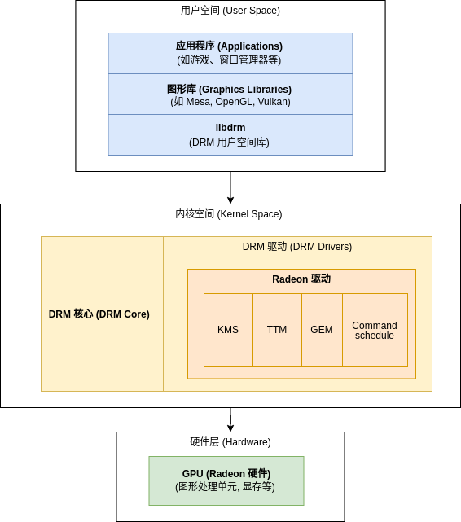

The following document is intended to provide reference guidance for developers adapting other AMD graphics cards to the K1 platform. This article will use the changes we made to the kernel when adapting the Radeon HD7350 graphics card as an example, introducing the key points involved and explaining the reasons and considerations behind these modifications. Whether you are adapting a GPU of the same generation as the HD7350 or another AMD GPU, this document can serve as a reference and guide.

# 1. Introduction
Independent graphics card drivers in the Linux kernel primarily rely on the DRM (Direct Rendering Manager) subsystem, which is a kernel module for managing Graphics Processing Unit (GPU) resources. It is designed to provide a unified interface to support various hardware devices. Independent graphics card drivers typically include the following layers:
- **User Space Interface**: Interacts with user-space graphics libraries (such as Mesa, X.Org, Wayland) through interfaces like ioctl.
- **DRM Core Layer**: Provides the basic framework and common functionalities, such as memory management, scheduling, synchronization, etc.
- **Hardware-Specific Driver Modules**: Implements specific hardware control logic for different manufacturers and models of graphics cards (such as NVIDIA, AMD, Intel, etc).

The main components of DRM include:
- **DRM Core**: Responsible for managing the initialization of graphics card devices, resource allocation, memory management, and communication between user space and kernel space. It provides a common API interface for specific hardware drivers to call.
- **Driver Modules**: For different brands and models of independent graphics cards, the Linux kernel provides corresponding driver modules, such as nouveau (NVIDIA open-source driver), amdgpu (AMD graphics driver), etc. These modules implement specific functions like hardware initialization, instruction set management, interrupt handling, power management, and more.
- **GEM (Graphics Execution Manager)**: Manages graphics memory objects, supporting efficient allocation and sharing of video memory. Through GEM, user-space applications can create and manage graphics buffers, achieving efficient graphics rendering.
- **TTM (Translation Table Maps)**: TTM can serve as the backend for GEM, responsible for mapping and managing the relationship between video memory and system memory. It is mainly used to handle memory pressure and resource allocation strategies.
- **Scheduling and Synchronization**: Graphics card drivers need to effectively manage multi-task scheduling to ensure the efficient execution of each graphics task. Synchronization mechanisms (such as Fence) are used to coordinate the operation order between kernel space and user space, avoiding resource conflicts.
- **Memory Management**: Responsible for the allocation, mapping, and reclamation of video memory, ensuring efficient use of memory resources. Supports zero-copy technology to reduce data transmission overhead between kernel and user space.

radeon Driver Structure Diagram:


# 2. Configuration and Modification

When adapting AMD graphics cards to the K1 platform, modifications and adjustments are often required in areas such as graphics drivers, Device Tree, address mapping, caching strategies, DMA bit width, and interrupt management within the kernel. For RISC-V architecture platforms, these adjustments need to be made with an understanding of RISC-V memory management and PCIe address space mapping mechanisms. This reference document will cover the following aspects:

1. Device Tree parsing and address mapping;
2. Adding write-combining support;
3. Adjusting cache attributes and access permissions;
4. DMA address width adaptation;
5. MSI interrupt support limitations;
6. Linux kernel graphics driver configuration.

### 2.1 Device Tree and Address Mapping

**Device Tree Parsing:**

1. In the Device Tree, the `ranges` property is used to define address mapping relationships, that is, how to map the address space of a child device to the address space of the parent device. This property typically appears in scenarios requiring address translation, such as in external buses or PCIe devices.
2. The `ranges` property of the PCIe root controller's Device Tree node is formatted as a numerical matrix, containing four parts: attributes, PCIe address, CPU address, and address length. Specifically, its format is `<address attribute, PCIe address, CPU address, address length>`.

```c
diff --git a/arch/riscv/boot/dts/spacemit/k1-x.dtsi b/arch/riscv/boot/dts/spacemit/k1-x.dtsi
index 7ea166ca6fb0..fd978a379c37 100644
--- a/arch/riscv/boot/dts/spacemit/k1-x.dtsi
+++ b/arch/riscv/boot/dts/spacemit/k1-x.dtsi
@@ -2198,7 +2198,8 @@ pcie2_rc: pcie@ca800000 {
             #address-cells = <3>;
             #size-cells = <2>;
             ranges = <0x01000000 0x0 0xb7002000 0 0xb7002000 0x0 0x100000>,
-                 <0x02000000 0x0 0xa0000000 0 0xa0000000 0x0 0x17000000>;
+                 <0x42000000 0x0 0xa0000000 0 0xa0000000 0x0 0x10000000>,
+                 <0x02000000 0x0 0xb0000000 0 0xb0000000 0x0 0x7000000>; 
             interconnects = <&dram_range2>;
             interconnect-names = "dma-mem";
```

Before the change:

1. The source address mapped is `0xa0000000`, the target address is also `0xa0000000`, and the size is `0x17000000` (i.e., 368 MB). The address space segment has the MEM attribute.

After the change:

1. First segment: Source address is `0xa0000000`, target address is `0xa0000000`, size is `0x10000000` (i.e., 256 MB). This address space segment has MEM + prefetch attribute.
2. Second segment: Source address is `0xb0000000`, target address is `0xb0000000`, size is `0x7000000` (i.e., 112 MB). This address space segment has the MEM attribute.

By differentiating larger video memory intervals (such as marking a portion as prefetchable), access performance is optimized. Through this change, the address space is divided more rationally, enhancing access performance for specific segments (e.g., prefetch acceleration).

**Tip:**
 On the K1 platform, PCIe2 can utilize an address space size of 384MB, which includes configuration space and BAR space regions. When modifying the Device Tree, you can refer to existing GPU mapping examples, compare the BAR address ranges of different GPU models, and appropriately modify the mapping regions.

### 2.2 Adding wc (write-combining) Support

```c
diff --git a/arch/riscv/include/asm/pci.h b/arch/riscv/include/asm/pci.h
index cc2a184cfc2e..9f6f59aff214 100644
--- a/arch/riscv/include/asm/pci.h
+++ b/arch/riscv/include/asm/pci.h
@@ -27,6 +27,10 @@ static inline int pcibus_to_node(struct pci_bus *bus)
 #endif
 #endif /* defined(CONFIG_PCI) && defined(CONFIG_NUMA) */
 
+#if defined(CONFIG_SOC_SPACEMIT_K1X)
+#define arch_can_pci_mmap_wc() 1
+#endif
+
 /* Generic PCI */
 #include <asm-generic/pci.h>
```

Added write-combining (wc) support to the PCI address space mapping on the K1 platform.

The `write_combine` takes effect when the resource itself has the `IORESOURCE_PREFETCH` flag. Therefore, combined with the Device Tree modifications above, this enables the write-combining mode when mapping PCI resources to user space, thereby improving the efficiency of video memory access.

### 2.3 Adjusting Cache Attributes and Access Permissions

```c
diff --git a/drivers/gpu/drm/radeon/radeon_ttm.c b/drivers/gpu/drm/radeon/radeon_ttm.c
index 4eb83ccc4906..4693119e2412 100644
--- a/drivers/gpu/drm/radeon/radeon_ttm.c
+++ b/drivers/gpu/drm/radeon/radeon_ttm.c
@@ -512,6 +512,8 @@ static struct ttm_tt *radeon_ttm_tt_create(struct ttm_buffer_object *bo,
     else
         caching = ttm_cached;
 
+    caching = ttm_write_combined;
     if (ttm_sg_tt_init(&gtt->ttm, bo, page_flags, caching)) {
         kfree(gtt);
         return NULL;
```

In the `radeon_ttm_tt_create` interface, different cache modes (uncached/write-combined/cached) are originally selected based on `rbo->flags`. The default caching strategy may not be suitable for GPU video memory access patterns. By forcing the use of write-combined, cache consistency can be ensured.

```c
diff --git a/drivers/gpu/drm/ttm/ttm_module.c b/drivers/gpu/drm/ttm/ttm_module.c
index b3fffe7b5062..1319178edf03 100644
--- a/drivers/gpu/drm/ttm/ttm_module.c
+++ b/drivers/gpu/drm/ttm/ttm_module.c
@@ -74,7 +74,8 @@ pgprot_t ttm_prot_from_caching(enum ttm_caching caching, pgprot_t tmp)
 #endif /* CONFIG_UML */
 #endif /* __i386__ || __x86_64__ */
 #if defined(__ia64__) || defined(__arm__) || defined(__aarch64__) || \
-    defined(__powerpc__) || defined(__mips__) || defined(__loongarch__)
+    defined(__powerpc__) || defined(__mips__) || defined(__loongarch__) \
+    || defined(__riscv)
     if (caching == ttm_write_combined)
         tmp = pgprot_writecombine(tmp);
     else
```

Introduced RISC-V architecture support in the `ttm_prot_from_caching` function. When `caching = ttm_write_combined`, the corresponding page table attributes are set to write-combining mode. On the RISC-V platform, when the cache attribute is set to write-combining, the corresponding PTEs can correctly set the attributes to non-cached or write-combining.

### 2.4 Adjusting DMA Address Width (dma_bits)

```c
diff --git a/drivers/gpu/drm/radeon/radeon_device.c b/drivers/gpu/drm/radeon/radeon_device.c
index afbb3a80c0c6..42e6510eccf0 100644
--- a/drivers/gpu/drm/radeon/radeon_device.c
+++ b/drivers/gpu/drm/radeon/radeon_device.c
@@ -1361,7 +1361,7 @@ int radeon_device_init(struct radeon_device *rdev,
      * AGP - generally dma32 is safest
      * PCI - dma32 for legacy pci gart, 40 bits on newer asics
      */
-    dma_bits = 40;
+    dma_bits = 32;
     if (rdev->flags & RADEON_IS_AGP)
         dma_bits = 32;
     if ((rdev->flags & RADEON_IS_PCI) &&
```

Set `dma_bits` during driver initialization. The original code sets `dma_bits = 40`, indicating that the GPU can access up to 1TB of memory. Based on actual requirements, it was changed to `dma_bits = 32`, limiting the memory range to 4GB. Reducing the DMA bit width from 40 bits to 32 bits enhances stability.

For other AMD graphics cards, if the GPU itself does not need to access very large physical memory spaces, you can adjust `dma_bits` accordingly to ensure the device operates correctly.

### 2.5 MSI Interrupt Adaptation

```c
diff --git a/drivers/gpu/drm/radeon/radeon_irq_kms.c b/drivers/gpu/drm/radeon/radeon_irq_kms.c
index c4dda908666c..f540529909d3 100644
--- a/drivers/gpu/drm/radeon/radeon_irq_kms.c
+++ b/drivers/gpu/drm/radeon/radeon_irq_kms.c
@@ -244,6 +244,10 @@ static bool radeon_msi_ok(struct radeon_device *rdev)
     /* MSIs don't work on AGP */
     if (rdev->flags & RADEON_IS_AGP)
         return false;
+#if IS_ENABLED(CONFIG_SOC_SPACEMIT_K1X)
+       /* Chips <= GCN1 cannot get MSI to work on K1 */
+       return false;
+#endif
 
     /*
      * Older chips have a HW limitation, they can only generate 40 bits
```

On the K1 platform, using MSI interrupts with certain older architecture GPUs may cause interrupts to fail to trigger correctly. Disabling MSI can revert to traditional interrupt modes, ensuring the system operates stably.

**Tips:**

- If your GPU cannot trigger interrupts or if the system experiences abnormal interrupts after inserting the GPU, try disabling MSI.
- Only disable MSI when necessary. If the platform supports MSI, enabling it usually provides better performance and lower latency.

### 2.6 Enabling Graphics Driver Configuration

```c
diff --git a/arch/riscv/configs/k1_defconfig b/arch/riscv/configs/k1_defconfig
index 1e14a4a5c4f7..58dfdf05bfce 100644
--- a/arch/riscv/configs/k1_defconfig
+++ b/arch/riscv/configs/k1_defconfig
@@ -881,6 +881,8 @@ CONFIG_SPACEMIT_K1X_SENSOR_V2=y
 # CONFIG_DVB_CXD2099 is not set
 # CONFIG_DVB_SP2 is not set
 # CONFIG_DRM_DEBUG_MODESET_LOCK is not set
+CONFIG_DRM_RADEON=m
+CONFIG_DRM_RADEON_USERPTR=y
 CONFIG_DRM_SPACEMIT=y
 CONFIG_SPACEMIT_MIPI_PANEL=y
 CONFIG_SPACEMIT_HDMI=y
```

Enable the corresponding graphics driver configuration in the Linux kernel, setting it to `Y` (built-in) or `m` (compiled as a module) in `make menuconfig`.

Currently, the K1 platform supports the Radeon driver (corresponding to AMD graphics cards with architectures prior to GCN 1.0). For newer AMD graphics cards, including those with GCN 1.0 and later architectures (such as Radeon Rx series and higher-end graphics cards), the amdgpu driver needs to be adapted. After modifying the driver code, ensure the corresponding driver configuration is enabled.