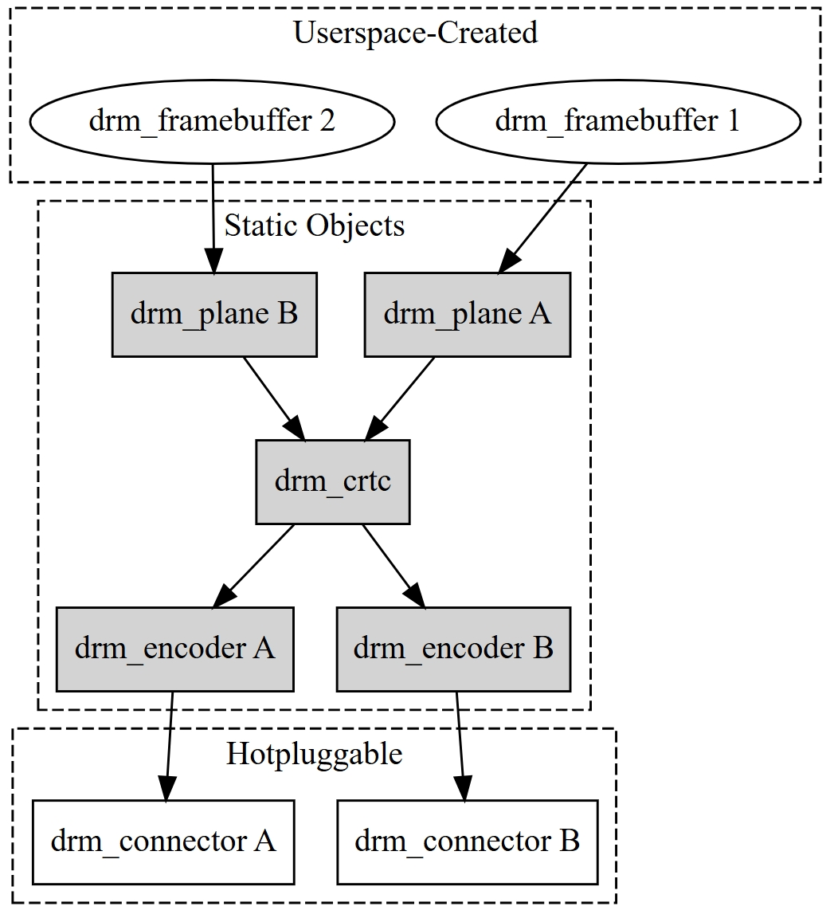

# Spacemit Display  Panel Driver Use Cases
This document introduces the Spacemit platform MIPI & HDMI panel driver use cases and debugging methods for U-Boot and kernel.
## Module Introduction
The Display module of the spacemit platform uses the DRM framework, which stands for Direct Rendering Manager. DRM is the mainstream display framework in the Linux system, tailored to the characteristics of current display hardware.


## Uboot panel porting guide
### Source Code Structure
Spacemit platform U-Boot display driver source code structure:
```
uboot-2022.10/drivers/video$ tree spacemit
spacemit
├── dsi
│   ├── drv
│   │   ├── spacemit_dphy.c
│   │   ├── spacemit_dphy.h
│   │   ├── spacemit_dsi_common.c
│   │   ├── spacemit_dsi_drv.c
│   │   ├── spacemit_dsi_drv.h
│   │   └── spacemit_dsi_hw.h
│   ├── include
│   │   ├── spacemit_dsi_common.h
│   │   └── spacemit_video_tx.h
│   ├── Makefile
│   └── video
│       ├── lcd                                               // panel Configuration
│       │   ├── lcd_ft8201sinx101.c
│       │   ├── lcd_gx09inx101.c
│       │   ├── lcd_icnl9911c.c
│       │   ├── lcd_icnl9951r.c
│       │   ├── lcd_jd9365dah3.c
│       │   └── lcd_lt8911ext_edp_1080p.c
│       ├── spacemit_mipi_port.c
│       └── spacemit_video_tx.c
├── Kconfig
├── Makefile
├── spacemit_dpu.c
├── spacemit_dpu.h
├── spacemit_edp.c
├── spacemit_hdmi.c
├── spacemit_hdmi.h
├── spacemit_mipi.c
└── spacemit_mipi.h
```
### Configuration
#### CONFIG Configuration
Execute `make uboot-menuconfig` and navigate to `Device Drivers -> Graphics support`. Enable the following configurations (enabled by default)。
```
Device Drivers  --->
  Graphics support  --->
     <*> Enable SPACEMIT Video Suppor
     <*>    HDMI port
     <*>    MIPI Port
     <*>        EDP Port
```
#### HDMI DTS Configuration
Configure the device tree related to HDMI
```c
//uboot-2022.10/arch/riscv/dts/k1-x_deb1.dts
&dpu {
	status = "okay";
};

&hdmi {
	pinctrl-names = "default";
	pinctrl-0 = <&pinctrl_hdmi_0>;          //pinctrl
	status = "okay";
};
```
#### DSI DTS Configuration
##### MIPI DSI
###### Gpio
MIPI DSI panel GPIO configuration, including panel reset GPIO and panel power control GPIO.
Taking the k1-x_deb1 scheme as an example: gpio81 is configured as the panel reset pin, and gpio82 and gpio83 are configured as the panel power control pins.
```c
//uboot-2022.10/arch/riscv/dts/k1-x_deb1.dts
&dpu {
	status = "okay";
};

&mipi_dsi {
        status = "okay";
};

&panel {
        dcp-gpios = <&gpio 82 0>;          // Panel power control GPIO
        dcn-gpios = <&gpio 83 0>;          // Panel power control GPIO
        backlight = <&backlight>;
        reset-gpios = <&gpio 81 0>;        // Panel reset GPIO
        status = "okay";
};
```
###### DSI Power Configuration
MIPI DSI power configuration, including the MIPI DSI 1.2V power control configuration.
Taking the k1-x_deb1 scheme as an example:  PMIC LDO_5 is configured for MIPI DSI 1.2V.
```c
//uboot-2022.10/arch/riscv/dts/k1-x_spm8821.dtsi
                    /* dldo */
        ldo_27: LDO_REG5 {
                regulator-name = "ldo5";
                regulator-min-microvolt = <500000>;
                regulator-max-microvolt = <3400000>;
                regulator-state-mem {
                        regulator-off-in-suspend;
                };
        };

//uboot-2022.10/arch/riscv/dts/k1-x_deb1.dts
&ldo_27 {
    regulator-init-microvolt = <1200000>;
    regulator-boot-on;
    regulator-state-mem {
                    regulator-off-in-suspend;
    };
};
```
###### PWM
Control the backlight brightness via PWM.
```
&pwm14 {
	pinctrl-names = "default";
	pinctrl-0 = <&pinctrl_pwm14_1>;
	status = "okay";
};

&backlight {
	pwms = <&pwm14 0 2000>;
	default-brightness-level = <6>;
	status = "okay";
};
```
#### display timing Configure

Pixel Clock Calculation:\
**pixel clock** = htotal * vtotal * fps = (hactive + hfp + hbp + hsync) * (vactive + vfp + vbp + vsync) * fps\
**Bit clock**: Data transmission clock frequency per lane in the MIPI DSI data transmission process.\
Bit clock Calculation：\
**bit clock** = ((htotal * vtotal * fps * bpp) / lane bumber) * 1.1 = (((hactive + hfp + hbp + hsync) * (vactive + vfp + vbp + vsync) * fps * bpp) / lane bumber) * 1.1\
**DSI clock**: Actual clock signal on the MIPI DSI clock lane.  Uses dual-edge sampling; one clock cycle transmits two bits of data.\
**dsi clock** = bit clock / 2\
**Note**： The Spacemit platform requires multiplying the calculated MIPI DSI bit clock by a factor of 1.1.\
Using the MIPI DSI panel model `lcd_gx09inx101_mipi` as an example, this section describes how to configure the MIPI DSI DPU timing and MIPI DSI DPHY timing.\
**pixel clock** = (hactive + hfp + hbp + hsync) * (vactive + vfp + vbp + vsync) * fps = （1200 + 50 + 40 + 10）* (1920 + 20 + 16 + 4) * 60 = 152880000 HZ\
**bit clock** = (((hactive + hfp + hbp + hsync) * (vactive + vfp + vbp + vsync) * fps * bpp) / lane bumber) * 1.1 = (（（1200 + 50 + 40 + 10）* (1920 + 20 + 16 + 4) * 60 * 24）/ 4) * 1.1 = 1009008000 HZ\
Based on the display timing calculations, the pixel clock is 152,880,000 Hz (system configurable to 153,000,000 Hz), and the bit clock is 1,009,008,000 Hz (system configurable to 1,000,000,000 Hz).  In the DTS file, `clock-frequency` is set to 153,000,000, and `spacemit-dpu-bitclk` and `phy-bit-clock` are set to 1,000,000,000.
```c
// uboot-2022.10/drivers/video/spacemit/dsi/video/lcd/lcd_gx09inx101.c
struct spacemit_mode_modeinfo gx09inx101_spacemit_modelist[] = {
        {
                .name = "1200x1920-60",
                .refresh = 60,                //fps
                .xres = 1200,                 // width in pixels
                .yres = 1920,                 // height in pixels
                .real_xres = 1200,
                .real_yres = 1920,
                .left_margin = 40,            //hbp (Horizontal Back Porch)
                .right_margin = 80,           //hfp (Horizontal Front Porch)
                .hsync_len = 10,              //hsync (Horizontal Sync)
                .upper_margin = 16,           //vbp (Vertical Back Porch)
                .lower_margin = 20,           //vfp (Vertical Front Porch)
                .vsync_len = 4,               //vsync (Vertical Sync)
                .hsync_invert = 0,
                .vsync_invert = 0,
                .invert_pixclock = 0,
                .pixclock_freq = 153*1000,    // Pixel Clock frequency in Hz
                .pix_fmt_out = OUTFMT_RGB888,
                .width = 142,                 // Physical display width (unit unspecified)
                .height = 228,                // Physical display height (unit unspecified)
        },
};

struct spacemit_mipi_info gx09inx101_mipi_info = {
        .height = 1920,    // Display height in pixels
        .width = 1200,     // Display width in pixels
        .hfp = 80,         // Horizontal Front Porch in pixels
        .hbp = 40,         // Horizontal Back Porch in pixels
        .hsync = 10,       // Horizontal Sync pulse width in pixels
        .vfp = 20,         // Vertical Front Porch in pixels
        .vbp = 16,         // Vertical Back Porch in pixels
        .vsync = 4,        // Vertical Sync pulse width in pixels
        .fps = 60,         // Frames per second

        .work_mode = SPACEMIT_DSI_MODE_VIDEO,   // DSI operating mode: video mode
        .rgb_mode = DSI_INPUT_DATA_RGB_MODE_888,// MIPI DSI data format: RGB888
        .lane_number = 4,                       // Number of MIPI DSI lanes
        .phy_bit_clock = 1000000000,             // MIPI DSI PHY bit clock frequency in Hz
        .phy_esc_clock = 51200000,              // MIPI DSI PHY escape clock frequency in Hz
        .split_enable = 0,                      // DSI split mode disabled
        .eotp_enable = 0,                       // DSI EOTP (End Of Transmission Packet) disabled

        .burst_mode = DSI_BURST_MODE_BURST,     // DSI burst mode enabled
};
```
A previously functional MIPI DSI panel has been debugged, and its associated C files are located in the `lcd` directory.
```
uboot-2022.10/drivers/video/spacemit/dsi/video$ tree lcd
lcd
├── lcd_ft8201sinx101.c
├── lcd_gx09inx101.c
├── lcd_icnl9911c.c
├── lcd_icnl9951r.c
├── lcd_jd9365dah3.c
└── lcd_lt8911ext_edp_1080p.c
```
### Adding A New MIPI Panel Configuration Example
Using `lcd_gx09inx101` as an example:
1. Create a new file named `lcd_gx09inx101.c` in the directory `/uboot-2022.10/drivers/video/spacemit/dsi/video/lcd/`.
```c
/ SPDX-License-Identifier: GPL-2.0
/*
 * Copyright (C) 2023 Spacemit Co., Ltd.
 *
 */

#include <linux/kernel.h>
#include "../../include/spacemit_dsi_common.h"
#include "../../include/spacemit_video_tx.h"
#include <linux/delay.h>

#define UNLOCK_DELAY 0

struct spacemit_mode_modeinfo gx09inx101_spacemit_modelist[] = {
        {
                .name = "1200x1920-60",
                .refresh = 60,
                .xres = 1200,
                .yres = 1920,
                .real_xres = 1200,
                .real_yres = 1920,
                .left_margin = 40,
                .right_margin = 80,
                .hsync_len = 10,
                .upper_margin = 16,
                .lower_margin = 20,
                .vsync_len = 4,
                .hsync_invert = 0,
                .vsync_invert = 0,
                .invert_pixclock = 0,
                .pixclock_freq = 153*1000,
                .pix_fmt_out = OUTFMT_RGB888,
                .width = 142,
                .height = 228,
        },
};

struct spacemit_mipi_info gx09inx101_mipi_info = {
        .height = 1920,
        .width = 1200,
        .hfp = 80, /* unit: pixel */
        .hbp = 40,
        .hsync = 10,
        .vfp = 20, /* unit: line */
        .vbp = 16,
        .vsync = 4,
        .fps = 60,

        .work_mode = SPACEMIT_DSI_MODE_VIDEO, /*command_mode, video_mode*/
        .rgb_mode = DSI_INPUT_DATA_RGB_MODE_888,
        .lane_number = 4,
        .phy_bit_clock = 1000000000,
        .phy_esc_clock = 51200000,
        .split_enable = 0,
        .eotp_enable = 0,

        .burst_mode = DSI_BURST_MODE_BURST,
};

static struct spacemit_dsi_cmd_desc gx09inx101_set_id_cmds[] = {
        {SPACEMIT_DSI_SET_MAX_PKT_SIZE, SPACEMIT_DSI_LP_MODE, UNLOCK_DELAY, 1, {0x01}},
};

static struct spacemit_dsi_cmd_desc gx09inx101_read_id_cmds[] = {
        {SPACEMIT_DSI_GENERIC_READ1, SPACEMIT_DSI_LP_MODE, UNLOCK_DELAY, 1, {0xfb}},
};

static struct spacemit_dsi_cmd_desc gx09inx101_set_power_cmds[] = {
        {SPACEMIT_DSI_SET_MAX_PKT_SIZE, SPACEMIT_DSI_HS_MODE, UNLOCK_DELAY, 1, {0x1}},
};

static struct spacemit_dsi_cmd_desc gx09inx101_read_power_cmds[] = {
        {SPACEMIT_DSI_GENERIC_READ1, SPACEMIT_DSI_HS_MODE, UNLOCK_DELAY, 1, {0xA}},
};

static struct spacemit_dsi_cmd_desc gx09inx101_init_cmds[] = {
        //8279 + INX10.1
        {SPACEMIT_DSI_DCS_LWRITE, SPACEMIT_DSI_LP_MODE, 0,   2, {0xB0,0x01}},
        {SPACEMIT_DSI_DCS_LWRITE, SPACEMIT_DSI_LP_MODE, 0,   2, {0xC3,0x4F}},
        {SPACEMIT_DSI_DCS_LWRITE, SPACEMIT_DSI_LP_MODE, 0,   2, {0xC4,0x40}},
        {SPACEMIT_DSI_DCS_LWRITE, SPACEMIT_DSI_LP_MODE, 0,   2, {0xC5,0x40}},
        {SPACEMIT_DSI_DCS_LWRITE, SPACEMIT_DSI_LP_MODE, 0,   2, {0xC6,0x40}},
        {SPACEMIT_DSI_DCS_LWRITE, SPACEMIT_DSI_LP_MODE, 0,   2, {0xC7,0x40}},
        {SPACEMIT_DSI_DCS_LWRITE, SPACEMIT_DSI_LP_MODE, 0,   2, {0xC8,0x4D}},
        {SPACEMIT_DSI_DCS_LWRITE, SPACEMIT_DSI_LP_MODE, 0,   2, {0xC9,0x52}},
        {SPACEMIT_DSI_DCS_LWRITE, SPACEMIT_DSI_LP_MODE, 0,   2, {0xCA,0x51}},
        {SPACEMIT_DSI_DCS_LWRITE, SPACEMIT_DSI_LP_MODE, 0,   2, {0xCD,0x5D}},
        {SPACEMIT_DSI_DCS_LWRITE, SPACEMIT_DSI_LP_MODE, 0,   2, {0xCE,0x5B}},
        {SPACEMIT_DSI_DCS_LWRITE, SPACEMIT_DSI_LP_MODE, 0,   2, {0xCF,0x4B}},
        {SPACEMIT_DSI_DCS_LWRITE, SPACEMIT_DSI_LP_MODE, 0,   2, {0xD0,0x49}},

		·······

        {SPACEMIT_DSI_DCS_LWRITE, SPACEMIT_DSI_LP_MODE, 0,   2, {0xDA,0x19}},
        {SPACEMIT_DSI_DCS_LWRITE, SPACEMIT_DSI_LP_MODE, 0,   2, {0xDB,0x17}},
        {SPACEMIT_DSI_DCS_LWRITE, SPACEMIT_DSI_LP_MODE, 0,   2, {0xDC,0x17}},
        {SPACEMIT_DSI_DCS_LWRITE, SPACEMIT_DSI_LP_MODE, 0,   2, {0xDD,0x18}},
        {SPACEMIT_DSI_DCS_LWRITE, SPACEMIT_DSI_LP_MODE, 0,   2, {0xDE,0x1A}},
        {SPACEMIT_DSI_DCS_LWRITE, SPACEMIT_DSI_LP_MODE, 0,   2, {0xDF,0x1E}},
        {SPACEMIT_DSI_DCS_LWRITE, SPACEMIT_DSI_LP_MODE, 0,   2, {0xE0,0x20}},
        {SPACEMIT_DSI_DCS_LWRITE, SPACEMIT_DSI_LP_MODE, 0,   2, {0xE1,0x23}},
        {SPACEMIT_DSI_DCS_LWRITE, SPACEMIT_DSI_LP_MODE, 0,   2, {0xE2,0x07}},
        {SPACEMIT_DSI_DCS_LWRITE, SPACEMIT_DSI_LP_MODE, 200, 2, {0x11, 0x00}},
        {SPACEMIT_DSI_DCS_LWRITE, SPACEMIT_DSI_LP_MODE,  50, 2, {0x29, 0x00}},
};

static struct spacemit_dsi_cmd_desc gx09inx101_sleep_out_cmds[] = {
        {SPACEMIT_DSI_DCS_SWRITE,SPACEMIT_DSI_LP_MODE,200,1,{0x11}},
        {SPACEMIT_DSI_DCS_SWRITE,SPACEMIT_DSI_LP_MODE,50,1,{0x29}},
};

static struct spacemit_dsi_cmd_desc gx09inx101_sleep_in_cmds[] = {
        {SPACEMIT_DSI_DCS_SWRITE,SPACEMIT_DSI_LP_MODE,50,1,{0x28}},
        {SPACEMIT_DSI_DCS_SWRITE,SPACEMIT_DSI_LP_MODE,200,1,{0x10}},
};


struct lcd_mipi_panel_info lcd_gx09inx101 = {
        .lcd_name = "gx09inx101",
        .lcd_id = 0x8279,
        .panel_id0 = 0x1,
        .power_value = 0x14,
        .panel_type = LCD_MIPI,
        .width_mm = 142,
        .height_mm = 228,
        .dft_pwm_bl = 128,
        .set_id_cmds_num = ARRAY_SIZE(gx09inx101_set_id_cmds),
        .read_id_cmds_num = ARRAY_SIZE(gx09inx101_read_id_cmds),
        .init_cmds_num = ARRAY_SIZE(gx09inx101_init_cmds),
        .set_power_cmds_num = ARRAY_SIZE(gx09inx101_set_power_cmds),
        .read_power_cmds_num = ARRAY_SIZE(gx09inx101_read_power_cmds),
        .sleep_out_cmds_num = ARRAY_SIZE(gx09inx101_sleep_out_cmds),
        .sleep_in_cmds_num = ARRAY_SIZE(gx09inx101_sleep_in_cmds),
        //.drm_modeinfo = gx09inx101_modelist,
        .spacemit_modeinfo = gx09inx101_spacemit_modelist,
        .mipi_info = &gx09inx101_mipi_info,
        .set_id_cmds = gx09inx101_set_id_cmds,
        .read_id_cmds = gx09inx101_read_id_cmds,
        .set_power_cmds = gx09inx101_set_power_cmds,
        .read_power_cmds = gx09inx101_read_power_cmds,
        .init_cmds = gx09inx101_init_cmds,
        .sleep_out_cmds = gx09inx101_sleep_out_cmds,
        .sleep_in_cmds = gx09inx101_sleep_in_cmds,
        .bitclk_sel = 3,
        .bitclk_div = 1,
        .pxclk_sel = 2,
        .pxclk_div = 6,
};

int lcd_gx09inx101_init(void)
{
        int ret;

        ret = lcd_mipi_register_panel(&lcd_gx09inx101);
        return ret;
}
```
The following items are configured based on the screen-related information.\
initial-cmd:
```c
static struct spacemit_dsi_cmd_desc gx09inx101_init_cmds[] = {
        //8279 + INX10.1
        {SPACEMIT_DSI_DCS_LWRITE, SPACEMIT_DSI_LP_MODE, 0,   2, {0xB0,0x01}},
        {SPACEMIT_DSI_DCS_LWRITE, SPACEMIT_DSI_LP_MODE, 0,   2, {0xC3,0x4F}},
        {SPACEMIT_DSI_DCS_LWRITE, SPACEMIT_DSI_LP_MODE, 0,   2, {0xC4,0x40}},
        {SPACEMIT_DSI_DCS_LWRITE, SPACEMIT_DSI_LP_MODE, 0,   2, {0xC5,0x40}},
        {SPACEMIT_DSI_DCS_LWRITE, SPACEMIT_DSI_LP_MODE, 0,   2, {0xC6,0x40}},
        {SPACEMIT_DSI_DCS_LWRITE, SPACEMIT_DSI_LP_MODE, 0,   2, {0xC7,0x40}},
        {SPACEMIT_DSI_DCS_LWRITE, SPACEMIT_DSI_LP_MODE, 0,   2, {0xC8,0x4D}},
        {SPACEMIT_DSI_DCS_LWRITE, SPACEMIT_DSI_LP_MODE, 0,   2, {0xC9,0x52}},
        {SPACEMIT_DSI_DCS_LWRITE, SPACEMIT_DSI_LP_MODE, 0,   2, {0xCA,0x51}},
        {SPACEMIT_DSI_DCS_LWRITE, SPACEMIT_DSI_LP_MODE, 0,   2, {0xCD,0x5D}},
        {SPACEMIT_DSI_DCS_LWRITE, SPACEMIT_DSI_LP_MODE, 0,   2, {0xCE,0x5B}},
        {SPACEMIT_DSI_DCS_LWRITE, SPACEMIT_DSI_LP_MODE, 0,   2, {0xCF,0x4B}},
        {SPACEMIT_DSI_DCS_LWRITE, SPACEMIT_DSI_LP_MODE, 0,   2, {0xD0,0x49}},

		·······

        {SPACEMIT_DSI_DCS_LWRITE, SPACEMIT_DSI_LP_MODE, 0,   2, {0xDA,0x19}},
        {SPACEMIT_DSI_DCS_LWRITE, SPACEMIT_DSI_LP_MODE, 0,   2, {0xDB,0x17}},
        {SPACEMIT_DSI_DCS_LWRITE, SPACEMIT_DSI_LP_MODE, 0,   2, {0xDC,0x17}},
        {SPACEMIT_DSI_DCS_LWRITE, SPACEMIT_DSI_LP_MODE, 0,   2, {0xDD,0x18}},
        {SPACEMIT_DSI_DCS_LWRITE, SPACEMIT_DSI_LP_MODE, 0,   2, {0xDE,0x1A}},
        {SPACEMIT_DSI_DCS_LWRITE, SPACEMIT_DSI_LP_MODE, 0,   2, {0xDF,0x1E}},
        {SPACEMIT_DSI_DCS_LWRITE, SPACEMIT_DSI_LP_MODE, 0,   2, {0xE0,0x20}},
        {SPACEMIT_DSI_DCS_LWRITE, SPACEMIT_DSI_LP_MODE, 0,   2, {0xE1,0x23}},
        {SPACEMIT_DSI_DCS_LWRITE, SPACEMIT_DSI_LP_MODE, 0,   2, {0xE2,0x07}},
        {SPACEMIT_DSI_DCS_LWRITE, SPACEMIT_DSI_LP_MODE, 200, 2, {0x11, 0x00}},
        {SPACEMIT_DSI_DCS_LWRITE, SPACEMIT_DSI_LP_MODE,  50, 2, {0x29, 0x00}},
};
```
Reading the Panel ID via configuration of read id
```c
//uboot-2022.10/drivers/video/spacemit/dsi/video/lcd/lcd_gx09inx101.c
static struct spacemit_dsi_cmd_desc gx09inx101_read_id_cmds[] = {
        {SPACEMIT_DSI_GENERIC_READ1, SPACEMIT_DSI_LP_MODE, UNLOCK_DELAY, 1, {0xfb}},
};
```
The expected value from the 0xFB register should be 0x1.
```c
//uboot-2022.10/drivers/video/spacemit/dsi/video/lcd/lcd_gx09inx101.c
struct lcd_mipi_panel_info lcd_gx09inx101 = {
        .lcd_name = "gx09inx101",
        .panel_id0 = 0x1,
```
Reading the power_value for ESD check\
For lcd_gx09inx10, read the 0xA register for the ESD check. The power register to be read may vary depending on the panel. Configure it based on the actual situation.
```
//uboot-2022.10/drivers/video/spacemit/dsi/video/lcd/lcd_gx09inx101.c
static struct spacemit_dsi_cmd_desc gx09inx101_read_power_cmds[] = {
        {SPACEMIT_DSI_GENERIC_READ1, SPACEMIT_DSI_HS_MODE, UNLOCK_DELAY, 1, {0xA}},
};
```
power_value: The expected value to be read from the 0xA register. 
```c
//uboot-2022.10/drivers/video/spacemit/dsi/video/lcd/lcd_gx09inx101.c
struct lcd_mipi_panel_info lcd_gx09inx101 = {

        .power_value = 0x10,
```

2. Makefile Modification
```c
//uboot-2022.10/drivers/video/spacemit/dsi/Makefile
# SPDX-License-Identifier: GPL-2.0

obj-y += video/spacemit_video_tx.o \
        video/spacemit_mipi_port.o \
        drv/spacemit_dphy.o \
        drv/spacemit_dsi_common.o \
        drv/spacemit_dsi_drv.o

obj-y += video/lcd/lcd_icnl9911c.o
obj-y += video/lcd/lcd_icnl9951r.o
obj-y += video/lcd/lcd_jd9365dah3.o
obj-y += video/lcd/lcd_gx09inx101.o
obj-y += video/lcd/lcd_lt8911ext_edp_1080p.o
```
3. Modify spacemit_dsi_common.h
```c
//uboot-2022.10/drivers/video/spacemit/dsi/include/spacemit_dsi_common.h
int lcd_icnl9911c_init(void);
int lcd_icnl9951r_init(void);
int lcd_gx09inx101_init(void);    // Added declaration for the new driver's init function
int lcd_jd9365dah3_init(void);
int lcd_lt8911ext_edp_1080p_init(void);
```
4. Modify spacemit_mipi_port.c
```c
//uboot-2022.10/drivers/video/spacemit/dsi/video/spacemit_mipi_port.c

if (strcmp("lt8911ext_edp_1080p", priv->panel_name) == 0) {
        tx_device_client.panel_type = LCD_EDP;
        tx_device.panel_type = tx_device_client.panel_type;
        lcd_lt8911ext_edp_1080p_init();
    } else if(strcmp("icnl9951r", priv->panel_name) == 0) {
        tx_device_client.panel_type = LCD_MIPI;
        tx_device.panel_type = tx_device_client.panel_type;
        lcd_icnl9951r_init();
    } else if(strcmp("jd9365dah3", priv->panel_name) == 0) {
        tx_device_client.panel_type = LCD_MIPI;
        tx_device.panel_type = tx_device_client.panel_type;
        lcd_jd9365dah3_init();
    } else {
        // lcd_icnl9911c_init();
        lcd_gx09inx101_init();          // Add gx09inx101 panel support; see the above three for adding other panels.
    }
```
### U-Boot startup logs
```
[   0.842] Found device 'mipi@d421a800', disp_uc_priv=000000007deb1aa0
            //   read id 
            //   struct lcd_mipi_panel_info lcd_gx09inx101.id0 Configuration
[   1.001] read panel id OK: read value = 0x1, 0x0, 0x0
[   1.003] Panel is gx09inx101
[   1.260] fb=7f700000, size=1200x1920
```
## Kernel panel porting guide
Reference for the functionality and usage of the Display module on the SpaceMIT platform:[spacemit platform display](https://bianbu-linux.spacemit.com/en/device/peripheral_driver/Display/)

### 2.1. HDMI configuration
HDMI configuration for the k1-x_deb1 solution

```c
// linux-6.6\arch\riscv\boot\dts\spacemit\k1-x_deb1.dts
&dpu_online2_hdmi {
	memory-region = <&dpu_resv>;
	status = "okay";
};

&hdmi{
	pinctrl-names = "default";
	pinctrl-0 = <&pinctrl_hdmi_0>;
	status = "okay";
};
```

### MIPI DSI panel configuration example.
During the kernel stage, MIPI screen debugging requires:
1. Configuring power supply and GPIO in the DTS based on the hardware schematic, providing appropriate enable voltages and power supplies for the LCD and DSI modules.
2. Creating a new DTSI file for the MIPI screen.
3. Configuring the appropriate clock (including front porch, back porch, resolution, and calculated pixel clock and bit clock), initial commands, and read ID commands in the DTSI based on the MIPI screen's datasheet, timing information, and the main control chip provided by the screen supplier.
4. Associating the MIPI panel with the corresponding solution.
Taking `lcd_jd9365dah3_mipi` as an example: The k1-x_MUSE-Paper-mini-4g solution uses `lcd_jd9365dah3_mipi` as its display screen.  The MIPI DSI-related portion of the DTS is shown below:
#### 1. k1-x_MUSE-Paper-mini-4g Solution
```
//linux-6.6/arch/riscv/boot/dts/spacemit/k1-x_MUSE-Paper-mini-4g.dts
#include "lcd/lcd_jd9365dah3_mipi.dtsi"
#include "k1-x-lcd.dtsi"
#include "k1-x-hdmi.dtsi"

............
&dpu_online2_dsi {
        memory-region = <&dpu_resv>;
        spacemit-dpu-bitclk = <500000000>;
        dsi_1v2-supply = <&ldo_5>;
        dsi_1v8-supply = <&ldo_11>;
        vin-supply-names = "dsi_1v2",
        status = "okay";
};

&dsi2 {
        status = "okay";

        panel2: panel2@0 {
                status = "okay";
                compatible = "spacemit,mipi-panel2";
                reg = <0>;

                gpios-reset = <30>;
                gpios-dc = <34 42>;
                gpios-avdd = <35 36>;
                gpios-bl = <31>;
                id = <2>;
                delay-after-reset = <10>;
                force-attached = "lcd_jd9365dah3_mipi";
        };
};

&lcds {
        status = "okay";
};

&pwm14 {
        pinctrl-names = "default";
        pinctrl-0 = <&pinctrl_pwm14_1>;
        status = "okay";
};

&pwm_bl {
        pwms = <&pwm14 2000>;
        brightness-levels = <
                0   20  20  20  21  21  21  22  22  22  23  23  23  24  24  24
                25  25  25  26  26  26  27  27  27  28  28  29  29  30  30  31
                32  33  34  35  36  37  38  39  40  41  42  43  44  45  46  47
                48  49  50  51  52  53  54  55  56  57  58  59  60  61  62  63
                64  65  66  67  68  69  70  71  72  73  74  75  76  77  78  79
                80  81  82  83  84  85  86  87  88  89  90  91  92  93  94  95
                96  97  98  99  100 101 102 103 104 105 106 107 108 109 110 111
                112 113 114 115 116 117 118 119 120 121 122 123 124 125 126 127
                128 129 130 131 132 133 134 135 136 137 138 139 140 141 142 143
                144 145 146 147 148 149 150 151 152 153 154 155 156 157 158 159
                160 161 162 163 164 165 166 167 168 169 170 171 172 173 174 175
                176 177 178 179 180 181 182 183 184 185 186 187 188 189 190 191
                192 193 194 195 196 197 198 199 200 201 202 203 204 205 206 207
                208 209 210 211 212 213 214 215 216 217 218 219 220 221 222 223
                224 225 226 227 228 229 230 231 232 233 234 235 236 237 238 239
                240 241 242 243 244 245 246 247 248 249 250 251 252 253 254 255
        >;
        default-brightness-level = <50>;
        status = "okay";
};
............
```
##### DSI Power Supply
According to the schematic:

The DSI requires AVDD1.8 and AVDD1.2 power supplies.

  - AVDD1.8_DSI is powered by BUCK3_1V8 by default and does not require control.
  - AVDD1.2_DSI is powered by DLDO1_1V1.
```
dsi_1v2-supply = <&ldo_5>;		//dldo1
vin-supply-names = "dsi_1v2"
```
##### MIPI Screen Power Supply
For this solution, the MIPI interface configuration, based on the schematic, requires configuring GPIO, LDO, and PWM.  The configuration is determined by the schematic. For example, the panel gx09inx101 described in the U-Boot documentation does not require LDO power.
###### GPIO
GPIOs requiring control:

  - dcp-gpios = gpio 34;
  - dcn-gpios = gpio 42 ;
  - avee-gpios = gpio 35;
  - avdd-gpios = gpio 36;
  - enable-gpios = gpio 31;
  - reset-gpios = gpio 30;

```
	gpios-reset = <30>;
	gpios-dc = <34 42>;
	gpios-avdd = <35 36>;
	gpios-bl = <31>;
```
###### Ldo
```
si_1v8-supply = <&ldo_11>;
vin-supply-names = "dsi_1v2", "dsi_1v8";
```

###### Pwm
According to the schematic, LCD_BL_PWM_1V8 can be powered not only through GPIO44 but also by controlling PWM14. This solution uses PWM for power supply, corresponding to the device tree.
```
&pwm14 {
        pinctrl-names = "default";
        pinctrl-0 = <&pinctrl_pwm14_1>;
        status = "okay";
};
```
#### 2. panel Configuration: lcd_jd9365dah3_mipi.dtsi
Create a new file named `lcd_jd9365dah3_mipi.dtsi` in the path `linux-6.6/arch/riscv/boot/dts/spacemit/lcd/`.
```
// SPDX-License-Identifier: GPL-2.0

/ { lcds: lcds {
        lcd_jd9365dah3_mipi: lcd_jd9365dah3_mipi {
                dsi-work-mode = <1>;
                dsi-lane-number = <4>;
                dsi-color-format = "rgb888";
                width-mm = <108>;
                height-mm = <172>;
                use-dcs-write;

                /*mipi info*/
                height = <1280>;
                width = <800>;
                hfp = <40>;
                hbp = <20>;
                hsync = <20>;
                vfp = <20>;
                vbp = <8>;
                vsync = <4>;
                fps = <60>;
                work-mode = <0>;
                rgb-mode = <3>;
                lane-number = <4>;
                phy-bit-clock = <500000000>;
                split-enable = <0>;
                eotp-enable = <0>;
                burst-mode = <2>;
                esd-check-enable = <0>;

                /* DSI_CMD, DSI_MODE, timeout, len, cmd */
                // initial-command
                initial-command = [
                        39 01 00 02 E0 00
                        39 01 00 02 E1 93
                        39 01 00 02 E2 65
                        39 01 00 02 E3 F8
                        39 01 00 02 80 03
                        39 01 00 02 E0 01
                        39 01 00 02 00 00
                        39 01 00 02 01 40
                        39 01 00 02 03 10

                        ······

                        39 01 00 02 2C 6B
                        39 01 00 02 35 0A
                        39 01 00 02 E0 00
                        39 01 78 02 11 00
                        39 01 05 02 29 00
                        39 01 00 02 35 00
                ];

                sleep-in-command = [
                        39 01 78 01 28
                        39 01 78 01 10
                ];
                sleep-out-command = [
                        39 01 96 01 11
                        39 01 32 01 29
                ];
                // read-id-command
                read-id-command = [
                        37 01 00 01 01
                        14 01 00 01 04
                ];

                display-timings {
                        timing0 {
                                clock-frequency = <70217143>;
                                hactive = <800>;
                                hfront-porch = <40>;
                                hback-porch = <20>;
                                hsync-len = <20>;
                                vactive = <1280>;
                                vfront-porch = <20>;
                                vback-porch = <8>;
                                vsync-len = <4>;
                                vsync-active = <1>;
                                hsync-active = <1>;
                        };
                };
        };
};};
```
##### Timing Calculation
**pixel clock**= (hactive + hfp + hbp + hsync) * (vactive + vfp + vbp + vsync) * fps = （800+ 40+ 20+ 20）* (1280+ 20+ 8+ 4) * 60 = 69273600HZ\
**bit clock** = (((hactive + hfp + hbp + hsync) * (vactive + vfp + vbp + vsync) * fps  * bpp) / lane bumber) * 1.1 = (（800+ 40+ 20+ 20）(1280+ 20+ 8+ 4) * 60 * 24）/ 4) * 1.1 = 457205760HZ

Based on display timing calculations, the pixel clock is 69,273,600 Hz, and the system can be configured to 70,000,000 Hz. The bit clock is 457,205,760 Hz, and the system can be configured to 500,000,000 Hz.  In the DTS file, `clock-frequency` is configured to 70,000,000, and `spacemit-dpu-bitclk` and `phy-bit-clock` are configured to 500,000,000.

During debugging, the initial configuration uses the calculated clock values; the system will select the closest available clock frequency for the screen.
```
phy-bit-clock = <457205760>;

clock-frequency = <69273600>;
```
After the system boots and the screen displays correctly, run the following command in the terminal:
```
cat /sys/kernel/debug/clk/clk_summary | grep dpu
```
Retrieving the closest `phy-bit-clock` and `clock-frequency` values and reconfiguring them saves the system time spent searching for suitable clocks and contributes to system stability.
#### System boot log
The displayed system boot log shows a correlation with the code, located at the following path: `linux-6.6/drivers/gpu/drm/spacemit`
```

[    3.849556] [drm] spacemit_dsi_probe()
[    3.854365] [drm] spacemit_panel_probe()
[    3.858602] [drm] spacemit_dsi_host_attach()
[    3.863035] [drm] panel driver probe success

······

[    5.417474] [drm] spacemit_dpu_bind()
[    5.421558] spacemit-dpu-drv soc:port@c0340000: assigned reserved memory node dpu_reserved@2ff40000
[    5.431147] [drm] dpu plane init ok
[    5.434709] spacemit-drm-drv c0340000.display-subsystem-dsi: bound soc:port@c0340000 (ops dpu_component_ops)
[    5.444791] [drm] find possible crtcs: 0x00000001
[    5.449672] spacemit-drm-drv c0340000.display-subsystem-dsi: bound d421a800.dsi2 (ops dsi_component_ops)
[    5.459311] spacemit-drm-drv c0340000.display-subsystem-dsi: bound soc:wb0 (ops spacemit_wb_component_ops)
[    5.469760] [drm] Initialized spacemit 1.0.0 20231115 for c0340000.display-subsystem-dsi on minor 1
[    5.478964] [drm] spacemit_panel_get_modes()
[    5.488968] [drm] spacemit_crtc_atomic_enable(power on)

[    5.510794] [drm] pxclk set_clk_val 143000000
[    5.511049] [drm] dpu_init
[    5.511099] [drm] spacemit_dsi_encoder_enable()
[    5.512114] [drm] spacemit_panel_prepare()
[    5.597334] usb 3-1: new SuperSpeed USB device number 2 using xhci-hcd
[    5.609192] mipi: UNBLANK!!
[    5.609196] [drm] spacemit_panel_enable()
[    5.913337] [drm] DPU type 1 id 2 Start!
[    5.931659] Console: switching to colour frame buffer device 150x120
[    6.022804] spacemit-drm-drv c0340000.display-subsystem-dsi: [drm] fb0: spacemitdrmfb frame buffer device

[    6.033858] [drm] spacemit_dpu_bind()
[    6.037801] spacemit-dpu-drv soc:port@c0440000: assigned reserved memory node dpu_reserved@2ff40000
[    6.047392] [drm] dpu plane init ok
[    6.050960] spacemit-drm-drv c0440000.display-subsystem-hdmi: bound soc:port@c0440000 (ops dpu_component_ops)
[    6.061437] spacemit-drm-drv c0440000.display-subsystem-hdmi: bound c0400500.hdmi (ops spacemit_hdmi_ops)
[    6.071302] [drm] spacemit_hdmi_connector_detect() hdmi status connected
[    6.078585] [drm] Initialized spacemit 1.0.0 20231115 for c0440000.display-subsystem-hdmi on minor 2
[    6.087858] [drm] spacemit_hdmi_connector_detect() hdmi status connected
[    6.094638] [drm] spacemit_hdmi_get_edid_block() len 128
[    6.121231] [drm] spacemit_hdmi_get_edid_block() len 128
[    6.132065] spacemit-drm-drv c0440000.display-subsystem-hdmi: [drm] fb1: spacemitdrmfb frame buffer device

······

[    7.996148] [drm] spacemit_panel_get_modes()


```

## FAQ
### 1. LCD and HDMI Configuration
Taking the k1-deb1 scheme as an example, the driver DTS defaults to disabling the LCD and enabling the HDMI, with the configuration as follows:\
Default Configuration
```c
//linux-6.6/arch/riscv/boot/dts/spacemit/k1-x_deb1.dts
&dpu_online2_dsi {
	memory-region = <&dpu_resv>;
	spacemit-dpu-bitclk = <1000000000>;
	spacemit-dpu-escclk = <76800000>;
	dsi_1v2-supply = <&ldo_5>;
	vin-supply-names = "dsi_1v2";
	status = "disabled";
};

&dsi2 {
	status = "disabled";

	panel2: panel2@0 {
		status = "ok";
		compatible = "spacemit,mipi-panel2";
		reg = <0>;

		gpios-reset = <81>;
		gpios-dc = <82 83>;
		id = <2>;
		delay-after-reset = <10>;
		force-attached = "lcd_gx09inx101_mipi";
	};
};

&lcds {
	status = "disabled";
};

&dpu_online2_hdmi {
	memory-region = <&dpu_resv>;
	status = "okay";
};

&hdmi{
	pinctrl-names = "default";
	pinctrl-0 = <&pinctrl_hdmi_0>;
	status = "okay";
};
```
To enable both the LCD and HDMI simultaneously, the status of both devices in the DTS configuration must be set to "okay"
```c
//linux-6.6/arch/riscv/boot/dts/spacemit/k1-x_deb1.dts
&dpu_online2_dsi {
	memory-region = <&dpu_resv>;
	spacemit-dpu-bitclk = <1000000000>;
	spacemit-dpu-escclk = <76800000>;
	dsi_1v2-supply = <&ldo_5>;
	vin-supply-names = "dsi_1v2";
	status = "okay";
};

&dsi2 {
	status = "okay";

	panel2: panel2@0 {
		status = "ok";
		compatible = "spacemit,mipi-panel2";
		reg = <0>;

		gpios-reset = <81>;
		gpios-dc = <82 83>;
		id = <2>;
		delay-after-reset = <10>;
		force-attached = "lcd_gx09inx101_mipi";
	};
};

&lcds {
	status = "okay";
};

&dpu_online2_hdmi {
	memory-region = <&dpu_resv>;
	status = "okay";
};

&hdmi{
	pinctrl-names = "default";
	pinctrl-0 = <&pinctrl_hdmi_0>;
	status = "okay";
};
```
Configure only the LCD.
```c
//linux-6.6/arch/riscv/boot/dts/spacemit/k1-x_deb1.dts
&dpu_online2_dsi {
	memory-region = <&dpu_resv>;
	spacemit-dpu-bitclk = <1000000000>;
	spacemit-dpu-escclk = <76800000>;
	dsi_1v2-supply = <&ldo_5>;
	vin-supply-names = "dsi_1v2";
	status = "okay";
};

&dsi2 {
	status = "okay";

	panel2: panel2@0 {
		status = "ok";
		compatible = "spacemit,mipi-panel2";
		reg = <0>;

		gpios-reset = <81>;
		gpios-dc = <82 83>;
		id = <2>;
		delay-after-reset = <10>;
		force-attached = "lcd_gx09inx101_mipi";
	};
};

&lcds {
	status = "okay";
};

&dpu_online2_hdmi {
	memory-region = <&dpu_resv>;
	status = "disabled";
};

&hdmi{
	pinctrl-names = "default";
	pinctrl-0 = <&pinctrl_hdmi_0>;
	status = "disabled";
};
```
### 2. Weston main screen configuration
Weston display script
```c
//buildroot/package/weston/run_weston.sh
#export EGL_LOG_LEVEL=debug
export MESA_LOADER_DRIVER_OVERRIDE=pvr
export XDG_RUNTIME_DIR=/root
export QT_QPA_PLATFORM_PLUGIN_PATH=/usr/lib/qt/plugins/platforms
export QT_QPA_PLATFORM=wayland
weston --log=/var/log/weston --tty=1 --idle-time=0
```
When both HDMI and LCD are configured as 'okay', the script will use the first DRM display device for output. \
To view the DRM devices, use the command:
```bash
cd /sys/class/drm
ls
```
The default configuration is that LCD is set to card1 and HDMI is set to card2. If you want the Weston interface to display on HDMI by default, you need to modify the run_weston.sh script
```c
//buildroot/package/weston/run_weston.sh
#export EGL_LOG_LEVEL=debug
export MESA_LOADER_DRIVER_OVERRIDE=pvr
export XDG_RUNTIME_DIR=/root
export QT_QPA_PLATFORM_PLUGIN_PATH=/usr/lib/qt/plugins/platforms
export QT_QPA_PLATFORM=wayland
weston --log=/var/log/weston --tty=1 --drm-device=card2 --idle-time=0
```
### 3. bianbu-desktop main screen configuration
The mutter application defaults to using DSI as the primary display. If you want to change it to HDMI, you need to modify the mutter package source code and recompile it
```c
//mutter/src/backends/meta-monitor.c
meta_monitor_is_laptop_panel (MetaMonitor *monitor)
{
  const MetaOutputInfo *output_info =
    meta_monitor_get_main_output_info (monitor);

  switch (output_info->connector_type)
    {
    case META_CONNECTOR_TYPE_eDP:
    case META_CONNECTOR_TYPE_LVDS:
    case META_CONNECTOR_TYPE_HDMIA: //default is META_CONNECTOR_TYPE_DSI
      return TRUE;
    default:
      return FALSE;
    }
}
```