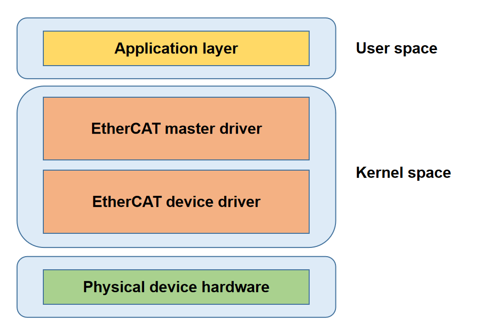

# EtherCAT
介绍 EtherCAT 主站驱动的功能和使用方法。
## 模块介绍
EtherCAT 主站模块是一个高性能实时通信内核模块，支持总线自动扫描、分布式时钟同步和多从设备高效管理，适用于工业自动化领域。

### 功能介绍
  

EtherCAT主站架构如上图所示，由四个部分构成：  
应用层: 用户应用程序，负责实现工业控制逻辑，通过接口与 EtherCAT 主站驱动交互。  
EtherCAT主站驱动层：实现核心协议、监测总线拓扑、自动配置从站、同步分布式时钟。  
EtherCAT设备驱动层：由实时网卡驱动构成，负责ECAT数据帧收发。  
物理层：网络硬件设备。 
### 源码结构介绍
EtherCAT主站驱动代码在drivers/net/ethercat目录下：  
```
# 代码中出现大量配对的xxx.h + xxx.c文件，前者负责数据结构和接口定义，后者负责实现
# 为了避免文件功能重复描述，我们仅对其中一者加以注释
.
├── device                     # EtherCAT device driver
│   ├── ecdev.h                
│   ├── ec_generic.c           # 通用网络设备驱动实现
│   ├── ec_k1x_emac.c          # 针对 K1 以太网控制器的专用驱动实现
│   ├── ec_k1x_emac.h          
│   ├── Kconfig                # 定义内核配置选项，下同                
│   └── Makefile               # 管理本目录下编译规则，下同
├── include                   
│   ├── config.h               # 全局配置选项和编译宏定义
│   ├── ecrt.h                 # 提供用户态和内核态之间交互的核心接口
│   ├── ectty.h                
│   └── globals.h              # 全局变量
├── Kconfig                  
├── Makefile                  
└── master                
    ├── cdev.c                 # 实现字符设备接口
    ├── cdev.h                 
    ├── coe_emerg_ring.c       # 处理 CoE 紧急消息
    ├── coe_emerg_ring.h       
    ├── datagram.c             # 实现操作 ECAT 数据报接口
    ├── datagram.h             
    ├── datagram_pair.c        # 提供操作 ECAT 数据报对的接口
    ├── datagram_pair.h        
    ├── debug.c                # 提供调试信息的输出功能
    ├── debug.h                
    ├── device.c               # 为主站提供网卡设备抽象及管理设备的接口
    ├── device.h               
    ├── domain.c               # 提供管理和操作 EtherCAT 域的接口
    ├── domain.h               
    ├── doxygen.c              # 生成 Doxygen 文档的辅助文件
    ├── eoe_request.c          # 处理 EoE（Ethernet over EtherCAT）请求
    ├── eoe_request.h          
    ├── ethernet.c             # 以太网帧的管理与封装
    ├── ethernet.h             
    ├── flag.c                 # 管理和操作协议标志位
    ├── flag.h                 
    ├── fmmu_config.c          # 提供配置 FMMU（场可编程映射单元）接口
    ├── fmmu_config.h          
    ├── foe.h                  
    ├── foe_request.c          # 实现 FoE 请求处理
    ├── foe_request.h          
    ├── fsm_change.c           # 状态变更状态机实现
    ├── fsm_change.h           
    ├── fsm_coe.c              # CoE 协议状态机实现
    ├── fsm_coe.h              
    ├── fsm_eoe.c              # EoE 协议状态机实现
    ├── fsm_eoe.h              
    ├── fsm_foe.c              # FoE 协议状态机实现
    ├── fsm_foe.h              
    ├── fsm_master.c           # 主状态机实现
    ├── fsm_master.h           
    ├── fsm_pdo.c              # PDO 读取状态机实现
    ├── fsm_pdo_entry.c        # PDO 条目读取状态机实现
    ├── fsm_pdo_entry.h        
    ├── fsm_pdo.h              
    ├── fsm_sii.c              # 从站信息接口（SII）读写状态机实现
    ├── fsm_sii.h              
    ├── fsm_slave.c            # 从站管理状态机实现
    ├── fsm_slave_config.c     # 从站配置状态机实现
    ├── fsm_slave_config.h     
    ├── fsm_slave.h            
    ├── fsm_slave_scan.c       # 从站扫描状态机实现
    ├── fsm_slave_scan.h       
    ├── fsm_soe.c              # SoE（Servo over EtherCAT）状态机实现
    ├── fsm_soe.h              
    ├── globals.h              
    ├── ioctl.c                # 提供 IOCTL 接口以支持用户态交互
    ├── ioctl.h               
    ├── Kconfig                
    ├── mailbox.c              # ECAT 邮箱管理
    ├── mailbox.h              
    ├── Makefile               
    ├── master.c               # master 模块核心逻辑
    ├── master.h               
    ├── module.c               # master 模块的初始化和清理
    ├── pdo.c                  # 提供 PDO 管理接口
    ├── pdo_entry.c            # 提供 PDO 条目管理接口
    ├── pdo_entry.h            
    ├── pdo.h                  
    ├── pdo_list.c             # 提供 PDO 链表管理方法
    ├── pdo_list.h             
    ├── reg_request.c          # 实现寄存器请求处理
    ├── reg_request.h          
    ├── rtdm.c                 # 实时驱动模型（RTDM）支持
    ├── rtdm_details.h         
    ├── rtdm.h                 
    ├── rtdm-ioctl.c           # RTDM IOCTL 接口实现
    ├── rtdm_xenomai_v3.c      # 支持 Xenomai v3 实时框架的接口
    ├── rt_locks.h             # 实时锁实现
    ├── sdo.c                  # 服务数据对象（SDO）管理
    ├── sdo_entry.c            # SDO 条目管理
    ├── sdo_entry.h            
    ├── sdo.h                  
    ├── sdo_request.c          # SDO 请求处理逻辑
    ├── sdo_request.h          
    ├── slave.c                # 从站状态管理逻辑
    ├── slave_config.c         # 从站配置实现
    ├── slave_config.h         
    ├── slave.h                
    ├── soe_errors.c           # 处理 SoE 错误
    ├── soe_request.c          # SoE 请求处理
    ├── soe_request.h          
    ├── sync.c                 # 分布式时钟（DC）功能实现
    ├── sync_config.c          # 同步配置逻辑
    ├── sync_config.h          
    ├── sync.h                 
    ├── voe_handler.c          # 处理 VOE（Vendor-specific over EtherCAT）请求
    └── voe_handler.h          

  
```
## 关键特性
| 特性 | 特性说明 |
| :-----| :----|
| 自动从站配置 | 支持自动扫描并配置连接的从站设备，简化网络配置 |
| 分布式时钟同步 | 实现 <1 µs 精度的分布式时钟（DC）同步 |
| 多协议支持 | 支持 CoE、SoE、FoE 等协议 |
| 高实时性能 | 支持 1 ms DC 周期，满足大部分工业应用的实时性要求 |
| 多主站组合 | 支持配置多个主站，每个主站可管理两个网络设备：主设备和备用设备 |

## 配置介绍
主要包括驱动CONFIG使能配置和dts配置
### CONFIG配置
ETHERCAT：如果要启用EtherCAT服务，首先将此选项配置为Y
```
menuconfig ETHERCAT
        bool "Ethercat native network driver support"
        depends on NET
        default y
        help
          This section contains all the Ethercat drivers.
```
EC_MASTER：启用master驱动
```
config EC_MASTER
        tristate "Ethercat master driver support"
        depends on ETHERCAT
        default n
        help
          Ethercat master driver support.

```
EC_GENERIC：启用通用网卡驱动  
EC_K1X_EMAC：启用实时网卡驱动  
```
config EC_GENERIC
        tristate "Ethercat generic device driver support"
        depends on ETHERCAT
        default n
        help
          generic native ethercat device driver support.

config EC_K1X_EMAC
        tristate "k1x native thercat device driver support"
        depends on ETHERCAT
        default n
        help
          Ethercat generic device driver support.

```
注：上面两个配置选项选一个即可
### dts配置
dts中可供配置的选项有：  
1. run-on-cpu：可绑定的cpu选项有 1、2、3、4、5、6、7  
2. debug-level：支持的debug-level有 0、1、2  
3. master-count： 最多支持 32 个主站
4. ec-devices： 用于 ethercat 的网络设备
5. master-indexes：ethercat设备绑定的主站号，master-indexes 取值范围是 0 ~ master-count-1  
6. modes：ethercat设备工作模式，支持ec_main和ec_backup两种选项

目前支持三种配置模式：  
一、配置两个主站，例如将eth0绑定到主站0、eth1绑定到主站1  
```
ec_master: ethercat_master {
        compatible = "igh,k1x-ec-master";
        run-on-cpu = <1>;         
        debug-level = <0>;
        master-count = <2>;   
        ec-devices = <&eth0>,<&eth1>;
        master-indexes = <0>,<1>;
        modes = "ec_main";
        status = "okay";
};

eth0: ethernet@cac80000 {
        compatible = "spacemit,k1x-ec-emac";
        ...

};

eth1: ethernet@cac81000 {
        compatible = "spacemit,k1x-ec-emac";
        ...

};
```
二、配置一个主站、一张网卡用于EtherCAT、一张网卡用于以太网，如eth0用于EtherCAT
```
ec_master: ethercat_master {
        compatible = "igh,k1x-ec-master";
        run-on-cpu = <1>;         
        debug-level = <0>;
        master-count = <1>;   
        ec-devices = <&eth0>;
        master-indexes = <0>;
        modes = "ec_main";
        status = "okay";
};

# 这里将eth0用于ethercat
eth0: ethernet@cac80000 {
        compatible = "spacemit,k1x-ec-emac";
        ...

};
```
三、配置一个主站、绑定两张网卡。如eth0用于主设备、eth1用作备份设备
```
ec_master: ethercat_master {
        compatible = "igh,k1x-ec-master";
        run-on-cpu = <1>;         
        debug-level = <0>;
        master-count = <1>;   
        ec-devices = <&eth0>,<&eth1>;
        master-indexes = <0>,<0>;
        modes = "ec_main","ec_backup";
        status = "okay";
};

# 这里将eth0用于ethercat
eth0: ethernet@cac80000 {
        compatible = "spacemit,k1x-ec-emac";
        ...

};

eth1: ethernet@cac81000 {
        compatible = "spacemit,k1x-ec-emac";
        ...

};
```
## 接口介绍
### API介绍
请求主站实例
```
ec_master_t *ecrt_request_master(unsigned int master_id);
```
创建过程数据域
```
ec_domain_t *ecrt_master_create_domain(ec_master_t *master);
```
激活主站
```
int ecrt_master_activate(ec_master_t *master);
```
同步主站参考时钟
```
int ecrt_master_sync_reference_clock_to(ec_master_t *master, uint64_t ref_time);
```
同步所有从站时钟
```
void ecrt_master_sync_slave_clocks(ec_master_t *master);
```
配置从站
```
ec_slave_config_t *ecrt_master_slave_config(ec_master_t *master, uint16_t alias, uint16_t position, uint32_t vendor_id, uint32_t product_code);

```
为从站配置PDO映射
```
int ecrt_slave_config_pdos(ec_slave_config_t *sc, uint16_t sync_index, const ec_sync_info_t *syncs);
```
注册PDO条目到指定数据域
```
int ecrt_slave_config_reg_pdo_entry(ec_slave_config_t *sc, uint16_t index, uint8_t subindex， ec_domain_t *domain, unsigned int *offset);

```
为从站配置分布式时钟
```
int ecrt_slave_config_dc(ec_slave_config_t *sc, uint16_t assign_activate, uint32_t sync0_cycle_time, int32_t sync0_shift, uint32_t sync1_cycle_time, int32_t sync1_shift);
```
## debug介绍
### sysfs
EtherCAT主站信息
```
/sys/class/EtherCAT/EtherCAT0
.
|-- dev
|-- power
|   |-- autosuspend_delay_ms
|   |-- control
|   |-- runtime_active_time
|   |-- runtime_status
|   `-- runtime_suspended_time
|-- subsystem -> ../../../../class/EtherCAT
`-- uevent

```
- dev  
提供主站设备号信息
- power  
管理设备的电源状态
- subsystem   
 链接：表明设备属于 EtherCAT 子系统
- uevent  
主站设备号与设备名

## 测试介绍
测试EtherCAT主站需要从站，主从连接后会自动开始扫描从站，自动扫描成功后，主站处于PREOP状态，此时等待应用程序运行即可
```
[  966.525910] k1x_ec_emac cac80000.ethernet ecm0 (uninitialized): Link is Up - 100Mbps/Full - flow control off
[  966.535906] EtherCAT 0: Link state of ecm0 changed to UP.
[  966.552545] EtherCAT 0: 1 slave(s) responding on main device.
[  966.558389] EtherCAT 0: Slave states on main device: INIT.
[  966.564036] EtherCAT 0: Scanning bus.
[  966.739197] EtherCAT 0: Bus scanning completed in 176 ms.
[  966.745275] EtherCAT 0: Using slave 0 as DC reference clock.
[  966.756564] EtherCAT 0: Slave states on main device: PREOP.

```
## FAQ